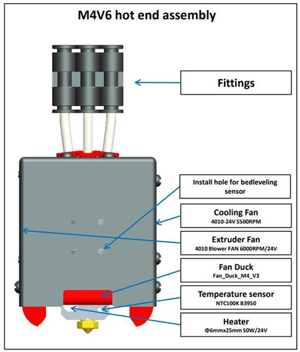
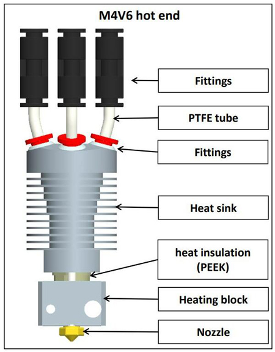
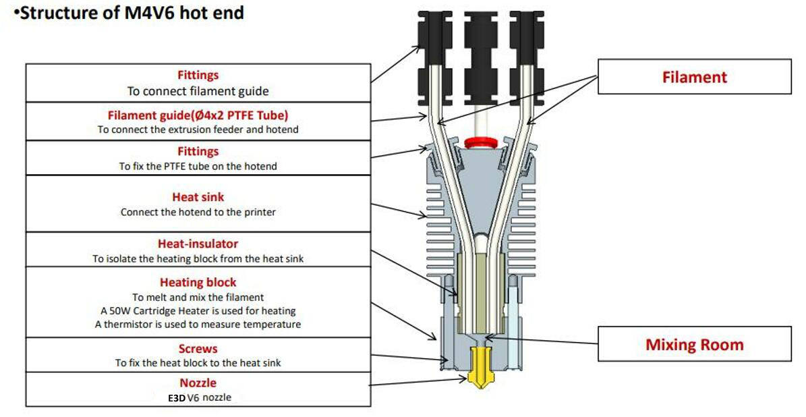
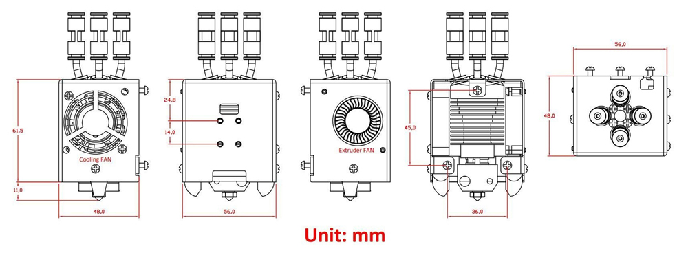
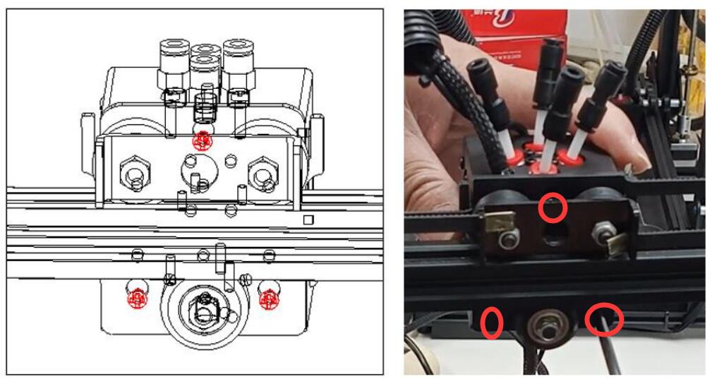
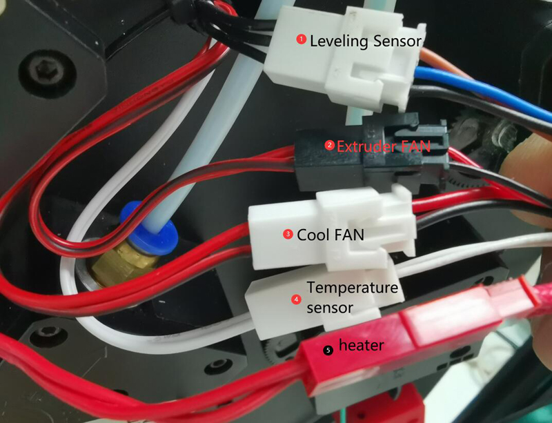

## :book: M4V6 hot end use manual
ZONESTAR 4-IN-1-OUT mix color hot end has 4 input channels and 1 nozzle, four filaments are mixed in the hot end and then extruded through one nozzle, so it not only allows the printer to print the filaments original color, but also allows for printing more colors by adjusting the filament mixing ratio.

### Contents
- **[Precautions for use](#⚠️-attention-please)**
- **[Specifications](#1-specifications)**
- **[Components of M4V6](#2-components)**
- **[Wiring Terminal Description](#3-wiring-terminal)**
- **[Structure](#4-structure)**
- **[Dimensions](#5-dimensions)**
- **[Installation & wiring](#6-installation--wiring)**
- **[Load/unload filaments](#7-loadunload-filaments)**
- **[Steps to print by using M4V6 hotend](#8-steps-to-use-m4v6-hotend)**
- **[Slicing guide](#9-slicing)**
- **[Troubleshooting](#10-troubleshootings)**

-----
## :warning: ATTENTION PLEASE 
### :loudspeaker: Before using the M4V6 hot end, please read [:book:Precautions for using M4V6](https://github.com/ZONESTAR3D/Upgrade-kit-guide/blob/main/HOTEND/M4/M4_V6/M4V6_Precaution.md) carefully.
### :loudspeaker: Must load 4 filaments onto the M4V6 hotend simultaneously, incorrect operationa may block the mix color hotend. If the hot end blockage caused by incorrect operation, it is not covered by the warranty. For how to load filaments, please refer to [this guide](#7-how-to-load-and-unload-filaments).
### :loudspeaker: DON'T pull the "inner PTFE tubes" out of the M4V6 hotend.

-----
### 1. Specifications
|            Item            |      Parameters            |            Item            |      Parameters            |
|:--------------------------:|:--------------------------:|:--------------------------:|:--------------------------:|
|    Rated Voltage           |      DC24V/60W Max         |     Nozzle Diameter        | Default 0.4mm1  |
|    Input Channel           |      4                     |     Nozzle model           |      E3D V6                |
|    Nozzles Number          |      1                     |     Filament Diameter      |      1.75mm                |
|    Heater                  |      24V/60W ⌀6x25mm       |     Temperature Sensor     | NTC Thermistor 100K B3950  |
|    Cooling Fan             |   4010/5000RPM/24V 0.15A   |    Extruder Fan            | 4010/5000RPM/24V 0.15A     |
|    Support Filaments       | PLA/PLA+/PETG/ABS/ASA etc. |    Working Temperature     | 260℃ Maximus              |
|    Wire length             |      1 meter               |    Outer Dimensions        |      50x60x75mm            |
|    Net weight              |      220g                  |    Gross weight            |      350g                  |

### 2. Components
 

### 3. Wiring Terminal
    
:pushpin: Extend cable is optional.

### 4. Structure

### 5. Dimensions

### 6. Installation & wiring
The mounting position of M4 hot end conform to the "ZONESTAR hot end mounting standard", which can be installed on almost all ZONESTAR 3d printers, including P802, M8, D805S, Z8, Z9, Z10 etc. series of products.   
#### 6.1 Installation
Simply remove the 3 screws behind the hot end assembly and install the M4 hotend assembly on the X carrier of the machine.
  
#### 6.2 Wiring
##### :loudspeaker: **Attention** 
- **Please watch for to distinguish terminals 3 and 4**, because their terminals  color are the same, but the wires color are different.    
If the wires of 3 and 4 are connected reversely, you can see the nozzle temperature displayed on the LCD screen will be much higher than the room temperature after you powered on the machine.
- When pluging the terminal, **be careful not to push the metal terminal from the plastic case**.     
#### :loudspeaker: **Please note**    
- **The cooling fan must be turned on** (when the temperature of the hot end is higher than 60°C), otherwise the hot end may be blocked or even damaged.  
 - By default, the **working voltage** of the fan and heater at the hot end is **DC 24V**. 
#### Please following the define of terminals to connect the hotend to your control board.  
- **Without extend cable**     
  
- **With extend cable**     
  
#### 6.3 Set hot end type on LCD MENU: Control>>Configure>>Hotend Type: Mixing
:warning: If your printer hasn't a 4.3" TFT-LCD screen, ignore this step.   
:warning: If you can't see the menu on the LCD screen of your printer, please upgrade to the newest version. [:link: **Firmware Download Link**](https://github.com/ZONESTAR3D/Firmware)    
  

### 7. Load/unload filaments
#### :warning: ATTENTION PLEASE! You need load 4 filament to the hot end even you print one color 3d model, DONOT leave any channel empty before printing.
- **Load filament to the hotend:**     
[:clapper:video tutorial](https://youtu.be/-47yB95uIxI).
  - Cut the front of the filament with diagonal pliers before loading it to the extruder and hot end.
  - Load 4 filaments to all extruders one by one.
  - Rotate the gear of extruders to load filament one by one, do not rotate each extruder more than 2 turns at a time, until all the filaments enter to the inner PTFE tube of hot end, extrdue more 4 ~ 5 turn for each extruder and then stop.      
  :warning: Don't feed filaments to the hotend when any channel of the hot end are empty.     
  :warning: Ensure that the filaments for each channel reach the bottom of the hot end before feeding the filament.
- **Unload filament from the hotend:**
  - Heating the nozzle (200℃ for PLA / 230℃ for PETG/ABS).
  - Simultaneously feed filament at least 10mm on all 4 channels.
  - Operature on the LCD menu or rotate the extruder gear to unload filaments.

### 8. Steps to print by using M4V6 hotend
#### Print one color 3D model
- **Prepare gcode file**. Slicing the 3d modle by using one color 3d printer settings, please refer to [**here**](https://github.com/ZONESTAR3D/Slicing-Guide/tree/master/PrusaSlicer#4-slicing-one-color).   
**Here is a test gcode file for your reference: [:arrow_down: download xyz_cube zip file](./xyz_cube.zip)** and unzip it on PC, and then copy the **xyz_cube.gcode** to SD card. Plug the SD card to the SD socket of machine.
- **Load filaments**. Refer to [:point_up: **"How to load and unload filament"**](#load-and-unload-filament) to load all 4 color filaments to the extruders and hotend.     
- **Print from SD card**. Move item to **Print** item on LCD screen and click the knob and choose the gcode file, click knob to start print.
- **Fine tune nozzle height**. Wait the nozzle and hotbed heating, and when the printer starting to print the first layer, double click the knob of LCD screen to fine tune the distance from the nozzle to the bed, and then wait it to finish.
#### Print multi color 3D model
- **Prepare gcode file**. Slicing the 3d modle by using M4 multi color 3d printer settings, please refer to [**here**](https://github.com/ZONESTAR3D/Slicing-Guide/blob/master/PrusaSlicer/PrusaSlicerGuide_M4.md).   
**Here is a test gcode file for your reference: [:arrow_down: **download M4_4CTest zip file](./M4_4CTest.zip)** and unzip it on PC, and then copy the **M4_4CTest.gcode** to SD card. Plug the SD card to the SD socket of machine.
- **Load filaments**. Refer to [:point_up: **"How to load and unload filament"**](#load-and-unload-filament) to load all 4 color filaments to the extruders and hotend.
- **Print from SD card**. Move item to **Print** item on LCD screen and click the knob and choose the gcode file, click knob to start print.
- **Fine tune nozzle height**. Wait the nozzle and hotbed heating, and when the printer starting to print the first layer, double click the knob of LCD screen to fine tune the distance from the nozzle to the bed, and then wait it to finish.

### 9. Slicing
We recommend using PrusaSlicer for slicing. For installation and usage tutorials, please refer to the following link:
- **[Install Prusaslicer software](https://github.com/ZONESTAR3D/Slicing-Guide/tree/master/PrusaSlicer)**    
- **[Slicing guide for M4 hotend](https://github.com/ZONESTAR3D/Slicing-Guide/blob/master/PrusaSlicer/PrusaSlicerGuide_M4.md)**     
For more tutorials on using other slicing software, please refer to: https://github.com/ZONESTAR3D/Slicing-Guide

### 10. Troubleshootings
- [**How to clean the blocked M4V6 hotend**](./M4V6_FAQ/cleanM4V6.md)      
The M4 hot end may be blocked due to improper operation, nozzle blockage, and other reasons. Please refer to [**:book:this manual**](./M4V6_FAQ/cleanM4V6.md) to clean the hot end.
- [**How to replace of the inner PTFE tubes**](./M4V6_FAQ/ReplaceM4V6InnerPTFE.md)      
After prolonged use on the hot end or due to improper operation, the **inner PTFE tubes** of M4V6 may need to be replaced. Please refer to [ **:book:this manual**](./M4V6_FAQ/ReplaceM4V6InnerPTFE.md) to operate.
- [**How to solve the stringing issue of M4V6**](https://github.com/ZONESTAR3D/Upgrade-kit-guide/blob/main/HOTEND/M4/M4_V6/M4V6_FAQ/stringsIssue.md)      
If you find a **stringing issue** ( :link: [wiki](https://www.matterhackers.com/articles/3d-printer-troubleshooting-guide#Issue9)) when printed by M4V6 hotend, please refer to [ **:book:this manual**](https://github.com/ZONESTAR3D/Upgrade-kit-guide/blob/main/HOTEND/M4/M4_V6/M4V6_FAQ/stringsIssue.md) to solve.

-----
### :paperclip: Appendix I: Achieve speedy printing by using M4V6 hot end
When printing a single color 3d model, M4V6 can support higher flow rates. About the details, please refer to [:book: this guide](./HighFlow/readme.md).

### :paperclip: Appendix II: [How to switch hotend between E4 hotend and M4 hotend](https://github.com/ZONESTAR3D/Upgrade-kit-guide/blob/main/HOTEND/FAQ_M4E4.md#how-to-switch-between-m4-hotend-and-e4-hotend)
