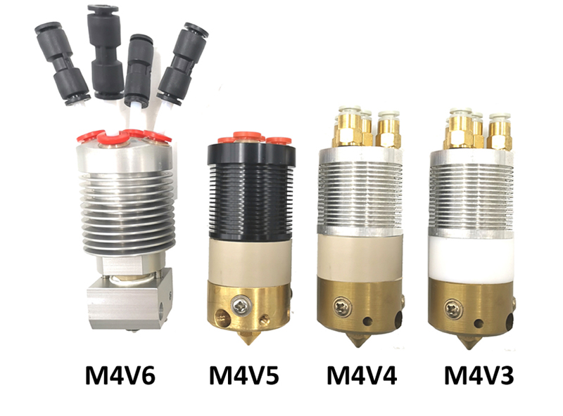

## ZONESTAR M4 (4-IN-1-OUT Mixing Color) Hotend
-  [**M4V6**: The 6th version 4-IN-1-OUT mix color hotend.](#m4v6)
-  [**M4V5**: The 5th version 4-IN-1-OUT mix color hotend.](#m4v5)
-  [**M4V4**: The 4th version 4-IN-1-OUT mix color hotend.](#m4v4)
-  [**M4V3**: The 3rd version 4-IN-1-OUT mix color hotend.](#m4v3)

### Differences on M4V3, M4V4, M4V5 and M4V6 hotends
1. **Shape**   
The M4 hot end assembly may be similar in appearance, please observe the shape of the hot end from the back of the metal housing to distinguish them.     
:warning: **Note:** M4V3 and M4V4 has the same shape, but they used different material of the thermal isolation block. The thermal isolation block of M4V4 is made by PEEK, it is brown. M4V3 is made by PTFE, it is brown.    

2. **Parameters**   

|           Parameter and Specification               |    M4V3       |    M4V4       |      M4V5     |      M4V6     |
|:---------------------------------------------------:|:--------------|:--------------|:--------------|:--------------|
|Maximum operating temperature                        |  240℃        |  260℃        |  260℃         |  260℃        |
|Unused Channel Closable[#1]               |  Yes          |  Yes          |  No           |  No           |
|Volume of Mixing Chamber (mm3)            |  40 ~ 50      |  40 ~ 50      |  40 ~ 50      |  30 ~ 40      |
|Anti Strings [#2]                         |  Poor         |   Poor        |  Poor         |  Good         |
|Maximum Flow Rate (mm3/s)[#3]  |  8            |   8           |  10           |  30           |
|Maximum mix color print speed (mm/s)[#3]  |  60           |   60          |  75           |  150          |
|Maximum multi color print speed (mm/s)[#3]|  50           |   50          |  60           |  100          |

[#1]: Unused channels can be closed.   
[#2]: It can be improved obviously after using the small storage room nozzle.     
[#3]: Tested with PLA filament @205℃ temperature. Recommended to use 60~80% of the maximum print speed when slicing.

-----
## M4V6
- **[:book: Introduction](./M4_V6/readme.md)**  
- **[:gift: Buy a M4V6 Hotend assembly](https://bit.ly/3QhWJtf)**  
- **[:gift: Buy a M4V6 Hotend assembly](https://www.aliexpress.com/item/1005004547646195.html)**   
### What's improved
The M4V6 has reformed the structure of the hot end, which is completely different from the previous version. It uses an inclined feed channel and canceled the flow channel inside the heater. Advantages compared with the previous version M4 hot ends:
1. Solved the leakage issue completely.
2. Reduced the volume of mixing room, the drawing/stings issue is greatly improved.

-----
## M4V5
- **[:book: Introduction](./M4_V5/readme.md)**   
- **[:gift: Buy a M4V5 Hotend](https://www.aliexpress.com/item/1005001581641783.html)**    
<!-- ### Structure diagram -->
<!--  -->
### The different between **M4V5** with **M4V4**:  
1. Removed the inner PTEF pipes, Reduce the probability of clogged because the internal PTEF pipe be damaged.   
2. Upgraded the fittings, easier to load filament and replace the filament guide. 
### :warning: ATTENTION PLEASE
Because M4V5 used different fittings which to fix the PTFE filament guides, its size is bigger than M4V3 and M4V4, so M4V5 can't be installed to the older housing.   

-----
## M4V4
- **[:book: Introduction](./M4_V3_V4/readme.md)**      
- **[:gift: ~~Buy a M4V4 Hotend~~](https://www.aliexpress.com/item/1005002124027691.html)**  
- **[:gift: ~~Buy a M4V4 Hotend assembly~~](https://www.aliexpress.com/item/1005001581641783.html)**   
<!-- ### Structure diagram -->
<!--  -->
### The different between  **M4V4** with **M4V3**:  
1. Upgraded the insulation block material from [**PETF** to **PEEK**:art:](./M4_V3_V4/PEEK_Insulation_block.jpg), so M4-V4 can work at maxius temperature to 260℃.  
2. Upgraded the nozzle to a [**Small store room nozzle**:art:](./M4_V3_V4/small_store_room_nozzle.jpg to improve the strings issue.         
#### upgrading parts from M4V3 to M4V4
- **[:gift: ~~PEEK_Insulation_block~~](https://www.aliexpress.com/item/1005002124027691.html)**  
- **[:gift: Small store room nozzle](https://www.aliexpress.com/item/1005001447928770.html)**

-----
## M4V3
**[:book: Introduction](./M4_V3_V4/readme.md)**
<!-- ### Structure diagram -->
<!--  -->

-----
## Slicing guide for M4 hotend
- **[:+1:PrusaSlicer](https://github.com/ZONESTAR3D/Slicing-Guide/tree/master/PrusaSlicer)**     
- **[Cura](https://github.com/ZONESTAR3D/Slicing-Guide/tree/master/cura)**     
<!-- - **[Test gcode files](https://github.com/ZONESTAR3D/Slicing-Guide/tree/master/PrusaSlicer/test_gcode/M4)** -->

-----
## Troubleshooings
#### [:book: **Troubleshooings for M4V3/M4V4/M4V5**](./troubleshooting.md)