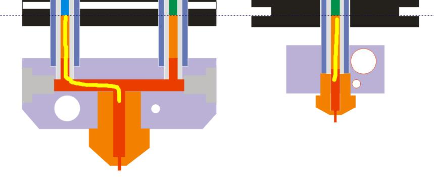
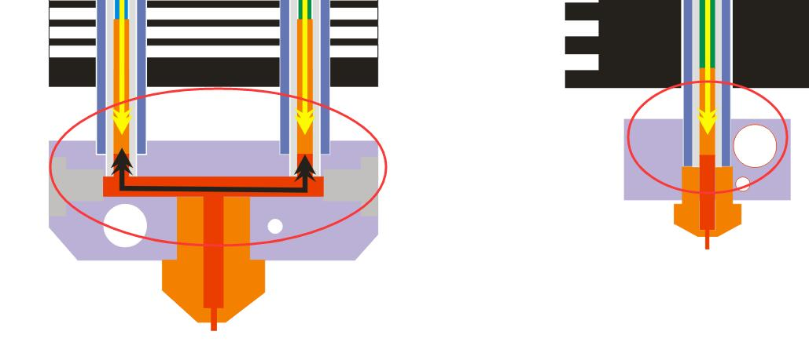
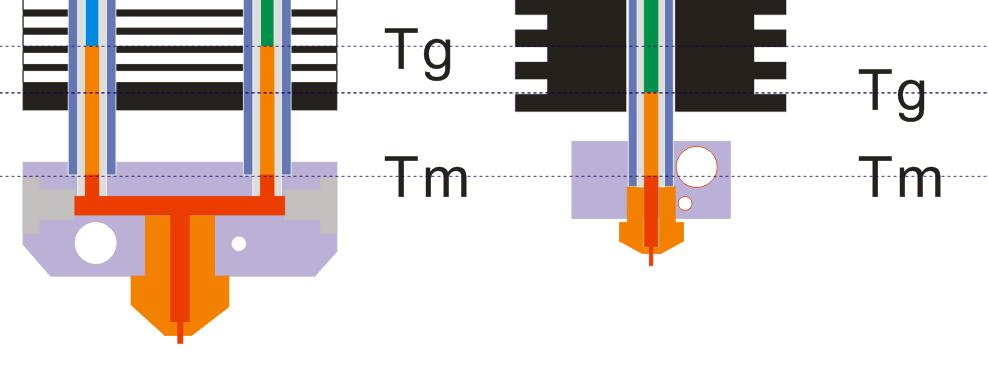
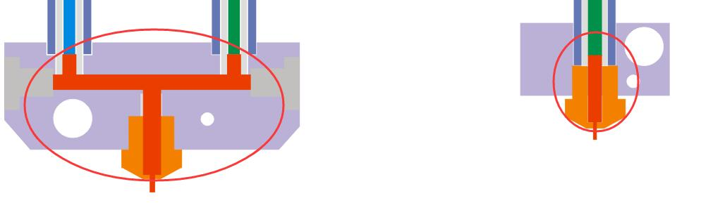
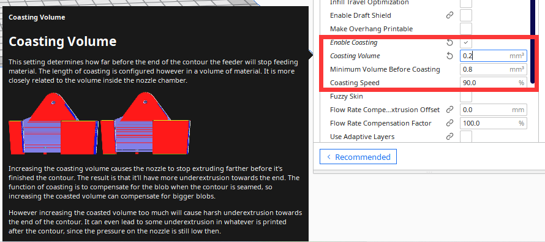
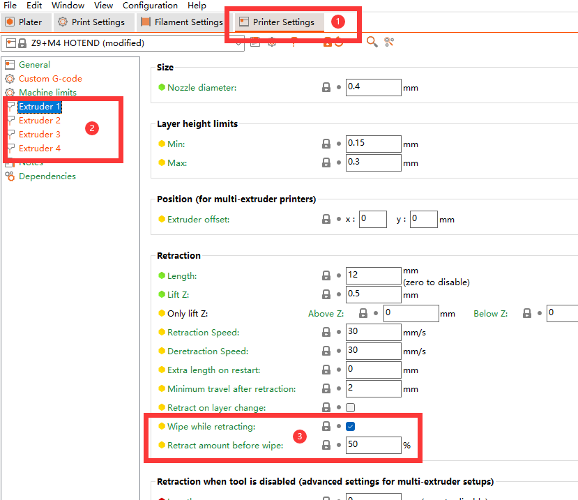

## Tourbleshooting for M4 (4-IN-1-OUT Mixing Color) Hotend
### :warning: These issue has been completely solved in M4V6, if your hotend is M4V6, you can ignore this guide.
### 1. Clogged issue
#### :question: Reasons
1. The length of the extrusion channel is longer than that of the single color.   
       
2. Since the channels at the hot end of the color mixing are interconnected, the filaments in the feed channels are also under the action of the reverse extrusion force of the other channels at the same time.  
    
3. The longer of the filament between Tg(Glass Transition Temperature) and Tm(Melting Temperature), the greater its adhesion to the feed tube (refer to [***Hot End Design Theory***](https://reprap.org/wiki/Hot_End_Design_Theory)), and the final result will be that the extrusion feeder can't push the filament.  
   
4. Other reasons: Due to weight, processing and installation restrictions, the distance between the extruder feeder and the hot end needs to be longer, it also increases the resistance of the extruder.  
#### :pill: Solutions 
1. Increase extruder force, for exmple upgrade to [**Dual gear extruder**](https://www.aliexpress.com/item/1005003473360998.html) or [**Titan extruder**](https://www.aliexpress.com/item/1005001678239017.html) .  
2. Choose harder filaments, for example **PLA+** > **PLA** > **silk-PLA**.  
3. Reduce the heat transfer rate of **Insulation block** and keep the "Heat sink" cool, to short the filament distance between Tg and Tm.  
4. Minimize the length of the mixing chamber channels.   
5. Improve retraction settings.  
6. Do not leave the channel unused for a long time, filament in Tg state for a long time will be more firmly attached to the filament guide.
 
### 2. Strings issue
#### :question: Reasons
Because there is a mixing color chamber, so the stored filaments in the mixing color hotend is bigger than single color hotend, it will reduce the effect of retraction.  
   
#### :pill: Solutions  
##### 1. Reduce the size of mixing color chamber, for example, upgrade to [**small store room nozzle**](https://www.aliexpress.com/item/1005001447928770.html).  
##### 2. Add "wipe" on silcing settings.
###### Cura Slicer (Coasting)

###### PrusaSlicer (Wipe while retracting)

##### 3. Turn on auto synchronous retraction feature. For detail, please refer to [**here**](https://github.com/ZONESTAR3D/Upgrade-kit-guide/tree/main/HOTEND/M4%20%204-IN-1-OUT%20Mixing%20Color%20Hotend/Example#turn-on-the-function-on-lcd-screen)
##### 4. If you are very concerned about strings issue, it is recommended that you buy a single color or 4-IN-1-OUT Non-mix color Hotend.
- :book: [**4-IN-1-OUT Non-Mix Color Hotend**](../E4%204-IN-1-OUT%20Non-Mixing%20Color%20Hotend/example/readme.md)
- :gift: [**4-IN-1-OUT Non-Mix Color Hotend**](https://www.aliexpress.com/item/1005002951777699.html)
