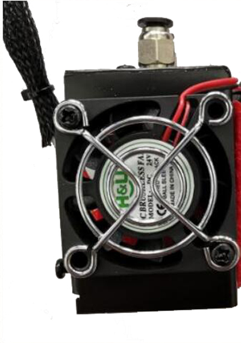
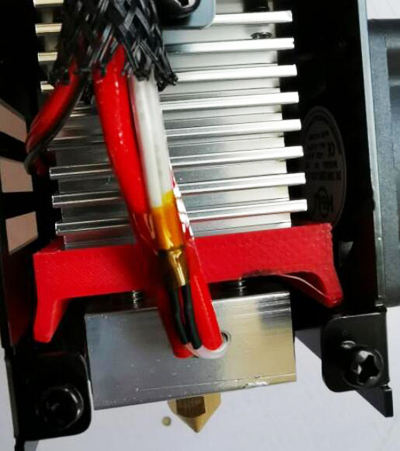

## R2 Hotend
**R2** hot end is a 2-IN-2-OUT hotend, it has two input channels and 2 nozzles. Two filaments can be loaded into the heating block and extruded through the nozzle. 

## R2S Hotend
**R2S** is similar to **R2** hot end, but the two nozzles of R2S share the same heater and temperature sensor, so the temperatures of the two channels of R2S hot end cannot be set separately.     

----
## Slicing settings
You can import ZONESTAR 3D Printer Profiles into Cura, then add a "Z5 with R2S Hotend" machine and refer to its settings.
For details, please refer to ["Cura Slicer Guide"](https://github.com/ZONESTAR3D/Slicing-Guide/tree/master/cura) and ["Z5 with R2S hotend setting reference"](https://github.com/ZONESTAR3D/Slicing-Guide/tree/master/cura/R2S_Hotend).

----
## Solution to the problem of the hot end being unable to heat to over 240 degree
In some machines, you may find that the R2S hot end cannot be heated to over 235 degrees. If you encounter this problem, please refer to the following methods to solve it:
#### 1. Reverse the installation direction of the cooling fan to blow it outward to reduce heat loss.  

#### 2. Print and install a "wind shield" to the heat sink, to avoid the wind blow to the heater directly.
[:arrow_down:Download stl file](./Windshield.zip)    
