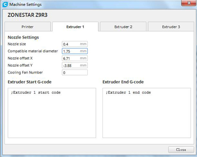
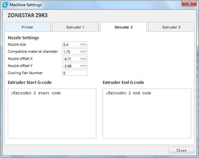
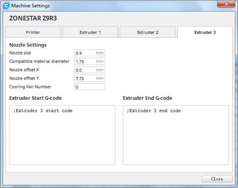
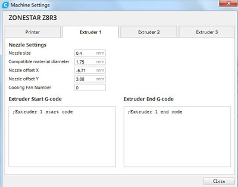
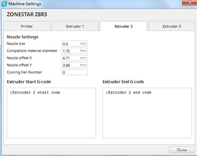
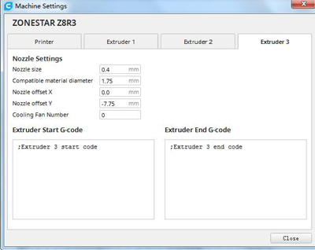

## R3 V1/V2
### Structure diagram

### What's different with R3 V1 & R2

## Slicing
### About the offset of the nozzle on R3 hotend

#### Example 1: set the nozzle offset on Z9M3 3d printer with R3 hotend

#### Example 2: set the nozzle offset on Z8T 3D printer with R3 hotend

## Example

