## R3 V1/V2
### Structure diagram
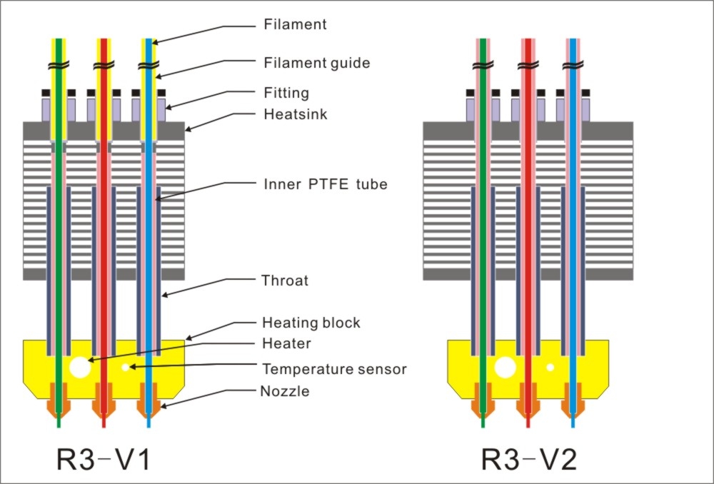

### What's different with R3 V1 and V2
The second version of the R3 hot end has removed the "inner PTFE tubes", making feeding smoother and less prone to blockage caused by the deterioration of the "inner PTFE tubes" after prolonged use. Therefore, :warning:it is important to note that when inserting PTFE tubes, they need to be inserted at the bottom of the hot end.

## Wiring
There are 2 fan wires (with XH-2.54 connector), 1 temperature sensor wire (White high-temperature thin wire with XH-2.54 connector), and 2 cartridge heater wires (Red high-temperature resistant wire). When wiring, please note:
#### 1. Wiring the fans
  Please pay attention to distinguishing between the ***hot end heat-sink cooling fan*** and the ***extruder fan***, as their wire and terminals are similar. 
  - ***The heat-sink cooling fan*** should operate when the nozzle temperature exceeds 50℃ or 60℃, also it can be connected to the AUX-POW connector of the control board, let it working directly when power on.      
  - ***The extruder fan*** is used to cool the extruded plastic and should be controlled by the control board (switch or rotation speed).          
  :warning: The interface of the fan is polarized, red should be connected to the positive pole, and black should be connected to the negative pole. Please pay attention to whether it matches your control board. If it doesn't match, you can pull the wire terminals out of the plastic box of the connector and exchange them.
#### 2. Wiring the temperature sensor wiring
The temperature sensor uses NTC 100K B3950 thermistor, which should be connected to the temperature measurement connector of the control board. The temperature sensor wire has no polarity.
#### 3. Wiring the cartridge heater wires 
The cartridge heater wires should be connected to the power supply port to hot end of the control board. Ithas no polarity.     
:warning: Please note that the working current of this heater is high (rated at approximately 2.5A), its wires should be securely connected to the terminals of the control board.   
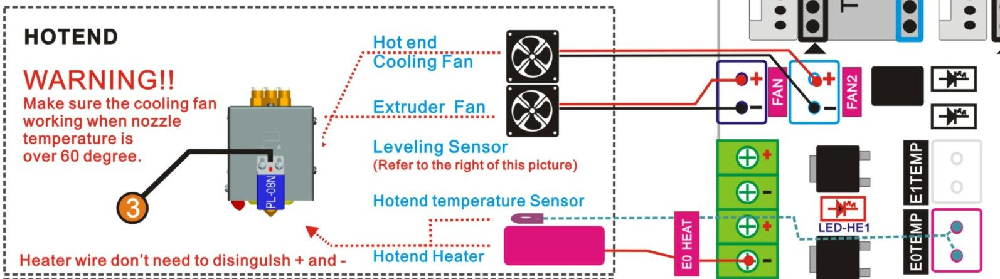

-----
## The nozzles offset of the R3 (3-IN-3-OUT) hot end

-----
## Slicing Settings
### For PrusaSlicer
#### Z8 3D printer + R3 hot end
- **[:arrow_down: download PrusaSlicer config for Z8R3](./Slicing_guide_for_R3_hotend/PrusaSlicerConfig_Z8R3.zip).**
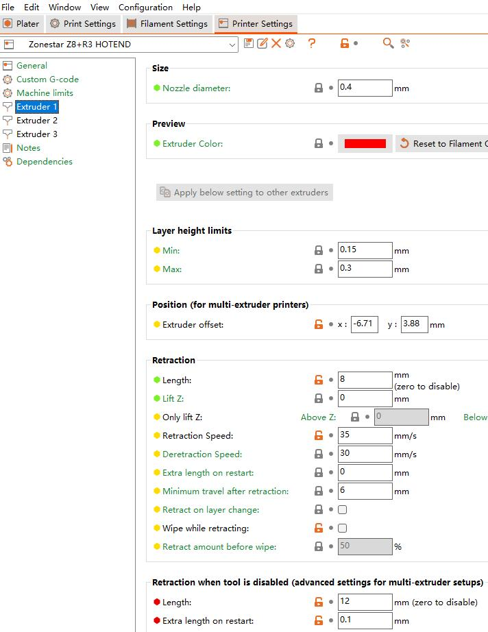 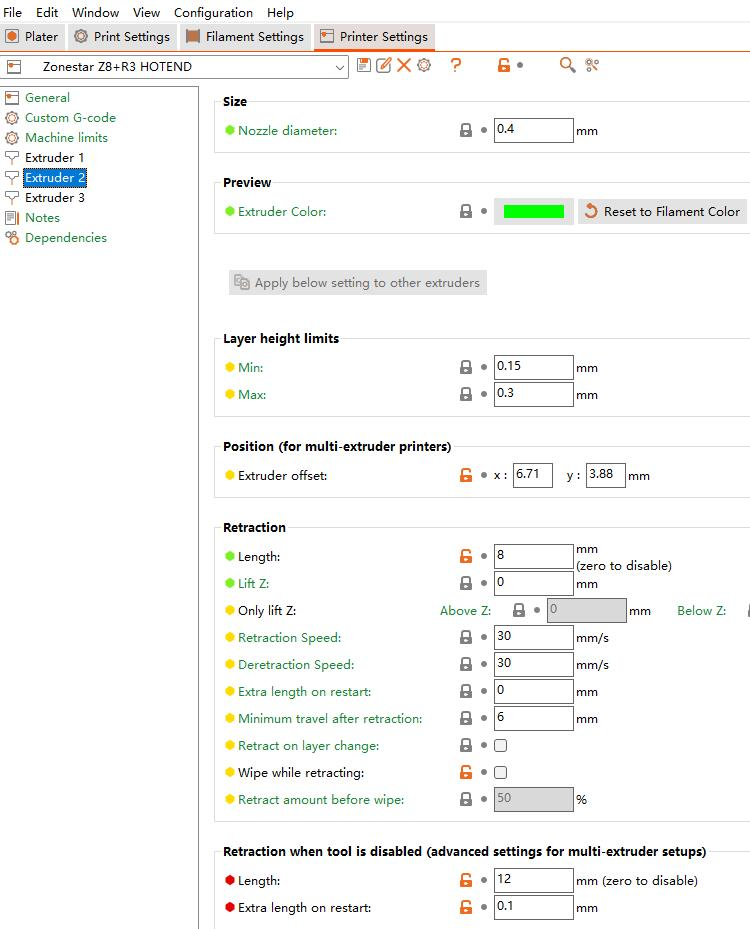 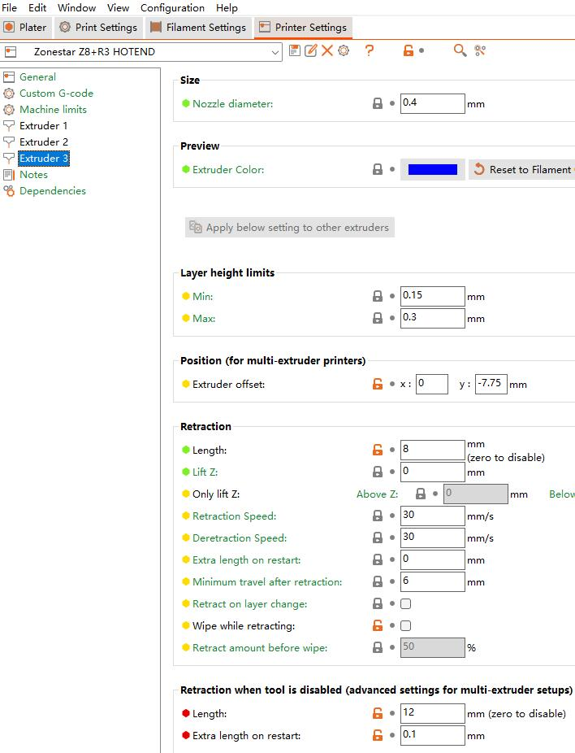
#### Z9 3D printer + R3 hotend
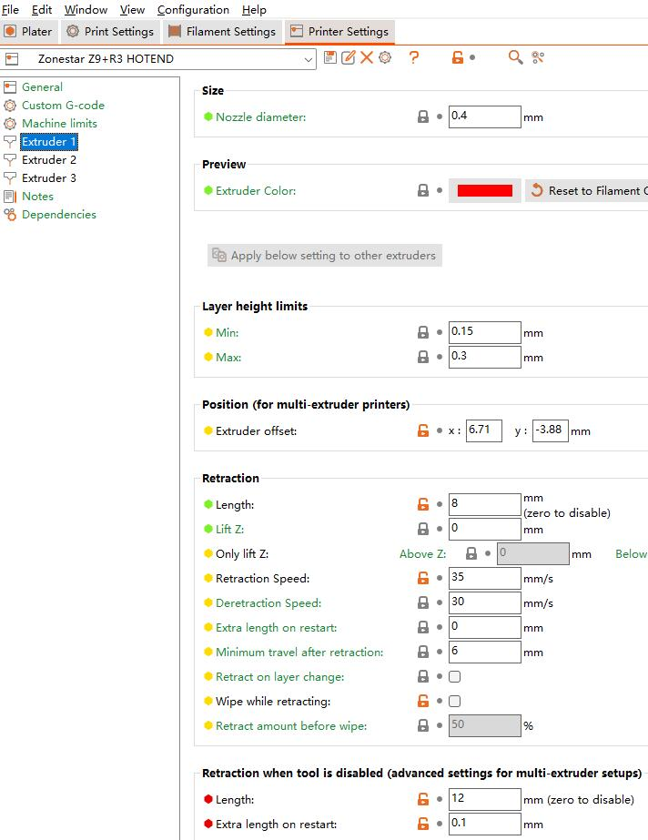 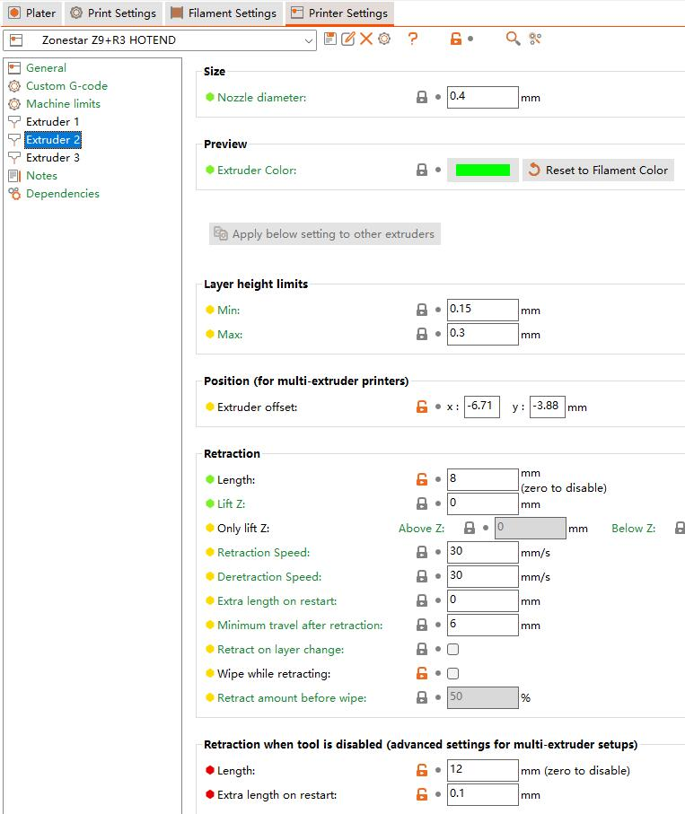 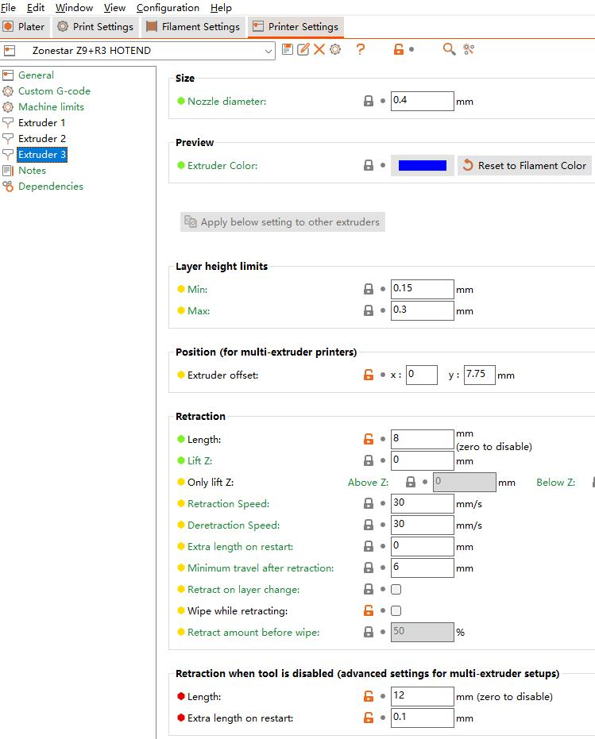
- **[:arrow_down: download PrusaSlicer config for Z9R3](./Slicing_guide_for_R3_hotend/PrusaSlicerConfig_Z9R3.zip).**

### For Cura Slicer
#### Set the nozzle offset on Z9M3 3d printer with R3 hot end
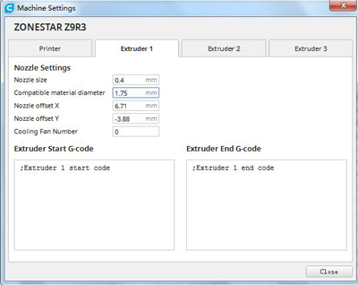 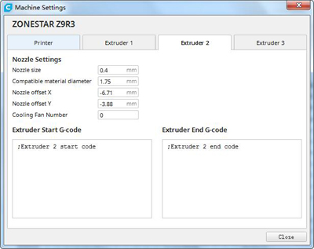 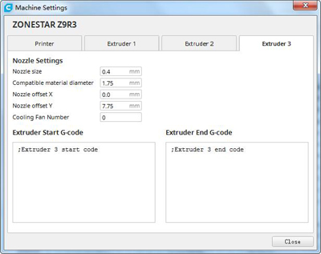
#### Set the nozzle offset on Z8T 3D printer with R3 hot end
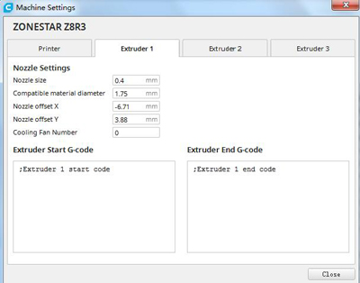 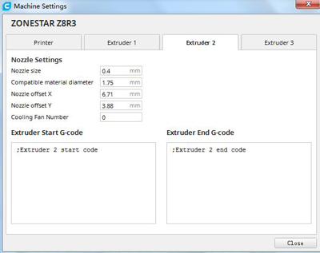 

