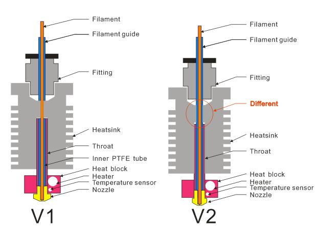
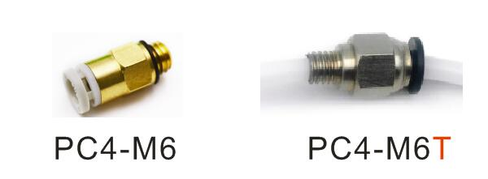
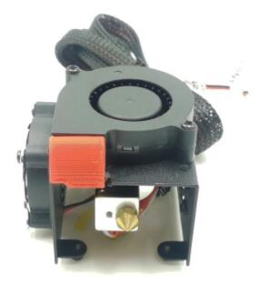

## Structure diagram of single color hot end

### What's different between HE6-V1 and HE6-V2:  
#### 1. Heat sink

#### 2. Fittings (HE6-V2 used PC4-M6T)

#### If you want to upgrade from HE6-V1 to HE6-V2, you need to drill a 4.2mm hole on heat sink and replace the fitting from PC4-M6 to PC4-M6T.
#### NOTE: Try to plug the PTFE guide as far as deeply, otherwise may cause filament leaked or be clogged.

## For Z6 & Z5X
### [Sell link](https://www.aliexpress.com/item/1005001274803204.html)
  

## For other machines
### [Sell link 12V single color hotend](https://www.aliexpress.com/item/1005001274803204.html)  
### [Sell link 24V single color hotend](https://www.aliexpress.com/item/1005001275334841.html)
    