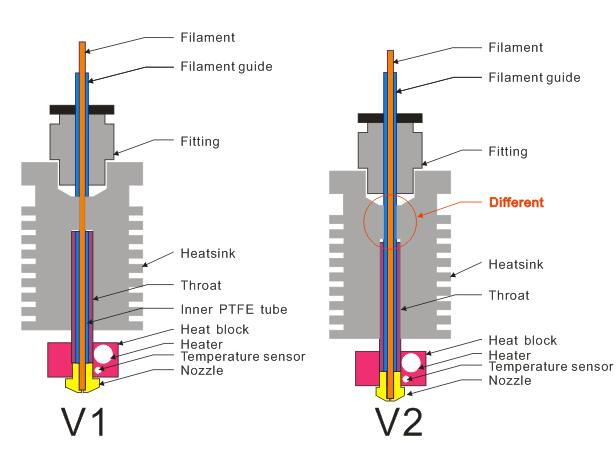
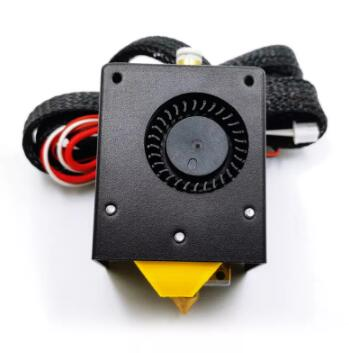
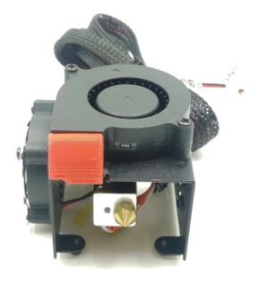
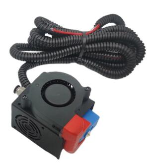
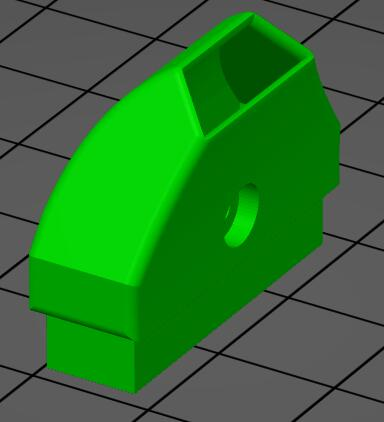
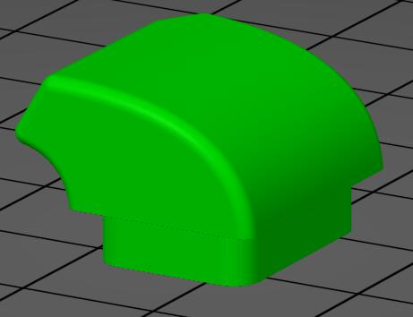
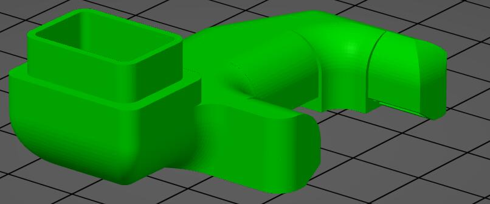

## Structure diagram of single color hot end

## Single color hotend For Z6 & Z5X
This hotend is a small size hotend for Z6 and Z5X, 12V working voltage. **SKU: PHS_Z6**
### [sales link](https://www.aliexpress.com/item/1005001274803204.html)
  

## Single color hotend For other machines
This hotend is a normal size hotend for P802/D805/Z5S/Z8/Z9/Z10 3d printer. **SKU: PHS_12V/PHS_24V**  
    
- [12V Version sales link](https://www.aliexpress.com/item/1005001274803204.html) please choose this one if your printer is P802/D805/Z5S.  
- [24V Version sales link](https://www.aliexpress.com/item/1005001275334841.html) please choose this one if your printer is Z8/Z9/Z10.    

## High flow fast printing single color hotend **SKU: PHS_HF**  
A high flow fast printing high temperature single color hotend assembly, it can be used to Z9 series 3D printer.
- [sales link ](https://www.aliexpress.com/item/1005001274803204.html)

## Fan duck stl files
#### [:arrow_down: Fan duck for PHS_Z6](/fanstl/FAN_PHS_Z6.stl)

#### [:arrow_down: Fan duck for PHS_12V and PHS_24V](/fanstl/FAN_PHS.stl)

#### [:arrow_down: Fan duck for PHS_HF](/fanstl/FAN_PHS_HF.stl)
