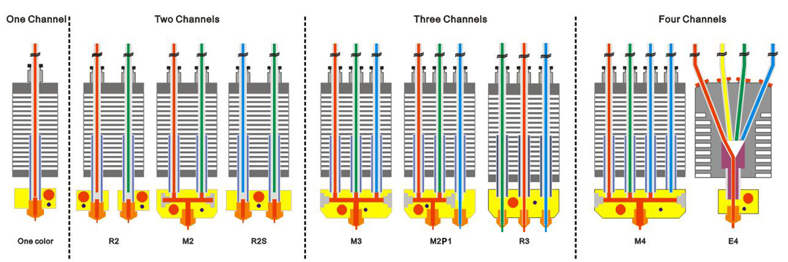

### Choose Language (Translated by google)

# Hotend
The hotend is the component of a 3D printer that melts the filament for extrusion. Generally, the hot end consists of the following parts:

1. **Nozzle**: To melt filament and flow out， the size of its outlet determines the layer thickness can be built. It is usually made of materials with high thermal conductivity and high hardness, such as copper and carbon steel.  
2. **Heating block**: It is a device used to fix the heating rod and nozzle together. It is usually made of materials with high thermal conductivity, such as aluminum and copper.  
3. **Insulation block**: It is a device used to isolate the heater from the Heat sink, usually made of high temperature resistant but low thermal conductivity materials, such as stainless steel, PTFE, PEEK, etc..  
4. **Heat sink**: In order to fix the hot end to the printer and keep the consumables cool in front of the hot end to conduct extrusion pressure, the heat insulation block usually needs to be connected to the Heat sink, and then install the heat sink to the 3d printer.    
5. **Cooling fan**: Speed up the heat dissipation efficiency of the radiator, and there are also designs using water cooling methods.  
6. **Extrusion fan**: It be used to cool the colloid extruded from the nozzle so that the filaments can be formed and fixed as soon as possible.  
7. **Heater and temperature sensor**:  
> **Referance document:**[***Hot End Design Theory***](https://reprap.org/wiki/Hot_End_Design_Theory)  
  

------
## [Single color Hotend](./Single%20color%20Hotend/)
Included documents about ZONESTAR single color hot end

------
## [M2 (2-IN-1-OUT)  Mixing color hotend](./M2%202_IN-1-OUT%20Mixing%20Color%20Hotend/)
**M2** hot end is a 2-IN-1-OUT hotend, it has two feeding channels and one nozzle. Two filaments are mixed in the mixing chamber in the heating block and extruded through the nozzle.  
We have mass produced four versions of M2 hot end. For details, please refer to the documents in the "**M2 2-IN-1-OUT mixing color Hotend**" directory.  

------
## [M3 (3-IN-1-OUT) Mixing color hotend](./M3%20%203-IN-1-OUT%20Mixing%20Color%20Hotend/)
**M3** hot end is a 3-IN-1-OUT hotend, it has three feeding channels and one nozzle. Three filaments are mixed in the mixing chamber in the heating block and extruded through the nozzle.  
We have mass produced four versions of M3 hot end. For details, please refer to the documents in the "**M3 3-IN-1-OUT mixing color Hotend**" directory.  

## [M2P1 3-IN-2-OUT Mixing Color Hotend](./M2P1%20%203-IN-2-OUT%20Mixing%20Color%20Hotend/)
**M2P1** hot end is a 3-IN-2-OUT hotend, it has three feeding channels and two nozzle. Two filaments are mixed in the mixing chamber in the heating block and extruded through one of the nozzle, another independent nozzle can be used to print the support filament.   
Simply put, it is a combination of an M2 hot end and a single color hot end. It has the advantages of M2, singel nozzle hot end and double nozzle hot end. It can meet the needs of printing singel color, mixed color and two-color, as well as singel color+ support (such as PLA + PVA).

## [R3 3-IN-3-OUT HOTEND](./R3%203-IN-3-OUT%20HOTEND/)
**R3** hot end is a 3-IN-3-OUT hotend, it has three feeding channels and three nozzles, and all of the three nozzle share one heater and temperature sensor.  
We have mass produced 2 versions of R3 hot end. For details, please refer to the documents in the "**R3 3-IN-3-OUT HOTEND**" directory.  

------
## [M4(4-IN-1-OUT Mixing color) hotend](./M4%20%204-IN-1-OUT%20Mixing%20Color%20Hotend/)
**M4** hot end is a 4-IN-1-OUT hotend, it has four feeding channels and one nozzle. Four filaments are mixed in the mixing chamber in the heating block and extruded through the nozzle.  
We have mass produced five versions of M4 hot end. For details, please refer to the documents in the "**M4 4-IN-1-OUT mixing color Hotend**" directory.  

## [E4 (4-IN-1-OUT Non-Mix Color) Hotend](./E4%204-IN-1-OUT%20Non-Mixing%20Color%20Hotend/)
**E4** hot end is a 4-IN-1-OUT hotend, it has four feeding channels and one nozzle. One of the four filaments can be pushed in the heating block and extruded through the nozzle, When a new filament push in, it needs to pull out the previous filament first.
For details, please refer to the documents in the "**E4 4-IN-3-OUT NON-Mixing Color Hotend**" directory.  

### Advantages and disadvantages of E4 and M4 hot end
#### Advantages of E4 hotend
1. No strings/drawing issue.
2. Less clogging issue.
3. Smaller "extruder switch prime tower" inneed while printing multi colors.
#### Advantages of M4 hotend
1. Get more colors than extruders.
2. Support gradient color printing feature.

------
# [Slicing Guide](https://github.com/ZONESTAR3D/Slicing-Guide)
Please refer to the [:point_right: guide](https://github.com/ZONESTAR3D/Slicing-Guide)

