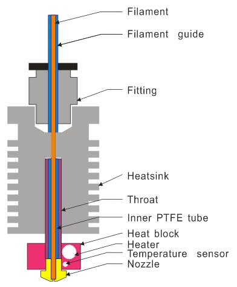

## M3 3-IN-1-OUT Mixing Color Hotend
## M2P1 3-IN-2-OUT Mixing Color Hotend
## R3 3-IN-3-OUT HOTEND
## M4  4-IN-1-OUT Mixing Color Hotend
## E4 (4-IN-1-OUT Non-Mixing Color Hotend)

---
# Slicing Guide  
Please refer to the guide [**here**](https://github.com/ZONESTAR3D/Slicing-Guide)

## Structure diagram of single color hot end structure
### V1

### V2

## Structure diagram of mixing color hot end
### M2 hotend

### M3 & M4 hotend
The structures of M3 and M4 hot ends are basically the same, but the number of input channels is different. The structure diagram of M3 hot end is shown below: