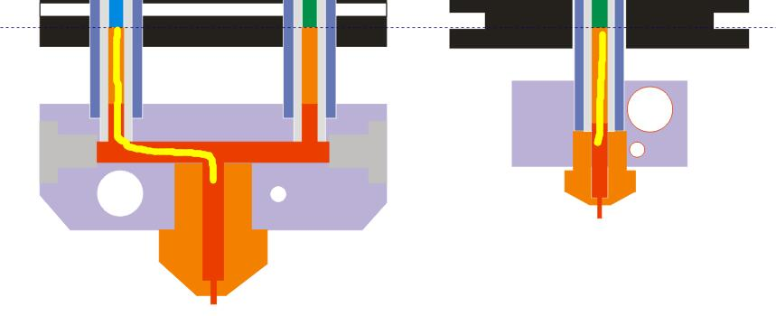

# Hotend
The hotend is the component of a 3D printer that melts the filament for extrusion. Generally, the hot end consists of the following parts:

1. **Nozzle**: To melt filament and flow out， the size of its outlet determines the layer thickness can be built. It is usually made of materials with high thermal conductivity and high hardness, such as copper and carbon steel.  
2. **Heating block**: It is a device used to fix the heating rod and nozzle together. It is usually made of materials with high thermal conductivity, such as aluminum and copper.  
3. **Insulation block**: It is a device used to isolate the heater from the Heat sink, usually made of high temperature resistant but low thermal conductivity materials, such as stainless steel, PTFE, PEEK, etc..  
4. **Heat sink**: In order to fix the hot end to the printer and keep the consumables cool in front of the hot end to conduct extrusion pressure, the heat insulation block usually needs to be connected to the Heat sink, and then install the heat sink to the 3d printer.    
5. **Cooling fan**: Speed up the heat dissipation efficiency of the radiator, and there are also designs using water cooling methods.  
6. **Extrusion fan**: It be used to cool the colloid extruded from the nozzle so that the filaments can be formed and fixed as soon as possible.  
7. **Heater and temperature sensor**:  
> **Referance document:**[***Hot End Design Theory***](https://reprap.org/wiki/Hot_End_Design_Theory)  
  

## Single color Hotend
Included documents about ZONESTAR single color hot end

## M2 (2-IN-1-OUT)  Mixing color hotend
**M2** hot end is a 2-IN-1-OUT hotend, it has two feeding channels and one nozzle. Two filaments are mixed in the mixing chamber in the heating block and extruded through the nozzle.  
We have mass produced four versions of M2 hot end. For details, please refer to the documents in the "**M2 2-IN-1-OUT mixing color Hotend**" directory.  

## M3 (3-IN-1-OUT) Mixing color hotend
**M3** hot end is a 3-IN-1-OUT hotend, it has three feeding channels and one nozzle. Three filaments are mixed in the mixing chamber in the heating block and extruded through the nozzle.  
We have mass produced four versions of M3 hot end. For details, please refer to the documents in the "**M3 3-IN-1-OUT mixing color Hotend**" directory.  

## M2P1 3-IN-2-OUT Mixing Color Hotend
**M2P1** hot end is a 3-IN-2-OUT hotend, it has three feeding channels and two nozzle. Two filaments are mixed in the mixing chamber in the heating block and extruded through one of the nozzle, another independent nozzle can be used to print the support filament.   
Simply put, it is a combination of an M2 hot end and a single color hot end. It has the advantages of M2, singel nozzle hot end and double nozzle hot end. It can meet the needs of printing singel color, mixed color and two-color, as well as singel color+ support (such as PLA + PVA).

## M4(4-IN-1-OUT)  Mixing color hotend
**M4** hot end is a 4-IN-1-OUT hotend, it has four feeding channels and one nozzle. Four filaments are mixed in the mixing chamber in the heating block and extruded through the nozzle.  
We have mass produced five versions of M4 hot end. For details, please refer to the documents in the "**M4 4-IN-1-OUT mixing color Hotend**" directory.  

## :bug: Issues of the mixing color hotend 
### 1. Clogged issue
#### :question: Reasons
1. The length of the extrusion channel is longer than that of the single color.   
       
2. Since the channels at the hot end of the color mixing are interconnected, the filaments in the feed channels are also under the action of the reverse extrusion force of the other channels at the same time.  
    
3. The longer of the filament between Tg(Glass Transition Temperature) and Tm(Melting Temperature), the greater its adhesion to the feed tube (refer to [***Hot End Design Theory***](https://reprap.org/wiki/Hot_End_Design_Theory)), and the final result will be that the extrusion feeder can't push the filament.  
   
4. Other reasons: Due to weight, processing and installation restrictions, the distance between the extruder feeder and the hot end needs to be longer, it also increases the resistance of the extruder.  
#### :pill: Solutions 
1. Increase extruder force, for exmple upgrade to [**Dual gear extruder**](https://www.aliexpress.com/item/1005003473360998.html) or [**Titan extruder**](https://www.aliexpress.com/item/1005001678239017.html) .  
2. Choose harder filaments, for example **PLA+** > **PLA** > **silk-PLA**.  
3. Reduce the heat transfer rate of **Insulation block** and keep the "Heat sink" cool, to short the filament distance between Tg and Tm.  
4. Minimize the length of the mixing chamber channels.   
5. Improve retraction settings.  
6. Do not leave the channel unused for a long time, filament in Tg state for a long time will be more firmly attached to the filament guide.
 
### 2. Strings issue
#### :question: Reasons
Because there is a mixing color chamber, so the stored filaments in the mixing color hotend is bigger than single color hotend, it will reduce the effect of retraction.  
   
#### :pill: Solutions  
##### 1. Reduce the size of mixing color chamber, for example, upgrade to [**small store room nozzle**](https://www.aliexpress.com/item/1005001447928770.html).  
##### 2. Add "wipe" on silcing settings.
###### Cura Slicer (Coasting)

###### PrusaSlicer (Wipe while retracting)

##### 3. Synchronous retract to use multiple extruders. It called "Auto Retraction" or "FW Retract" too, about detail, please refer to [Here](https://github.com/ZONESTAR3D/Upgrade-kit-guide/tree/main/HOTEND/M4%20%204-IN-1-OUT%20Mixing%20Color%20Hotend/Example#use-auto-retraction-function-to-improve-stings-issue)
##### 4. If you are very concerned about strings issue, it is recommended that you buy a single color or 4-IN-1-OUT Non-mixing color Hotend.
- :package: [**Single color Hotend**](https://www.aliexpress.com/item/1005002829919346.html)
- :package: [**Direct Drive Extruder**](https://fr.aliexpress.com/item/1005002847644867.html)
- :package: [**4-IN-1-OUT Non-Mixing Color (E4) Hotend**](https://www.aliexpress.com/item/1005002951777699.html)

## R3 3-IN-3-OUT HOTEND
**R3** hot end is a 3-IN-3-OUT hotend, it has three feeding channels and three nozzles, and all of the three nozzle share one heater and temperature sensor.  
We have mass produced 2 versions of R3 hot end. For details, please refer to the documents in the "**R3 3-IN-3-OUT HOTEND**" directory.  

## E4 (4-IN-1-OUT Non-Mixing Color Hotend)
**E4** hot end is a 4-IN-1-OUT hotend, it has four feeding channels and one nozzle. One of the four filaments can be pushed in the heating block and extruded through the nozzle, When a new filament push in, it needs to pull out the previous filament first.
For details, please refer to the documents in the "**E4 4-IN-3-OUT NON-Mixing Color Hotend**" directory.  

## Advantages and disadvantages of E4 and M4 hot end
### Advantages of E4 hotend
1. No strings/drawing issue.
2. Less clogging issue.
3. Smaller "extruder switch prime tower" inneed while printing multi colors.

### Advantages of M4 hotend
1. Get more colors than extruders.
2. Support gradient color printing feature.

# Slicing Guide  
Please refer to the guide [**here**](https://github.com/ZONESTAR3D/Slicing-Guide)

