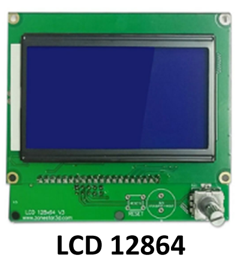
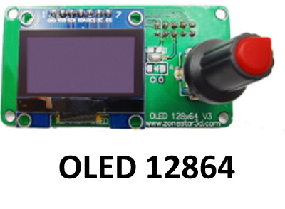
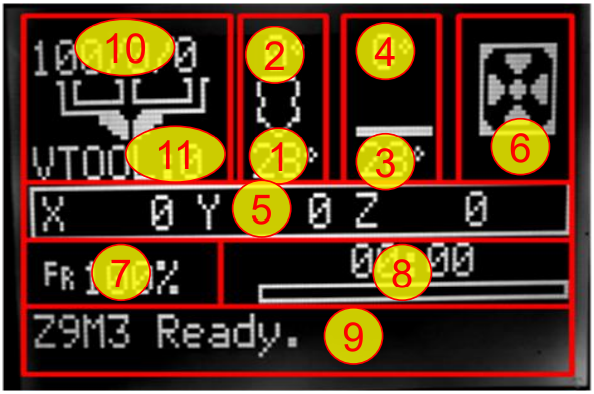

### Choose Language (Translated by google)

-----
## LCD12864 (OLED12864) Menu Description
   

### Function of knob
- **Clockwise rotation**: Menu item + / Value +
- **Counterclockwise rotation**: Menu item - / Value -
- **Push (click)**: Open Menu / Enter

### Menu Desciption
#### 1. status menu

| No. |   Description            | No. |        Description       | No. |          Description     | No. |       Description        |
|-----|--------------------------|-----|--------------------------|-----|--------------------------|-----|--------------------------|
|  1  |Current hotend temperature|  2  |Setting hotend temperature|  3  |Current hotbed temperature|  4  |Setting hotbed temperature|
|  5  |Current X/Y/Z position    |  6  |Extrude fan speed         |  7  |Multiple of print speed   |  8  |SD card print progress    |
|  9  |Status message            |  10 |mix rate of extruders     |  11 |Current VTool / Mix Mode  |     |                          |

