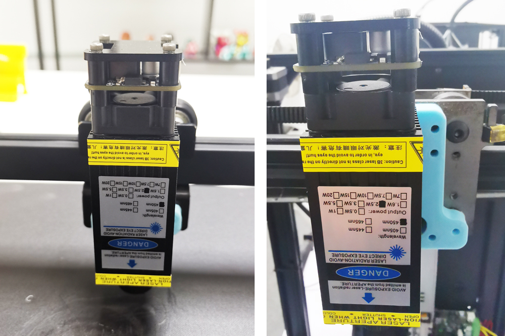

## Installation and Wiring
### :one: Install the bracket to the laser engine
For Z9V5Pro, please install the bracket to the left side, for other printer, please install it to the center.     

### :two: Install the laser engine with bracket to the X carrier of the printer
For Z9V5Pro, please install the bracket to the left side, for other printer, please install it to the center.     

### :three: Connect the laser engine to the controller board using the 3PIN cable.
:warning:Be careful not to invert the 2 ends of the wire (please refer to the color and terminal identification of the wire in the following picture).  
      
    

