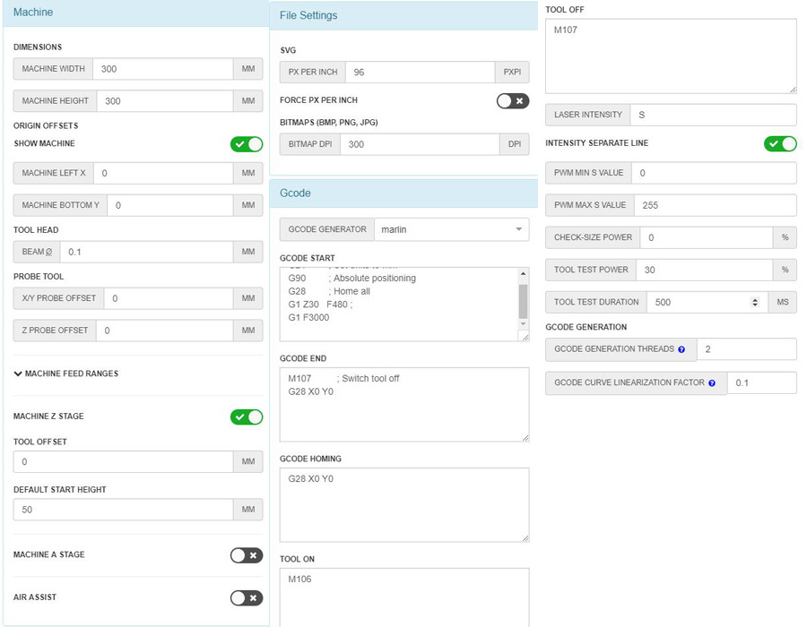
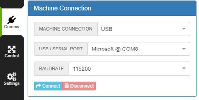
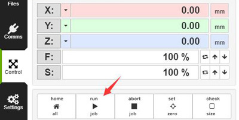

## LaserWeb 4 User Guide
**[:movie_camera: Video Tutorial](https://youtu.be/LmfofeiB5UU)**
### Step:one:: Download and install LaserWeb 4
Click [:arrow_down:**here**](https://github.com/ZONESTAR3D/LaserWeb4-Binaries) to download LaserWeb4 software and install it to your PC, for description, please refer the [**wiki page**](https://github.com/LaserWeb/LaserWeb4/wiki) of LaserWeb4. 
### Step:two:: Settings of LaserWeb 4 

#### Gcode
>
    Start G-code 
    G21           ; Set units to mm
    G90           ; Absolute positioning
    G28           ; Home all
    G1 Z30 F480   ; Move laser engine to 30mm height
    G1 F3000      ; set default movement speed

    END G-code 
    M107            ; Switch tool off
    G28 X0 Y0       ; Home X Y

    GCODE HOMING
    G28 X0 Y0       ; Home X Y

    TOOL ON
    M106

    TOOL OFF
    M107

### Step:three:: Load image and generate gcode
- 1. load a picture to be engraved.
- 2. Set the engraving size and move the picture to the position.
- 3. Drage the picture to "Gcode" window
- 4. Set "Cut rate", "Laser Diameter" parameters etc.
- 5. Generate the gcode.
### Step:four:: Turn on the 3d printer and then connect 3D Printer to PC by USB cable
1. Turn on 3d printer
2. Turn on "laser" setting on LCD MENU. "Control>>Configre>>Laser"
3. Connect the 3d printer to PC by USB cable
4. Set "USB serial port" and BAUDRATE = 115200 and then click "Connect" button.      
  
### Step:five:: Start engraving
1. Turn on power of the laser (push the button on the top Laser engine).
2. Ware the glasses.
3. Clik "Run" button on Laserweb to start engraving     
