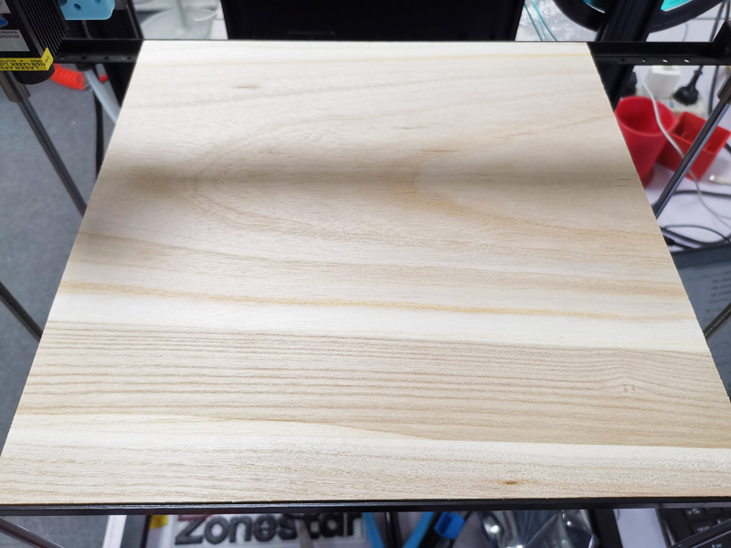
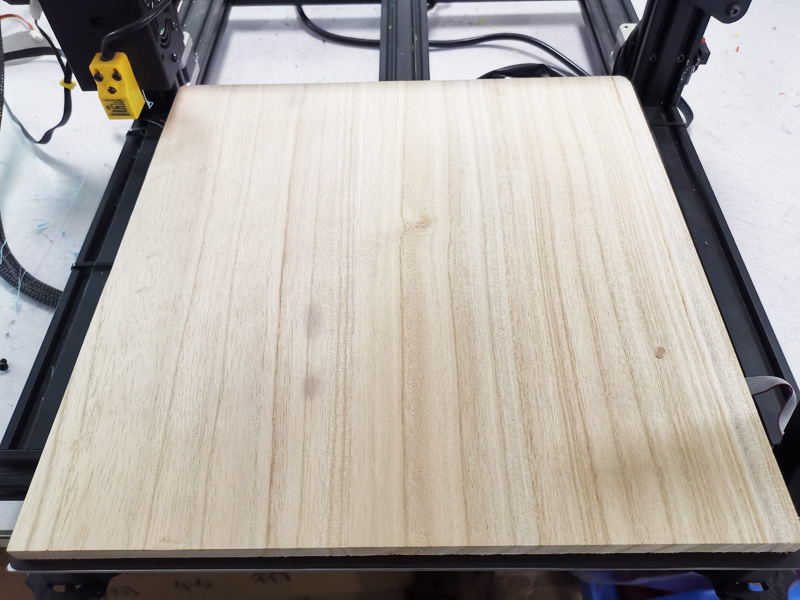

# Laser Engine Installation and Engraving Operation Guide

## :warning:ATTENTION PLEASE

### :warning:DONOT turn on the power of the 3D printer and laser engine before installing the laser and completing the wiring, 

### :warning:DONOT turn on the laser power without wearing glasses.

### :warning:DONOT use the laser without personnel monitoring.

### :warning:DONOT use the laser without a fire extinguisher nearby.

### :warning:It is recommended to equipe an exhaust fan because it may generate smoke and dust when engraving.

-----
## [Installation & Wiring](./Installation/readme.md)

- :book: Refer to [**this guide**](./Installation/readme.md) to install the laser engine to the printer.
  - :arrow_down:[**Click here**](./Installation/lkbr_V2.zip) to download the bracket stl and gcode file if need.
- :book: Connect the laser engine wire to the control board and laser engine.

-----
## Prepare

### :one: Protect the hot bed
Put a wood board (thickness >= 5mm) or a ceramic tile to the bed to prevent it from being damaged by laser light. 
- For Z9V5Pro, you can remove the hotbed and put a (300mmx300mm) wood board to the bracket of the hot bed.

- For Z8, you can put a (300mmx300mm) wood board to the bracket of the hot bed.

### :two: Turn on the laser engine feature
:warning: If you can't find this MENU on your LCD screen, please upgrade the firmware of your 3d printer.
1. Turn on 3d printer.
2. Turn on "laser" setting on LCD MENU. "Control>>Configre>>Laser".
### :three: Adjust the focal of the laser engine
Follow the steps below to adjust the focal length of the laser, to operate using the LCD menu:   
1. Set the fan speed to 0. ***Prepare>>Temperature>>Fan: 0***
2. Home the laser enging head. ***Prepare>>Auto Home>>Home All***
3. Move the Z axis to 50mm. ***Prepare>>Move>>Move Z: 50***
4. Move the laser engine above the carved object. ***Prepare>>Move>>Move X & Prepare>>Move>>Move Y***
5. Turn on the power supply of the laser engine.
6. Increase the fan speed slowly until you can see the laser light spot clearly. ***Prepare>>Temperaure>>Fan: xx***
7. Rotate the lens knob of the laser engine to adjust the laser light spot size to the minimum.
8. Set the fan speed to 0, and then turn off the laser power supply. ***Prepare>>Temperature>>Fan: 0***

-----
## Operation Guide
You can use LaserWeb or inkscape to genarate the gcode file and then doing engrave. 
### :+1: [:book:LaserWeb Use Guide](./LaserWeb/readme.md)
### [:book:inkscape Use Guide](./inkscape/readme.md)

