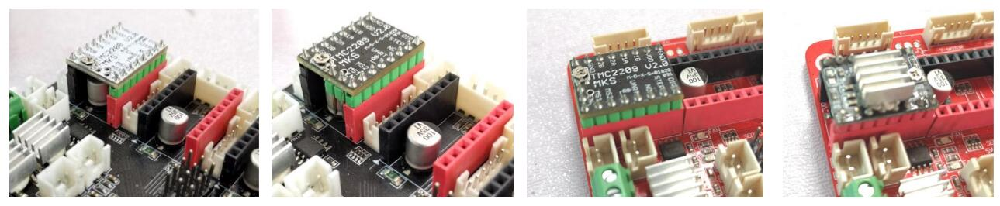
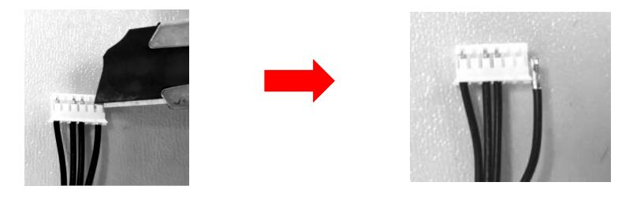
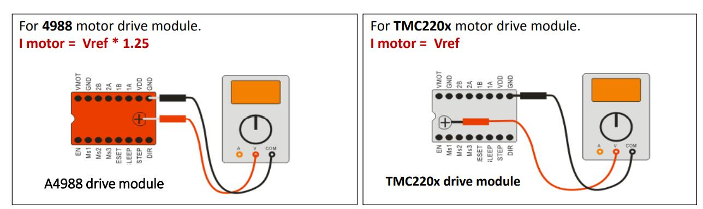

## :warning: ATTENTION PLEASE
- **Power off the control board before replacing/plugin the drive module.**
- **Pay attention to the direction when plugin, incorrect direction may burn the drivers and control board.**
- **Usually we have already set the motor drive current before shipping out, please don't tune the potentiometer if you are not sure how to adjust it.**

### How to change working direction by exchange motor wiring 
You may need to change the stepper motor working direction after replaced the motor drivers, such as replaced A4988 to TMC2208, you can upgrade the appropriate firmware to the control board or adjust the motor wiring to reserved the motor working direction.
- Simply exchange PIN1 and PIN3 of the motor cable, the stepping motor working direction will be reversed.

- TIPS: Use a knife to turn up the clip of the terminal and then pull out the wiring

### How to adjust drive current
If you want to adjust the current of the motor driver module, please measure the voltage (Vref) on the potentiometer with a multimeter.     
**:loudspeaker: NOTE**
- **Diconnected the motor wire and then supply power to the control board.**
- **For A4988 drive module, you can supply power to the control board from USB, but for TMC drive module, it must supply power to the control board from DC terminal.**

