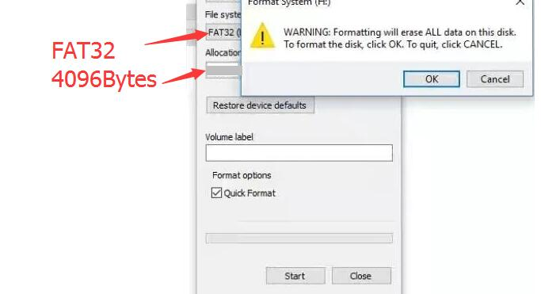
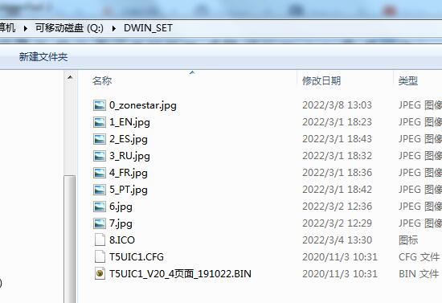
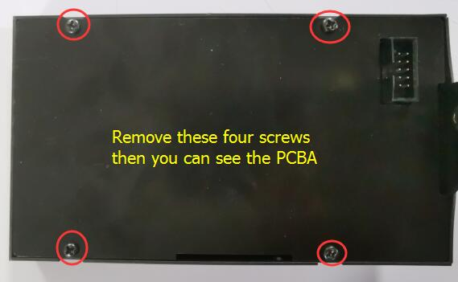
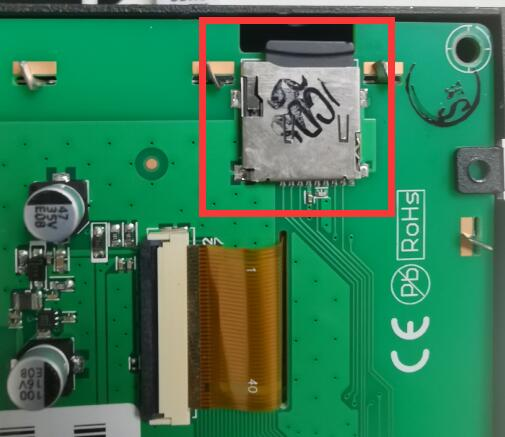
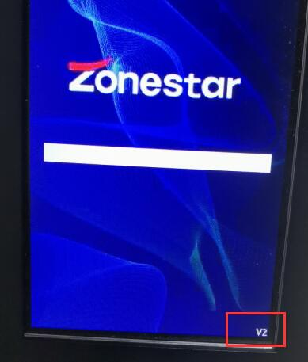

[**Download 4.3" TFT-LCD documents in one go**](https://downgit.github.io/#/home?url=https://github.com/ZONESTAR3D/Upgrade-kit-guide/tree/main/TFT-LCD/LCD-DWIN)

## Assembly
### Step 1: assemble the foot

### Step 2: install to the printer

## Wiring
### Connect to the EXP2 connector of ZM3E4
**For others control board, please refer to the wiring diagrame of the printer**

### Pin define on DWIN_LCD

	//EC11 P2 and G pins connected to GND. 
	//Pin define of EXP2 of ZM3E4
	#define BEEPER_PIN          PA15    //
	#define BTN_EN1 			PB3    	//
	#define BTN_EN2 			PB5    	//
	#define BTN_ENC 			PB4   	//
	#define LCD_TXD 			PA9   	//RXD of UART1
	#define LCD_RXD 			PA10   	//TXD of UART1

## User guide
- [***Menu description***](https://github.com/ZONESTAR3D/Upgrade-kit-guide/blob/main/TFT-LCD/LCD-DWIN/user_guide/LCD-DWIN%20MENU%20Description%20V1_2.pdf)

## Upload firmware
#### Step 1: Prepard a Micro-SD card (Size: 1~8GB), and format to FAT32 format with "Allocation units size" is 4069 bytes. 
      
##### [format SD Card on Windows](https://recoverit.wondershare.com/partition-tips/format-sd-in-windows-10.html?/topic/916-upgrade-to-pdf-to-pages/=&comment=2884&gclid=Cj0KCQiAmpyRBhC-ARIsABs2EApQAT_0jaSjNTHDKfbyTB8K-lLEt9m_hd2Ro526ZG6lerIJX3YE-7caAhXAEALw_wcB)  
##### [format SD Card on Mac OS](https://recoverit.wondershare.com//mac-tips/format-sd-card-fat32-mac.html?gclid=Cj0KCQiAmpyRBhC-ARIsABs2EAo1hhsQ62C9vIhIAKUQitkIz72xy7axY1Ylf9p7Z7-kPSLVffoWslQaAp19EALw_wcB) 
#### Step 2: Download and unzip "DWIN\_SET" to your PC, copy DWIN_SET to the root directory of SD card.
  
  

#### Step 3: Remove the screws from the back of LCD box, take down the backplate.

#### Step 4: Remove the screws that mounted the LCD screen.

#### Step 5: Insert the Micro-SD card into the socket of the LCD screen PCBA.

#### Step 6: Connect the LCD screen to the 3d printer (Power on it first), and the LCD screen will show full "BLUE" and then full "RED" about 30 seconds.

#### Step 7: Disconnect the LCD screen cable and remove the Micro-SD card.
#### Step 8: Install the screws just removed in the reverse order, Done! 
#### After upload firmware (V2 version), you can find a string "V2" on LCD SCREEN
  

## How to downlod files from Github page
#### Step 1: Click this link [**https://downgit.github.io/**](https://downgit.github.io/) 
#### Step 2: Copy the Github file or direcotry link which you want to download.
#### Step 3: Click download button and wait a few seconds, it will start to download automatically. 
   

