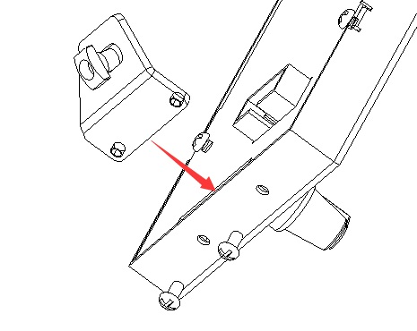

## Assembly
### Step 1: assemble the foot

### Step 2: install to the printer

## Wiring
### Connect to the EXP2 connector of ZM3E4
**For others control board, please refer to the wiring diagrame of the printer**

## User guide
- [***Menu description***](https://github.com/ZONESTAR3D/Upgrade-kit-guide/blob/main/TFT-LCD/LCD-DWIN/user_guide/LCD-DWIN%20MENU%20Description%20V1_2.pdf)

