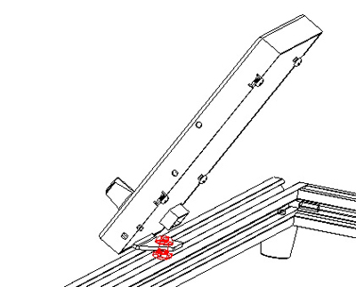

[**Download 4.3" TFT-LCD documents in one go**](https://downgit.github.io/#/home?url=https://github.com/ZONESTAR3D/Upgrade-kit-guide/tree/main/TFT-LCD/LCD-DWIN)   
[**:star2:How to downlod files from Github page**](https://github.com/ZONESTAR3D/Document-and-User-Guide#how-to-downlod-files-from-github-page)

## Assembly
### Step 1: assemble the foot

### Step 2: install to the printer

## Wiring
### Connect to the EXP2 connector of ZM3E4
**For others control board, please refer to the wiring diagrame of the printer**

### Pin define on DWIN_LCD

	//EC11 P2 and G pins connected to GND. 
	//Pin define of EXP2 of ZM3E4
	#define BEEPER_PIN    PA15    //
	#define BTN_EN1 			PB3    	//
	#define BTN_EN2 			PB5    	//
	#define BTN_ENC 			PB4   	//
	#define LCD_TXD 			PA9   	//RXD of UART1
	#define LCD_RXD 			PA10   	//TXD of UART1

## User guide
- :green_book: [***Menu description V3***](./user_guide/LCD-DWIN%20MENU%20Description%20V3.pdf)
- :green_book: [***Menu description V2***](./user_guide/LCD-DWIN%20MENU%20Description%20V2.pdf)
- :green_book: [***Menu description V1***](./user_guide/LCD%20DWIN%20MENU%20Description%20V1_2.pdf)

## Upload firmware
#### Step :one: : Prepard a Micro-SD card (Size: 1~8GB), and format to FAT32 format with "Allocation units size" is 4069 bytes. 
      
- :star2: [**Format SD Card on Windows**](https://recoverit.wondershare.com/partition-tips/format-sd-in-windows-10.html?/topic/916-upgrade-to-pdf-to-pages/=&comment=2884&gclid=Cj0KCQiAmpyRBhC-ARIsABs2EApQAT_0jaSjNTHDKfbyTB8K-lLEt9m_hd2Ro526ZG6lerIJX3YE-7caAhXAEALw_wcB)    
- :star2: [**Format SD Card on Mac OS**](https://recoverit.wondershare.com//mac-tips/format-sd-card-fat32-mac.html?gclid=Cj0KCQiAmpyRBhC-ARIsABs2EAo1hhsQ62C9vIhIAKUQitkIz72xy7axY1Ylf9p7Z7-kPSLVffoWslQaAp19EALw_wcB)

 
#### Step :two: : Download and unzip the zip file to your PC, copy DWIN\_SET to the root directory of SD card.  
- :arrow_down: [**Click here and then click "download" button to download DWIN-LCD MENU V3 files**](./V3/DWIN_MENU_V3.zip).   

  

#### Step :three: : Remove the screws from the back of LCD box, take down the backplate.

#### Step :four: : Remove the screws that mounted the LCD screen.

#### Step :five: : Insert the Micro-SD card into the socket of the LCD screen PCBA.

#### Step :six: : Connect the LCD screen to the 3d printer (Power on it first), and the LCD screen will show a "BLUE" screen and then a "RED" screen about 20~30 seconds later.

#### Step :seven: : Disconnect the LCD screen cable and remove the Micro-SD card.
#### Step :eight: : Install the screws just removed in the reverse order, Done! 
#### :checkered_flag: After upload firmware, you can find a string "Vx" on the right-bottom corner of LCD SCREEN when power on.
  

