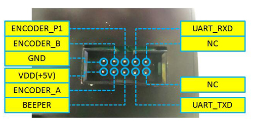
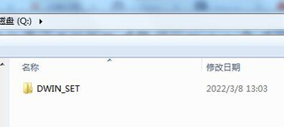

### :globe_with_meridians: Choose Language (Translated by google)

-----
[:arrow_down: **Download 4.3" TFT-LCD documents in one go**](https://downgit.github.io/#/home?url=https://github.com/ZONESTAR3D/Upgrade-kit-guide/tree/main/TFT-LCD/LCD-DWIN)   

-----
## Contents
- [**User guide**](#wiring)
- [**Assembly**](#assembly)
- [**Wiring**](#wiring)
- [**Update**](#update-image-data-of-dwin-lcd)

-----
## User guide
[***LCD Menu description***](./user_guide/readme.md)

-----
## Assembly
### Assemble the foot >> Install to the printer
  

## Wiring
### Connect to the EXP2 connector of ZM3E4
    
**For others control board, please refer to the wiring diagrame of the printer**   
### Pin define on DWIN_LCD
  
>
	//EC11 P2 and G pins connected to GND. 
	//Pin define of EXP2 of ZM3E4
	#define BEEPER_PIN    PA15    //
	#define BTN_EN1 			PB3    	//
	#define BTN_EN2 			PB5    	//
	#define BTN_ENC 			PB4   	//
	#define LCD_TXD 			PA9   	//RXD of UART1
	#define LCD_RXD 			PA10   	//TXD of UART1

-----
## Update image data of DWIN LCD
DWIN LCD is an independent HMI (Human Machine Interface) module, it has its own memory to store the image data of UI. When a 3D printer updates new functions, it may need to rely on upgrading the UI in the LCD.     
This chapter describes how to update the image data of DWIN LCD.
#### Step :one:: Prepard a Micro-SD card (Size: 1~8GB), and format to FAT32 format with 4069 bytes/cluster (allocation units size). 
      

-----
**:warning:ATTETION PLEASE:warning:**      
**The SD card must be formatted as required (both FAT32 format and 4069 bytes/cluster), otherwise the upgrade cannot succeed.**     
:pencil: [**How to Format SD Card on Windows**][formatwin] :pencil: [**How to Format SD Card on Mac OS**][formatmacos]

-----

#### Step :two:: [:arrow_down:Download the zip file](./DWIN_SET.zip) to your PC and unzip it, copy "DWIN_SET" folder to the root directory of Micro-SD card.      
-----
**:warning:ATTETION PLEASE:warning:** 
1. You can't copy those file to the root directory, those file MUST be stored in the "DWIN_LCD" folder.
2. Floder name must be "DWIN_LCD", there is a '_'(underline) between "DWIN" and "LCD", not a "-"(minus sign).
3. After the file zip is extracted, there may be a "DWIN_SET" folder under the "DWIN_SET" folder. You should copy the last "DWIN_SET" folder to the Micro-SD card. In other words, it must be "x:\DWIN_SET\\{files}", but not "x:\DWIN_SET\\DWIN_SET\\{files}" in the Micro-SD card (X represents the disk symbol of your SD card), please refer to the below picture:    
       

-----

#### Step :three:: Remove the screws from the back of LCD box, take down the backplate metal sheet.

#### Step :four:: Remove the screws that mounted the LCD screen.

#### Step :five:: Insert the Micro-SD card into the socket of the PCB.

#### Step :six:: Power on the 3d printer, and then connect the LCD screen to the 3d printer, wait about 20~30 seconds until the LCD screen show a "BLUE" screen and then a "RED" screen.

#### Step :seven:: Disconnect the LCD screen cable and remove the Micro-SD card from LCD screen.

#### Step :eight:: Install the screws back. 

#### :checkered_flag: After upload firmware, you can find a string "Vx" on the right-bottom corner of LCD SCREEN when power on.

## :loudspeaker: If the upgraded is fail, check double check if you have done Step2 and Step3 according the requirement.

[formatwin]: https://recoverit.wondershare.com/partition-tips/format-sd-in-windows-10.html?/topic/916-upgrade-to-pdf-to-pages/=&comment=2884&gclid=Cj0KCQiAmpyRBhC-ARIsABs2EApQAT_0jaSjNTHDKfbyTB8K-lLEt9m_hd2Ro526ZG6lerIJX3YE-7caAhXAEALw_wcB
[formatmacos]: https://recoverit.wondershare.com/partition-tips/format-sd-in-windows-10.html?/topic/916-upgrade-to-pdf-to-pages/=&comment=2884&gclid=Cj0KCQiAmpyRBhC-ARIsABs2EApQAT_0jaSjNTHDKfbyTB8K-lLEt9m_hd2Ro526ZG6lerIJX3YE-7caAhXAEALw_wcB
