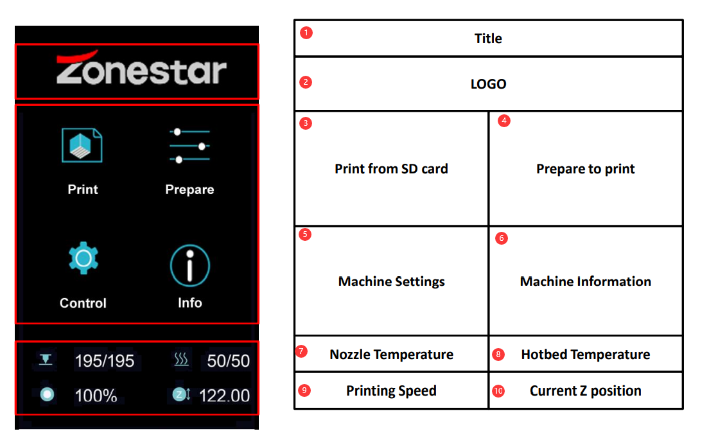
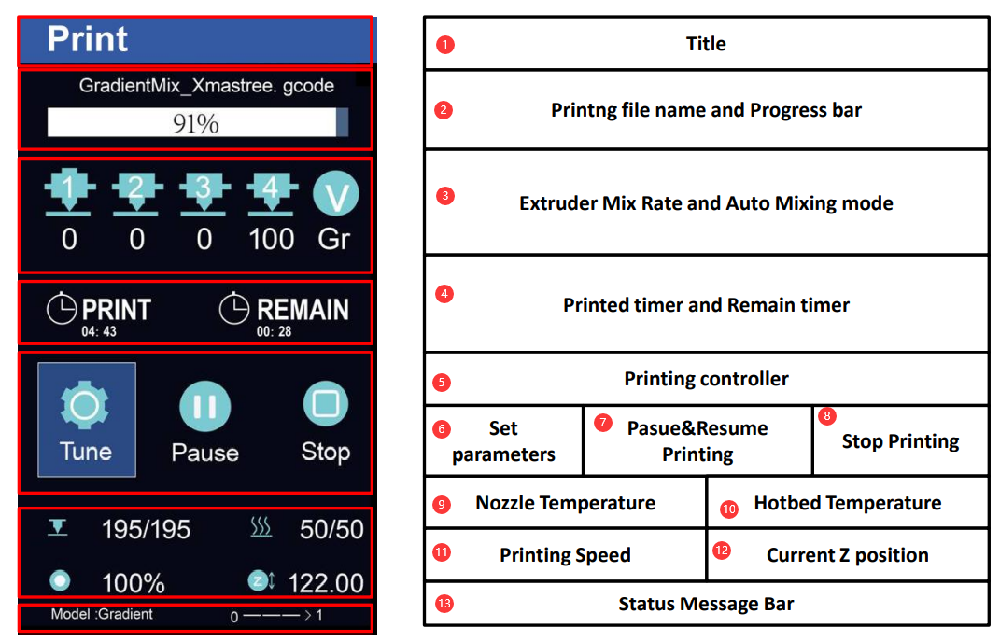
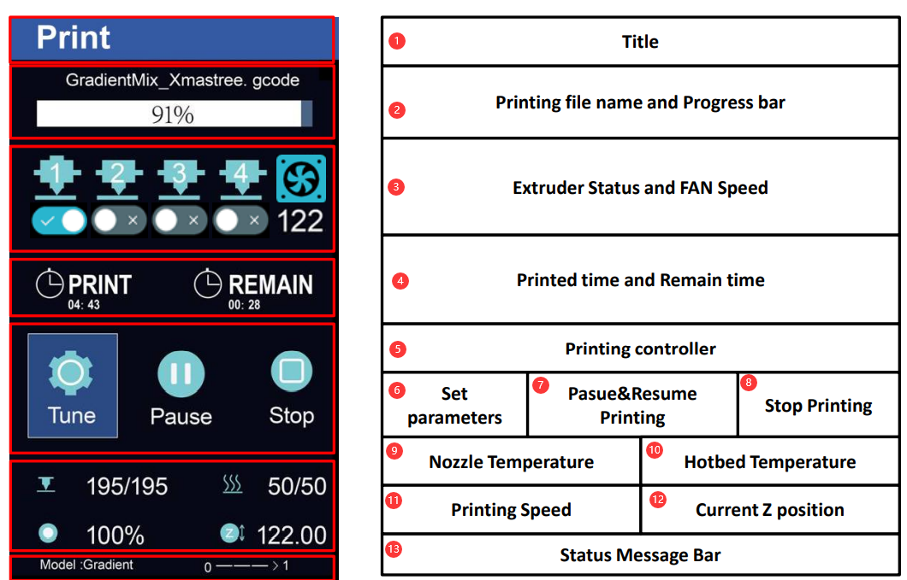

### :globe_with_meridians: Choose Language (Translated by google)

-----
# DWIN LCD Menu Description (MENU V3)
## Main Menu

| No.|         Name             | No.|              Name        | No.|              Name        | No.|              Name        |
|----|--------------------------|----|--------------------------|----|--------------------------|----|--------------------------|
| 1  |        Title             | 2  |  LOGO                    | 3  |  Print from SD card      | 4  |  Prepare to print        |  
| 5  |   Machine Settings       | 6  |  Machine Information     | 7  |  Nozzle Temperature      | 8  |  Hotbed Temperature      |
| 9  |   Printing Speed         | 10 |  Current Z position      |    |                          |    |                          |

## Printing status Menu 
### When Hotend Type is “Mixing”

| No.|         Name             | No.|              Name        | No.|              Name        | No.|              Name        |
|----|--------------------------|----|--------------------------|----|--------------------------|----|--------------------------|
| 1  |        Title             | 2  |  Printing Progress bar   | 3  | Extruder Ratio/Mix Model | 4  |  Printed and Remain tim  |  
| 5  |  Printing controller     | 6  |  Set parameters          | 7  | Pasue & Resume Printing  | 8  |  Stop Printing           |
| 9  |  Nozzle Temperature      | 10 |  Hotbed Temperature      | 11 | Printing Speed           | 12 |  Current Z position      |
| 13 |  Status Message          |    |                          |    |                          |    |                          |

### When Hotend Type is “Non-mixing”

| No.|         Name             | No.|              Name        | No.|              Name        | No.|              Name        |
|----|--------------------------|----|--------------------------|----|--------------------------|----|--------------------------|
| 1  |        Title             | 2  |  Printing Progress bar   | 3  | Extruder status/FAN Speed| 4  |  Printed and Remain tim  |  
| 5  |  Printing controller     | 6  |  Set parameters          | 7  | Pasue & Resume Printing  | 8  |  Stop Printing           |
| 9  |  Nozzle Temperature      | 10 |  Hotbed Temperature      | 11 | Printing Speed           | 12 |  Current Z position      |
| 13 |  Status Message          |    |                          |    |                          |    |                          |

## Menu
### Prepare Menu
- **Prepare Menu Tree**       
~~~
Prepare
  |
  |--Auto Home--------|--HOME ALL                 HOME all axis at once     
  |                   |--HOME X                   HOME X axis               
  |                   |--HOME Y                   HOME Y axis               
  |                   |--HOME Z                   HOME Z axis               
  |
  |--Temperature------|--Nozzle Temp              Set Nozzle(hotend) Temperature                                               
  |                   |--Bed Temp                 Set Hotbed Temperature                                                       
  |                   |--Fan Speed                Set Extruder Fan Speed                                                       
  |                   |--PreHeat PLA              Set Nozzle/Hotbed temperature for PLA filament(See “Control >>Preheat PLA”)
  |                   |--PreHeat ABS              Set Nozzle/Hotbed temperature for ABS filament(See “control >>Preheat ABS”)
  |                   |--Cooldown                 Turn off Hotend and Hotbed Power at once                                     
  |
  |--Move-------------|--Move X                   MOve X axis carrier            
  |                   |--Move Y                   MOve Y axis carrier            
  |                   |--Move Z                   MOve Z axis carrier            
  |                   |--Extruder1                MOve Extruder #1               
  |                   |--Extruder2                MOve Extruder #2               
  |                   |--Extruder3                MOve Extruder #3               
  |                   |--Extruder4                MOve Extruder #4               
  |                   |--Extruder All             MOve All Extruders at once     
  |
  |--Filament---------|--Preheat nozzle           Set the nozzle temperature and preheat it                                         
  |                   |--Extruder                 Choose the extruder need to be operatived                                         
  |                   |--Slowly length            How long filament be load/unload while do “Slowly Load“ & “lowly Unload”      
  |                   |--Quickly length           How long filament be load/unload while do “Quickly Load “ & “ Quickly Unload“ 
  |                   |--Slowly Load              Load filament slowly                                                              
  |                   |--Slowly Unload            Unload filament slowly                                                            
  |                   |--Quickly Load             Load filament quickly                                                             
  |                   |--Quickly Unload           Unload filament quickly                                                           
  |                                                                                    
  |--Bed Leveling-----|--Point1                   Move nozzle to the bed corner 1 (left-front)                          
  |                   |--Point2                   Move nozzle to the bed corner 2 (right-front)                 
  |                   |--Point3                   Move nozzle to the bed corner 3 (right-back)                  
  |                   |--Point4                   Move nozzle to the bed corner 4 (right-back)                  
  |                   |--HOME All                 HOME all axis at once                                         
  |                   |--Catch Probe offset       Auto catch the probe (bed leveling sensor) Z offset           
  |                   |--Probe Z-Offset           Fine tune the probe (bed leveling sensor) Z offset manually   
  |                   |--Auto leveling            Do auto leveling measure                                      
  |
  |--Language---------|--English                  Set menu language to English          
  |                   |--Spainish                 Set menu language to Spainish         
  |                   |--Russian                  Set menu language to Russian          
  |                   |--French                   Set menu language to French           
  |                   |--Portuguese               Set menu language to Portuguese       
  |
  |--Disable Steppers                             Turn off the motors power      
  |--Power off                                    Turn off the machine       
~~~
- **Prepare Menu Description**       

| Menu 2         | Menu 3             |                             Description                                           |
|----------------|--------------------|-----------------------------------------------------------------------------------|
| Auto Home      | HOME ALL           |HOME all axis at once                                                              |
|                | HOME X             |HOME X axis                                                                        |
|                | HOME Y             |HOME Y axis                                                                        |
|                | HOME Z             |HOME Z axis                                                                        |
| Temperature    | Nozzle Temp        |Set Nozzle(hotend) Temperature                                                     |
|                | Bed Temp           |Set Hotbed Temperature                                                             |
|                | Fan Speed          |Set Extruder Fan Speed                                                             |
|                | PreHeat PLA        |Set Nozzle/Hotbed temperature for PLA filament(See “Control >>Preheat PLA”)        |
|                | PreHeat ABS        |Set Nozzle/Hotbed temperature for ABS filament(See “control >>Preheat ABS”)        |
|                | Cooldown           |Turn off Hotend and Hotbed Power at once                                           |
| Move           | Move X             |MOve X axis carrier                                                                |
|                | Move Y             |MOve Y axis carrier                                                                |
|                | Move Z             |MOve Z axis carrier                                                                |
|                | Extruder1          |MOve Extruder #1                                                                   |
|                | Extruder2          |MOve Extruder #2                                                                   |
|                | Extruder3          |MOve Extruder #3                                                                   |
|                | Extruder4          |MOve Extruder #4                                                                   |
|                | Extruder All       |MOve All Extruders at once                                                         |
| Filament       | Preheat nozzle     |Set the nozzle temperature and preheat it                                          |
|                | Extruder           |Choose the extruder need to be operatived                                          |
|                | Slowly length      |How long filament be load/unload while do “Slowly Load“ & “lowly Unload”           |
|                | Quickly length     |How long filament be load/unload while do “Quickly Load “ & “ Quickly Unload“      |
|                | Slowly Load        |Load filament slowly                                                               |
|                | Slowly Unload      |Unload filament slowly                                                             |
|                | Quickly Load       |Load filament quickly                                                              |
|                | Quickly Unload     |Unload filament quickly                                                            |
| Bed Leveling   | Point1             |Move nozzle to the bed corner 1 (left-front)                                       |
|                | Point2             |Move nozzle to the bed corner 2 (right-front)                                      |
|                | Point3             |Move nozzle to the bed corner 3 (right-back)                                       |
|                | Point4             |Move nozzle to the bed corner 4 (right-back)                                       |
|                | HOME All           |HOME all axis at once                                                              |
|                | Catch Probe offset |Auto catch the probe (bed leveling sensor) Z offset                                |
|                | Probe Z-Offset     |Fine tune the probe (bed leveling sensor) Z offset manually                        |
|                | Auto leveling      |Do auto leveling measure                                                           |
| Language       | English            |Set menu language to English                                                       |
|                | Spainish           |Set menu language to Spainish                                                      |
|                | Russian            |Set menu language to Russian                                                       |
|                | French             |Set menu language to French                                                        |
|                | Portuguese         |Set menu language to Portuguese                                                    |
|Disable Steppers|                    |Turn off the motors power                                                          |
|Power off       |                    |Turn off the machine                                                               |

### Control Menu
- **Control Menu Tree**
~~~
Control
  |
  |--Mixer*-----------|--Mix                        Set mix rates of each extruder and commit to V-TOOL
  |                   |--Gradient(ON/OFF)           Start a Gradient mix printing and set paremeters   
  |                   |--Random (ON/OFF)            Start a Random mix printing and set paremeters     
  |                   |--Current V-TOOL             Set current(working) V-TOOL                        
  |  
  | *Display only when “Control>> Configure >>Hotend type: mixing”, see “Control>>Configure
  |
  |--Configre---------|--Auto Retract               Set Auto Retraction parameters                                              
  |                   |--Runout Sensor              Turn ON/OFF filament run out detection feature                              
  |                   |--PowerLoss Recovery         Turn ON/OFF Power lost Recovery feature                                     
  |                   |--Auto Shutdown              Turn ON/OFF idel auto shut down feature                                     
  |                   |--WiFi                       Turn ON/OFF WiFi feature                                                    
  |                   |--WiFi BaudRate              Set WiFi BaudRate (Need restart printer and change the WiFi module BaudRate)
  |                   |--Hotend Type                Set Hot end types (according to your hot end type)                          
  |                   |--Extr. Sequence             Change Extruder Sequence (only work on Non-Mixing Color hotend)             
  |                   |--Home Z offset              Set the Z HOME offset                                                       
  |                   |--Auto Leveling              Turn ON/OFF bed auto leveling feature                                       
  |                   |--Active Auto Level          Active bed auto leveling correct when printing                              
  |                   |--Hotend PID                 Set the hotend PID parameters                                               
  |
  |--Motion-----------|--Feedrate                   Set printing speed limiting parameters                
  |                   |--Acceleration               Set acceleration limiting parameters      
  |                   |--Jerk                       Set Jerk parameters                       
  |                   |--Step/mm                    Set Steps/mm parameters of stepping motors
  |                                                 
  |--Preheat PLA------|--Nozzle Temp                Set nozzle temperaturewhen do “Preheat PLA” on Prepare menu  
  |                   |--Bed Temp                   Set Bed temperature when do “Preheat PLA” on Prepare menu    
  |                   |--Fan Speed                  Set FAN speed when do “Preheat PLA” on Prepare menu          
  |                   |--Store Settings             Store above settings                                           
  |
  |--Preheat ABS------|--Nozzle Temp                Set nozzle temperaturewhen do “Preheat ABS” on Prepare menu  
  |                   |--Bed Temp                   Set Bed temperature when do “Preheat ABS” on Prepare menu    
  |                   |--Fan Speed                  Set FAN speed when do “Preheat ABS” on Prepare menu          
  |                   |--Store Settings             Store above settings                                           
  |
  |--Store Settings                                 Save the settings                                                         
  |--Load Settings                                  Load the settings from NVRAM (maybe it has been changed by Gcode command) 
  |--Restore Default                                Reset NVRAM settings to the factory status                                
~~~
- **Control Menu Description**

| Menu 2           | Menu 3            |                             Description                                           |  
|------------------|-------------------|-----------------------------------------------------------------------------------|  
| Mixer*           |Mix                |Set mix rates of each extruder and commit to V-TOOL                                |  
|                  |Gradient(ON/OFF)   |Start a Gradient mix printing and set paremeters                                   |  
|                  |Random (ON/OFF)    |Start a Random mix printing and set paremeters                                     |  
|                  |Current V-TOOL     |Set current(working) V-TOOL                                                        |  
| Configre         |Auto Retract       |Set Auto Retraction parameters                                                     |  
|                  |Runout Sensor      |Turn ON/OFF filament run out detection feature                                     |  
|                  |PowerLoss Recovery |Turn ON/OFF Power lost Recovery feature                                            |  
|                  |Auto Shutdown      |Turn ON/OFF idel auto shut down feature                                            |  
|                  |WiFi               |Turn ON/OFF WiFi feature                                                           |  
|                  |WiFi BaudRate      |Set WiFi BaudRate (Need restart printer and change the WiFi module BaudRate)       |  
|                  |Hotend Type        |Set Hot end types (according to your hot end type)                                 |  
|                  |Extr. Sequence     |Change Extruder Sequence (only work on Non-Mixing Color hotend)                    |  
|                  |Home Z offset      |Set the Z HOME offset                                                              |  
|                  |Auto Leveling      |Turn ON/OFF bed auto leveling feature                                              |  
|                  |Active Auto Level  |Active bed auto leveling correct when printing                                     |  
|                  |Hotend PID         |Set the hotend PID parameters                                                      |  
| Motion           |Feedrate           |Set printing speed limiting parameters                                             |  
|                  |Acceleration       |Set acceleration limiting parameters                                               |  
|                  |Jerk               |Set Jerk parameters                                                                |  
|                  |Step/mm            |Set Steps/mm parameters of stepping motors                                         |  
| Preheat PLA      |Nozzle Temp        |Set nozzle temperaturewhen do “Preheat PLA” on Prepare menu                        |
|                  |Bed Temp           |Set Bed temperature when do “Preheat PLA” on Prepare menu                          |
|                  |Fan Speed          |Set FAN speed when do “Preheat PLA” on Prepare menu                                |
|                  |Store Settings     |Store above settings                                                               |  
| Preheat ABS      |Nozzle Temp        |Set nozzle temperaturewhen do “Preheat ABS” on Prepare menu                        |
|                  |Bed Temp           |Set Bed temperature when do “Preheat ABS” on Prepare menu                          |
|                  |Fan Speed          |Set FAN speed when do “Preheat ABS” on Prepare menu                                |
|                  |Store Settings     |Store above settings                                                               |  
| Store Settings   |                   |Save the settings                                                                  |  
| Load Settings    |                   |Load the settings from NVRAM (maybe it has been changed by Gcode command)          |  
| Restore Default  |                   |Reset NVRAM settings to the factory status                                         |  

*Display only when “Control>> Configure >>Hotend type: mixing”, see “Control>>Configure"

### Tune Menu
Tune menu only display when the machine is printing.
- **Tune Menu Tree**
~~~
Tune
  |
  |--Speed                           Set the ratio of printing speed
  |--Flow Rate                       Set the flow rate of extruder
  |--Nozzle Temp                     Set Nozzle temperature
  |--Bed Temp                        Set Bed temperature
  |--Fan Speed                       Set Extruder FAN Speed
  |--Z Offset                        Tune Z offset
  |--Mixer                           Set mixer,refer to “Control>> Mixer” Menu (only display while “Hotend type is Mixing”)
  |--Configure                       Tune ON/OFF parts of configurations features, refer to “Control>> Configure” Menu
~~~

- **Tune Menu Description**

| Menu item        |                             Description                                                |  
|------------------|----------------------------------------------------------------------------------------|  
| Speed            |Set the ratio of printing speed                                                         |
| Flow Rate        |Set the flow rate of extruder                                                           |
| Nozzle Temp      |Set Nozzle temperature                                                                  |
| Bed Temp         |Set Bed temperature                                                                     |
| Fan Speed        |Set Extruder FAN Speed                                                                  |
| Z Offset         |Tune Z offset                                                                           |
| Mixer            |Set mixer,refer to “Control>> Mixer” Menu (only display while “Hotend type is Mixing”)  |
| Configure        |Tune ON/OFF parts of configurations features, refer to “Control>> Configure” Menu       |
  
-----
## :blue_book: [How to upgrade firmware](./LCD-DWIN-Upgrade-firmware.pdf)