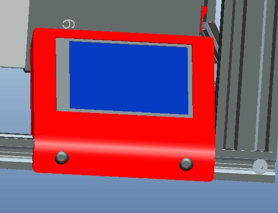

## Case stl file
The case stl files for install 3.5" TFT-LCD  screen, it included 2 stl files, one is the top and another is the bottom.  

 
## Firmware for TFT-LCD
The firmware for 3.5" TFT-LCD firmware, there ware 2 version:  
- **M3**, this one is for 3 extruders 3D printer.   
- **M4**, this one is for 4 extruders 3D printer.   
How to upload firmware, please refer to the user guide  

## User Guide
User guide for 3.5" TFT-LCD screen

## Video tutorial
Video tutorial for using and upload firmware etc. 
[Download video tutorial](https://www.jianguoyun.com/p/DVjWPUMQyoP1Bxi-954E)

## Mobile
How to control the 3.5" TFT-LCD screen with WiFi by Mobile 

