# WiFi Feature User Guide
## Connect WiFi module
- Refer to the below picture to connect the WiFi module to the control board.
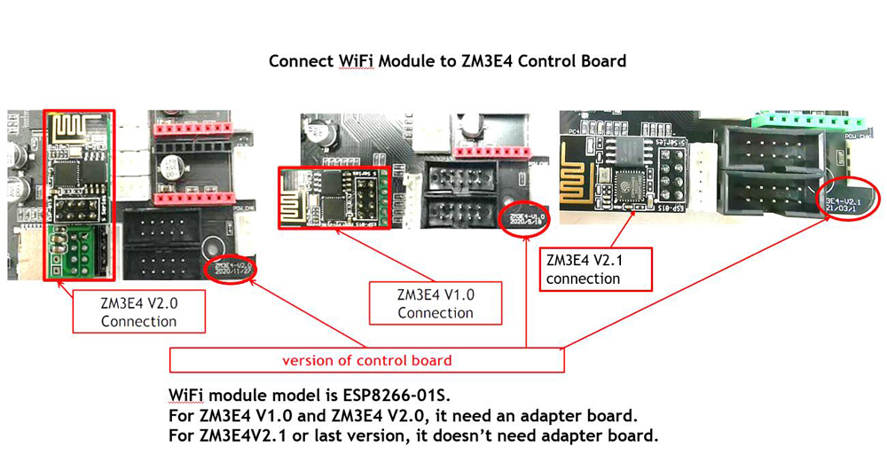  
### :warning: Please check whether the version of the WiFi module and the version of the control board are paired correctly. If the control board is v2.0 but the WiFi module is v2.1 (without adapter), the printer cannot be powered on after the WiFi module is plugged in.

## Work Mode
The WiFi module can work in two modes, namely, **Access Point (AP)** mode or **Client Station** mode.
- **Access Point (AP) mode:** The control equipment (laptop, PC, mobile phone etc.) link to 3d printer directly. In Access Point mode, the access distance between the control equipment and 3d printer should be less than 5 meters. :star:**When the WiFi module leave factory, it works in this mode.** 
- **Client Station mode:** Both the control equipment and 3d printer link to router, transfer control command by router. In Cilent Station mode, you can operate the machine within the coverage of the router.
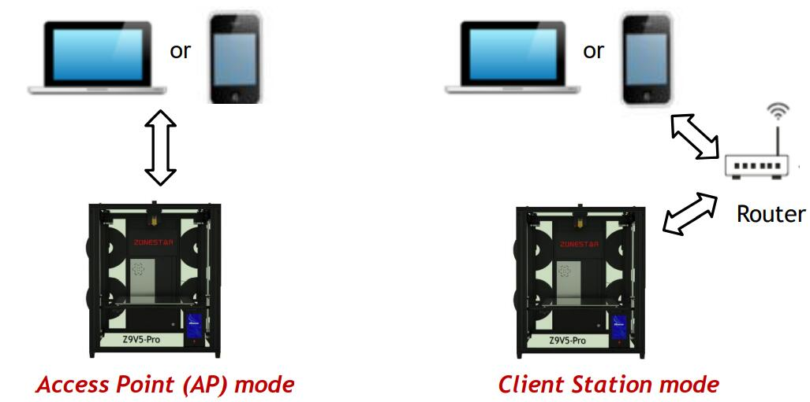

### Video tutorial

## Connet to printer by AP Mode
:warning: **You must use AP mode if you are connecting to the WiFi module for the first time.**  
:warning: **In AP mode, the distance between the printer and the control device should not exceed 5 meters.**   
1. Turn on the WiFi on LCD MENU “Control>>Configre>>WiFi”, after WiFi working, it will shows a IP address on the bottom of LCD screen “192.168.0.1”
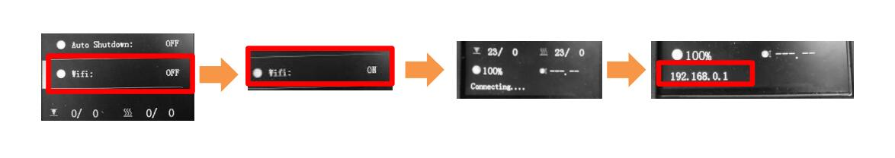
2. Find the WiFi hotspot of **"ZONESTAR3D" or "ZONESTAR3DP"** on the PC or laptop (or any other device can receive the WiFi signal) and connect to this hotspot, password is 12345678.  
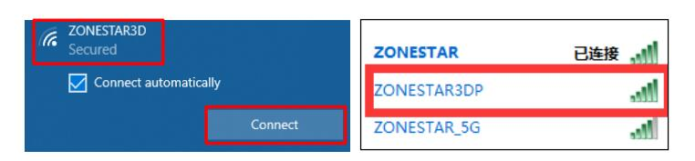
3. Input IP address 192.168.0.1 in the web explorer and press "Enter" or "search", the web explorer will show the ESP3D console page.  
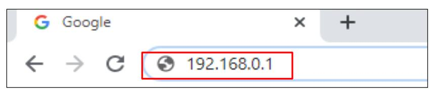  
:star2: If a newer version of firmware is installed on your machine (Z9V5Pro and Z8PM4), a QR-code will be displayed on the LCD screen after the WiFi module is turned on successfully. If you use a mobile phone to control the 3D printer, you can directly scan the QR-code with the browser instead of typing "192.168.0.1"     
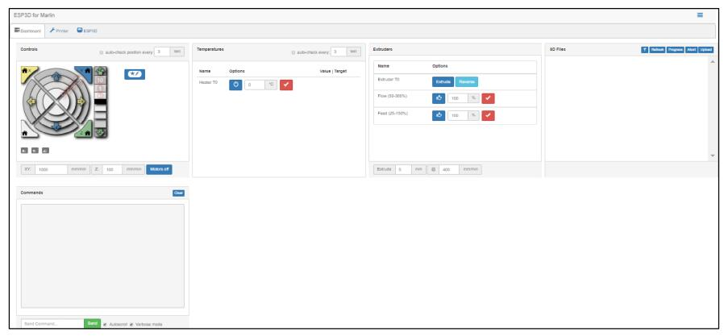  
4. You can control the 3d printer by ESP3D console page. For details, please refer to [ESP3D WebUI](https://github.com/luc-github/ESP3D-WEBUI)

## Switch to Client Station Mode from AP Mode
In the AP mode, your computer (mobile) is directly connected to the hotspot of the 3D printer, so you cannot access the internet through WiFi. If you have a wireless router and use WiFi to access the internet, you can switch to Client Station mode.
1. Refer to the following picture to set on **ESP3D console page**. 
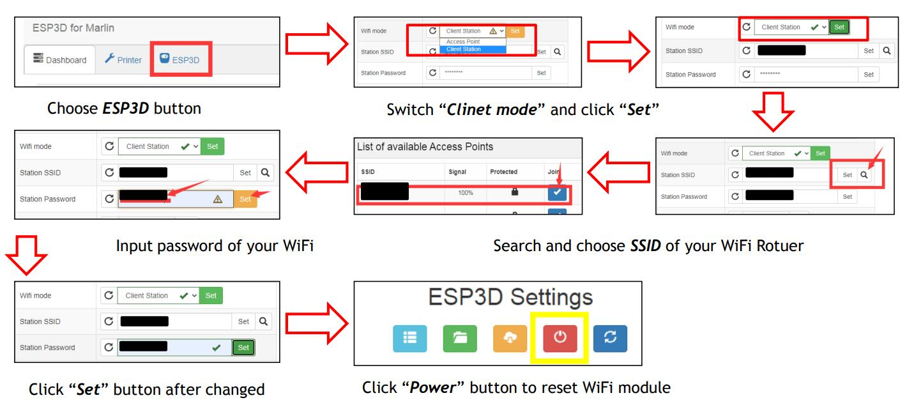    
**Station SSID      :**  the SSID of your WiFi hotspot.  
**Station Password  :**  the password of of WiFi hotspot.  
2. After reset the WiFi module, wait about 15 ~ 20 seconds, you can see the IP address on LCD screen as below.  
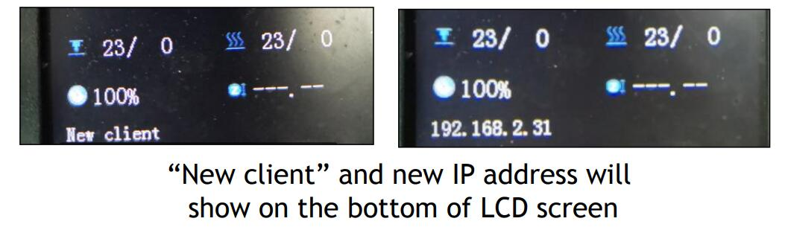  
3. Chaneg the WiFi hotspot to the SSID of your Rotuer on your PC or mobile phone.  
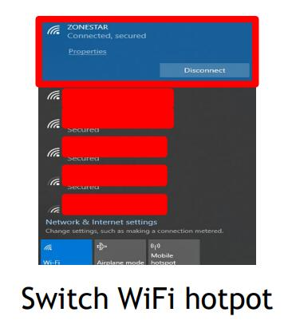  
4. Input the new IP address of your printer on the web explorer, the web explorer will show the ESP3D console page.      
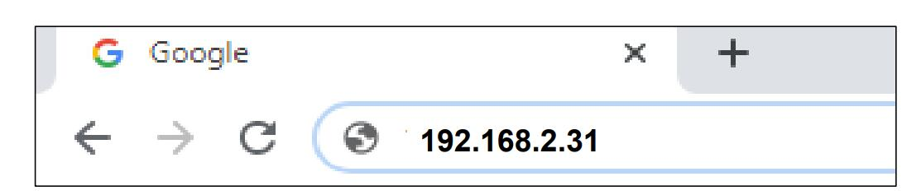  
:star2: If a newer version of firmware is installed on your machine (Z9V5Pro and Z8PM4), a QR-code will be displayed on the LCD screen after the WiFi module is reset successfully. If you use a mobile phone to control the 3D printer, you can directly scan the QR-code with the browser instead of typing the IP address.  

5. You can control the 3d printer by ESP3D console page. For details, please refer to [ESP3D WebUI](https://github.com/luc-github/ESP3D-WEBUI)

## Work on Client Station Mode
1. After switched to the client station mode, the WiFi module will save the SSID and password automatically. You only need to enter the IP address on web browser to access and control your 3D printer. 
2. The IP address of the 3D printer may be changed while the 3d printer is turned on. Please pay attention to the message on the LCD after the 3D printer is turned on.
3. If you forget or are not sure about the current IP address of the 3d printer, just need to turn off and then turn on WiFi feature on LCD screen and then find it on the LCD screen.

## Set WiFi Baud Rate
:warning: Upload gcode file to SD card via WiFi is slow, we suggest you copy the file directly if the gcode file is over 1M.  
You can improve the file uploading speed by modifying the baud rate of communication.   
:warning: You must set the same baud rate in the LCD display menu and ESP3D console page, otherwise you will not be able to control the 3D printer via WiFi.  
- **Step 1:** set the WiFi BaudRate on ESP3D console page and reset the WiFi module.
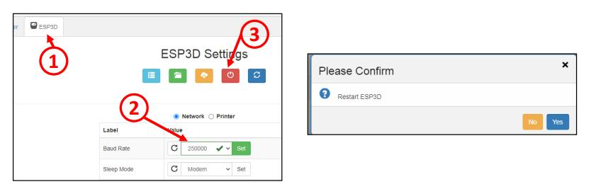
- **Step 2:** set the WiFi BaudRate on LCD menu.
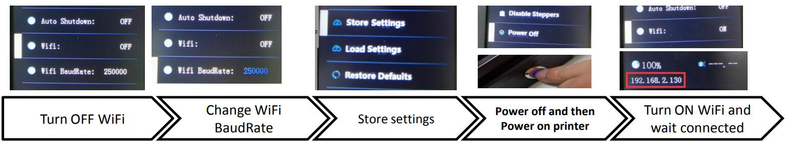

## WebUI User Guide
The webUI of WiFi is base on ESP3D WebUI, for the detail user guide, please refer to [**ESP3D-WEBUI**](https://github.com/luc-github/ESP3D-WEBUI).

-----
### :orange_book: About Wiring of WiFi Module
#### Wiring For ZM3E4 Control board
- **For ZM3E4 V2.1 or newer board**: its WiFi connector are compatible with the ESP8266_01S WiFi module , you can plug the ESP8266_01S to the connector directly.    
- **For ZM3E4 V1/V2.0 board**: their WiFi connector are **not compatible** with the ESP8266_01S WiFi module, so we added a adapter board to the WiFi module, so you can purchase [**:gift:the ESP8266 WiFi module with adapter board**](https://www.aliexpress.com/item/1005002378551489.html) from our store.    
If you have a EPS8266_01S WiFi module without adapter, you can connect it to the ZM3E4V1/ZM3E4V2 with 6 PIN DuPont Wire (as below picture) to connect EPS8266_01S WiFi module with ZM3E4V1/ZM3E4V2.     
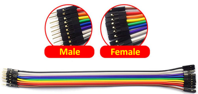
#### Pin define of ESP8266-S01 
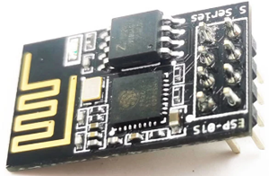 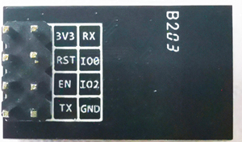
#### WiFi connector Pin define of the ZM3E4V1
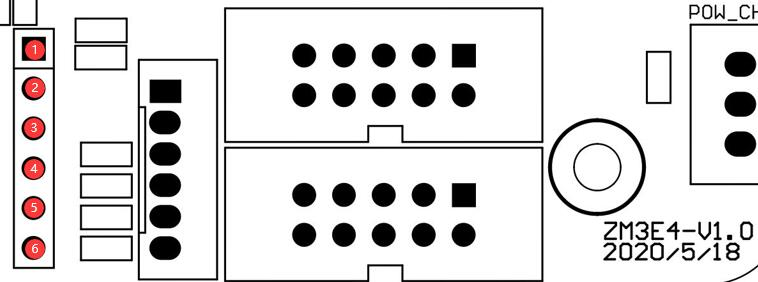
#### WiFi connector Pin define of the ZM3E4V2.0
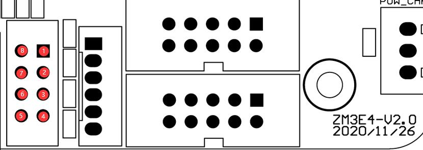
#### Wiring
| pin of ESP8266  |  Description    |  pin of ZM3E4V1 |pin of ZM3E4V2.0 | 
|-----------------|-----------------|-----------------|-----------------|
|     3V3         |  Power DC+      |  Pin 1 (+3.3V)  |   Pin 5 (+3.3V) |
|     RST         |  Reset WiFi     |  Pin 5 (W_RST)  |   Pin 7 (W_RST) |
|     EN          |  Chip Enable    |  Pin 6 (W_CS)   |   Pin 6 (W_CS)  |
|     TX          |  Data Transmit  |  Pin 3 (W_RX)   |   Pin 8 (W_RX)  |
|     RX          |  Data Received  |  Pin 4 (W_TX)   |   Pin 4 (W_TX)  |
|     IO0         |  Not connect    |                 |                 |
|     IO1         |  Not connect    |                 |                 |
|     GND         |  Power DC-      |  Pin 2 (GND)    |   Pin 1 (GND)   |
#### Wiring For ZM3E2 Control board
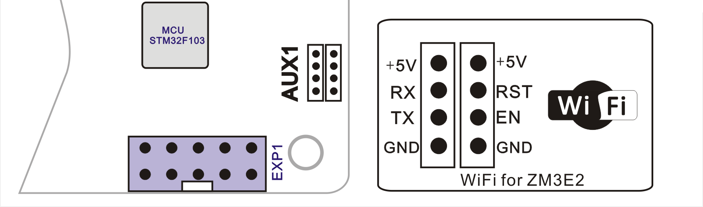

