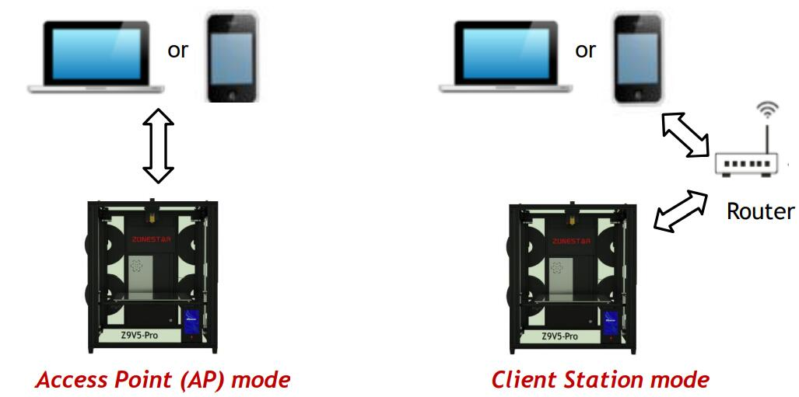
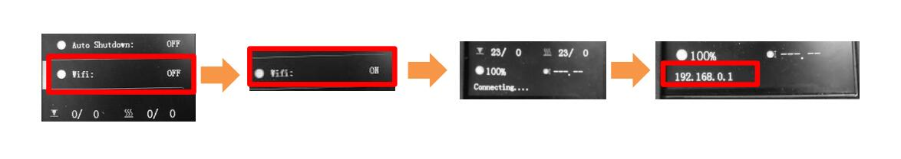
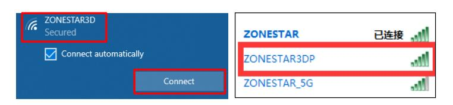
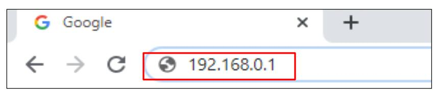
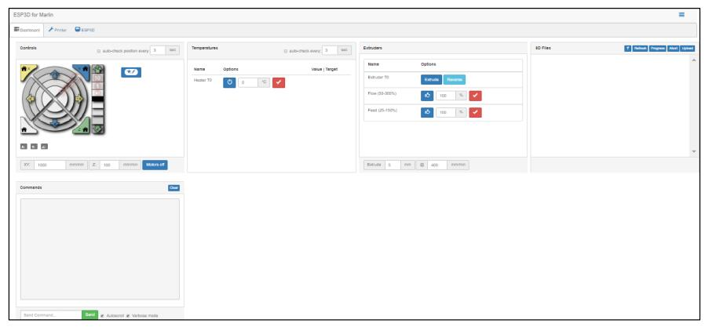
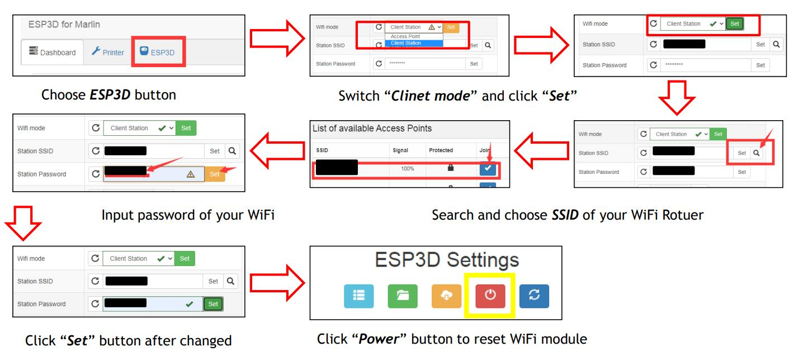
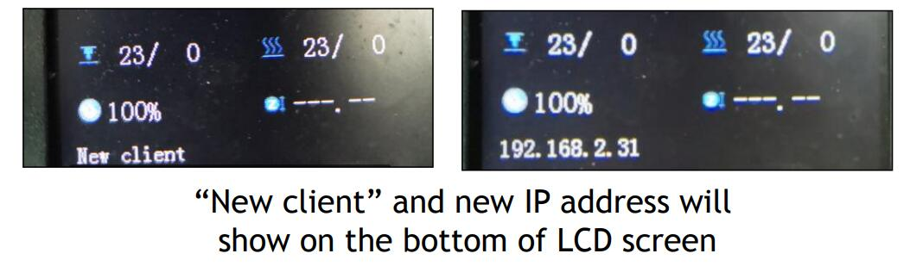
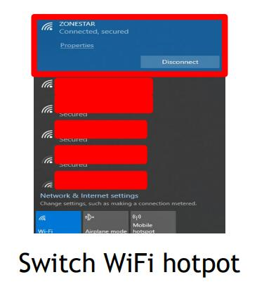
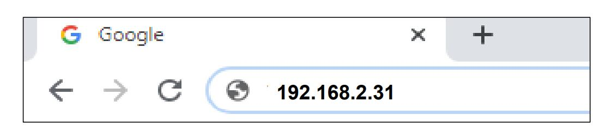

### Language / Translate

------
# WiFi Feature User Guide
## Connect WiFi module
- Refer to the below picture to connect the WiFi module to the control board.
  
### :warning: Please check whether the version of the WiFi module and the version of the control board are paired correctly. If the control board is v2.0 but the WiFi module is v2.1 (without adapter), the printer cannot be powered on after the WiFi module is plugged in.

- If your printer is Z9V5, please refer to [here](https://github.com/ZONESTAR3D/Z9/blob/main/Z9V5/Z9V5-MK2/5.%20FAQ/How%20to%20open%20the%20control%20box%20(Z9V5-MK2).jpg) to open the control box.   

## Work Mode
The WiFi module can work in two modes, namely, Access Point (AP) mode or Client Station mode.
- **Access Point (AP) mode:** The control equipment (laptop, PC, mobile phone etc.) link to 3d printer directly, ***when the WiFi module leave factory, it works in AP mode.***
- **Client Station mode:** Both the control equipment and 3d printer link to router, transfer control command by router.   
:star2: The control distance in AP mode is about 5 meters. In cilent mode, you can operate the machine within the coverage of the router.

## Connet to printer by AP Mode
:warning: **You must use AP mode if you are connecting to the WiFi module for the first time.**  
:warning: **The distance of WiFi control is less than 10 meters on AP Mode.**   
1. Turn on the WiFi on LCD MENU “Control>>Configre>>WiFi”, after WiFi working, it will shows a IP address on the bottom of LCD screen “192.168.0.1”

2. Choose the WiFi hotspot "ZONESTAR3DP" on the laptop (or any other device can receive the WiFi signal), connect it, the default password is 12345678.  

3. Input IP address 192.168.0.1 in the web explorer and press "Enter" or "search", the web explorer will show the ESP3D console page.  
  
:star2: If a newer version of firmware is installed on your machine (Z9V5Pro and Z8PM4), a QR-code will be displayed on the LCD screen after the WiFi module is turned on successfully. If you use a mobile phone to control the 3D printer, you can directly scan the QR-code with the browser instead of typing "192.168.0.1"     
  
4. You can control the 3d printer by ESP3D console page. For details, please refer to [ESP3D WebUI](https://github.com/luc-github/ESP3D-WEBUI)

## Switch to Client Station Mode from AP Mode
In the AP mode, your computer (mobile) is directly connected to the hotspot of the 3D printer, so you cannot access the internet through WiFi. If you have a wireless router and use WiFi to access the internet, you can switch to Client Station mode.
1. Refer to the following picture to set on **ESP3D console page**. 
    
**Station SSID      :**  the SSID of your WiFi hotspot.  
**Station Password  :**  the password of of WiFi hotspot.  
2. After reset the WiFi module, wait about 15 ~ 20 seconds, you can see the IP address on LCD screen as below.  
  
3. Chaneg the WiFi hotspot to the SSID of your Rotuer on your PC or mobile phone.  
  
4. Input the new IP address of your printer on the web explorer, the web explorer will show the ESP3D console page.      
  
:star2: If a newer version of firmware is installed on your machine (Z9V5Pro and Z8PM4), a QR-code will be displayed on the LCD screen after the WiFi module is reset successfully. If you use a mobile phone to control the 3D printer, you can directly scan the QR-code with the browser instead of typing the IP address.  

5. You can control the 3d printer by ESP3D console page. For details, please refer to [ESP3D WebUI](https://github.com/luc-github/ESP3D-WEBUI)

## Work on Client Station Mode
1. After switched to the client station mode, the WiFi module will save the SSID and password automatically. You only need to enter the IP address on web browser to access and control your 3D printer. 
2. The IP address of the 3D printer may be changed while the 3d printer is turned on. Please pay attention to the message on the LCD after the 3D printer is turned on.
3. If you forget or are not sure about the current IP address of the 3d printer, just need to turn off and then turn on WiFi feature on LCD screen and then find it on the LCD screen.

## Set WiFi Baud Rate
:warning: Upload gcode file to SD card via WiFi is slow, we suggest you copy the file directly if the gcode file is over 1M.  
You can improve the file uploading speed by modifying the baud rate of communication.   
:warning: You must set the same baud rate in the LCD display menu and ESP3D console page, otherwise you will not be able to control the 3D printer via WiFi.  
- **Step 1:** set the WiFi BaudRate on LCD menu.
- **Step 2:** set the WiFi BaudRate on ESP3D console page and reset the WiFi module.

