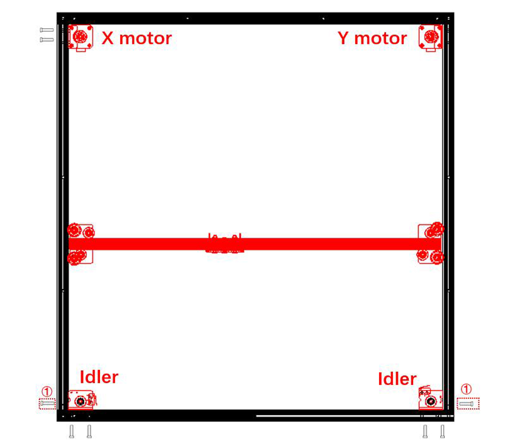
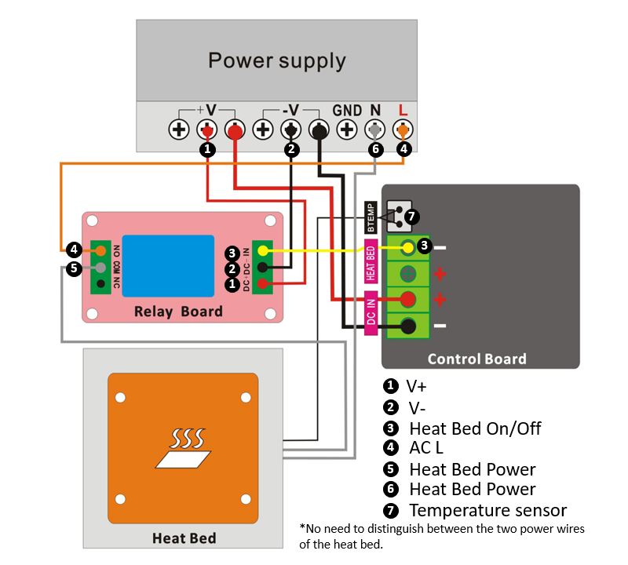

### :globe_with_meridians: Choose Language (Translated by google)

-----
# Z9V5Pro 500x500 Upgrade Kit Installation and Wiring Guide

-----
## Prepare
### 1. Print a hot end wires bracket
Before upgrading the 500x500 kit, please click [**:arrow_down:here**](./br_hecable.zip) to download stl file (a bracket be used to mount hot end cable) and then slicing and print it out by your Z9V5Pro.     

### 2. Upgrade firmware for Z9V5Pro-Max
Download and upload the firmware for upgraded to 500x500 to the control board.
- **[For Z9V5Pro-MK3/MK4/MK5, use Z9V5ProMK4Max](https://github.com/ZONESTAR3D/Firmware/tree/master/Z9/Z9V5/bin/Z9V5Pro-MK4/customized)**
- **[For Z9V5Pro-MK1/MK2, use Z9V5ProMax](https://github.com/ZONESTAR3D/Firmware/blob/master/Z9/Z9V5/bin/Z9V5Pro/customized/)**

-----
## Installation and Wiring
### 1. Disassemble the machine into modules, such as the top assembly, bottom assembly, Controller assembly, Z-carrier assemblies, etc..
### 2.Assemble the bottom profile frame according to the image below and install the rubber foot pads to the bottom profile.

### 3. Replace the X axis profile.

### 4. Assemble the top profile frame according to the image below. 
#### :warning: Note: The installation of the screws to fix the profiles are different from before. 
#### :warning: Note: Do not tighten the screws too tightly at this step.  

#### :warning: Note: There are 4 screws already installed on the Y profile, which are used to fix the Z-axis profile.

### 5. Disassemble the X & Y motor module and idlers from the profiles of the original top assembly and then install them to the frame of the new top assembly. Put the X axis assembly into the top assembly and tighten the screws to fix profiles.
    
#### :warning:Note: The two screws (labeled ① in the above picture) only exists in the latest version Z9V5Pro frame.
### 6. Open the control box, install the relay board and wiring floowing to the wiring diagram below.
### :zap:ATTETION PLEASE::zap:
- **The hot bed is worked at AC110V (220V), be careful not to damage the insulation layer when wiring.**
- **Before wiring, remove the plastic plug on the control box and let the hot bed wire pass through this hole.**
- **Please pay attention to distinguishing between the L and N wires of AC power and the NO/NC pin of the relay board.**    
    
     
### 7. Assemble all the components together, steps are basically the same as assembling a standard Z9V5Pro.
#### :warning: Note 1: Please refer to the picture below to fix Z axis profiles with top assembly.
  
#### :warning: Note 2: The hot bed bracket metal sheets and the hot bed need to be replace the new one.
#### :warning: Note 3: Install the LCD screen to the bottom-side profile of machine.
  
### 8. Install belts and add extened wire to X/Y/Z ENDSTOPs and hot end, replace the PTFE tubes of extruders. 
### 9. Install the bracket for mounting hot end cable to the top profile. 
