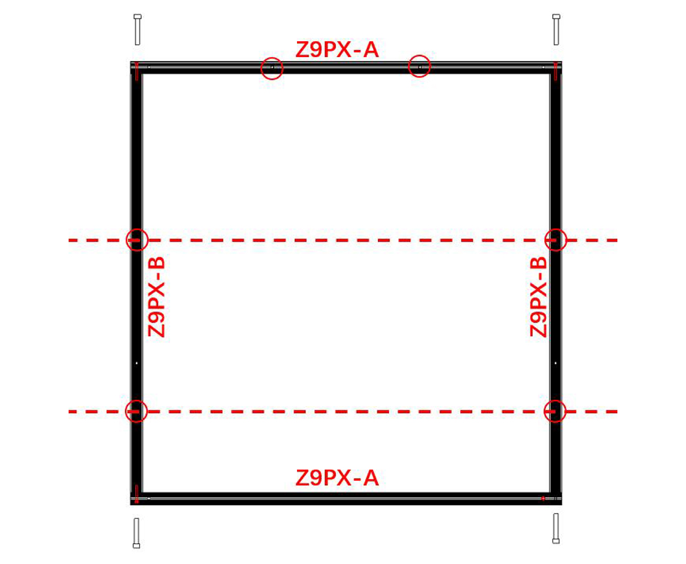

[MK1_FW]: https://github.com/ZONESTAR3D/Firmware/blob/master/Z9/Z9V5/bin/Z9V5Pro/customized/
[MK4_FW]: https://github.com/ZONESTAR3D/Firmware/tree/master/Z9/Z9V5/bin/Z9V5Pro-MK4/customized
[MK6_FW]: https://github.com/ZONESTAR3D/Firmware/tree/master/Z9/Z9V5/bin/Z9V5Pro-MK6/customized

----
### :globe_with_meridians: Choose Language

<!--  -->
<!--  -->
<!--  -->
<!--  -->
<!--  -->
<!--  -->
<!--  -->

<!--  -->
<!--  -->
<!--  -->
<!--  -->
<!--  -->
<!--  -->
<!--  -->
<!--  -->
<!--  -->

----
# <a id="en">Z9V5Pro 500x500 Upgrade Kit Installation and Wiring Guide</a>

## Parts
|Type|Specifications|Use to|QTY|
|:----:|:----:|:----:|:----:|
|Profile|Z9PX-A/2020V-700mm|Top-Front+Top-Back+Bottom-Front/Bottom-Back|4|
|Profile|Z9PX-B/2020V-680mm|Bottom-Left+Bottom-Right|2|
|Profile|Z9PX-X/2020V-656mm|X axis|1|
|Profile|Z9PX-Y/2040V-680mm|Top-Left+Top-Right|2|
|Metal Piece|	 Z9X-1-V1 hotbed bracket|	Printing platform 	|2|
|aluminum plate|	500x500x3mm	|Printing platform 	|1|
|Hotbed heater|Silicone heater/450x450mm/450W	|Printing platform 	|1|
|Hot bed sticker|	Optianal PC film or PEI|Printing platform|2|
|Hot bed screw|M4 hotbed screws and springs|	Printing platform 	|4|
|Relay Controller|	Heat bed relay control board|AC hotbed heater controller	|1|
|Timing Belt|2GT/6mm/Length:2000mm|replace the orignal timing belt	|2|
|Wire|Extruder wire of hotend	|Extension cable of hot end wiring	|1|
|Wire|Extruder wire of leveling sensor	|3PIN Extension wire for the Z ENDSTOPs	|2|
|Wire|Extruder wire of ENDSTOP	|2PIN Extension wire for the XY ENDSTOPs	|2|
|Nozzle|E3D Nozzle 0.6mm & 1.0mm	|Hotend	|2|
|PTFE Tube|	⌀4x2 PTFE tube/1.2m	|replace the orignal PTFE Tube	|4|
|Screws|M4x36, M5x10,M5x12,M5x22|to install the profiles	| |
|Screws|M3x6 poles|to install the controller	|4|
|Screww|M5x12	|to install a 3D print bracket for fixing the PTFE guide	|2|
|Nut	|M5 boart nut	|to instal a 3D print bracket for fixing the PTFE guide	|2|
|Ribbon|	4x25 ribbon| 	|10|

## Prepare
### 1. Print a hot end wires bracket
Before upgrading the 500x500 kit, please click [**:arrow_down:here**](./br_hecable.zip) to download stl file (a bracket be used to mount hot end cable) and then slicing and print it out by your Z9V5Pro.     
###### 
### 2. Upgrade firmware for Z9V5Pro-Max
Download and upload the firmware for upgraded to 500x500 to the control board.
- **[For Z9V5Pro-MK6][MK6_FW]**
- **[For Z9V5Pro-MK3/MK4/MK5][MK4_FW]**
- **[For Z9V5Pro-MK1/MK2][MK1_FW]**

## Installation and Wiring
### 1. Disassemble the machine into modules, such as the top assembly, bottom assembly, Controller assembly, Z-carrier assemblies, etc..
### 2. Assemble the bottom profile frame according to the picture below and install the rubber foot pads to the bottom profile.
###### 
### 3. Replace X axis profile and Z-axis carriers' bracket.
#### 3.1 Replace the X axis profile.
###### 
#### 3.2 Replacing the metal bracket of the Z-axis carriers.
:warning: Note: This component was newly added to products sold after November 2023, and earlier products sold did not have this accessory.
###### 
### 4. Assemble the top profile frame according to the picture below. 
#### :warning: Note: The installation of the screws to fix the profiles are different from before. 
#### :warning: Note: Do not tighten the screws too tightly at this step.  
###### 
#### :warning: Note: There are 4 screws already installed on the Y profile, which are used to fix the Z-axis profile.
###### 

### 5. Disassemble the X & Y motor module and idlers from the profiles of the original top assembly and then install them to the frame of the new top assembly. Put the X axis assembly into the top assembly and tighten the screws to fix profiles.
######     
#### :warning: Note: The two screws (labeled ① in the above picture) only exists in the latest version Z9V5Pro frame.
### 6. Open the control box, install the relay board and wiring floowing to the wiring diagram below.
### :zap: ATTENTION PLEASE: :zap:
- **The hot bed is worked at AC110V (220V), be careful not to damage the wires' insulation layer when wiring.**
- **Before wiring, remove the plastic plug on the control box and let the hot bed wire pass through this hole.**
- **Please pay attention to distinguishing between the L and N wires of AC power and the NO/NC pin of the relay board.**    
######     
######      
### 7. Assemble all the components together, steps are basically the same as assembling a standard Z9V5Pro.
#### :warning: Note 1: Please refer to the picture below to fix Z axis profiles with top assembly.
######   
#### :warning: Note 2: The hot bed bracket metal sheets and the hot bed need to be replace the new one.
#### :warning: Note 3: Install the LCD screen to the bottom-side profile of machine.
######   
### 8. Install belts and add extened wire to X/Y/Z ENDSTOPs and hot end, replace the PTFE tubes of extruders. 
### 9. Install the bracket for mounting hot end cable to the top profile. 

----
# <a id="es">Guía de instalación y cableado del kit de actualización Z9V5Pro 500x500</a>

## Partes
|Tipo|Especificaciones|Usar para|CANTIDAD|
|:----:|:----:|:----:|:----:|
|Perfil|Z9PX-A/2020V-700mm|Superior-Frontal+Superior-Posterior+Inferior-Frontal/Inferior-Posterior|4|
|Perfil|Z9PX-B/2020V-680mm|Abajo-Izquierda+Abajo-Derecha|2|
|Perfil|Z9PX-X/2020V-656mm|Eje X|1|
|Perfil|Z9PX-Y/2040V-680mm|Arriba-Izquierda+Arriba-Derecha|2|
|Pieza Metálica| Soporte de foco Z9X-1-V1| Plataforma de impresión |2|
|placa de aluminio| 500x500x3mm |Plataforma de impresión |1|
|Calentador de foco|Calentador de silicona/450x450mm/450W |Plataforma de impresión |1|
|Pegatina de cama caliente| Película de PC opcional o PEI|Plataforma de impresión|2|
|Tornillo para cama caliente|Tornillos y muelles para cama caliente M4| Plataforma de impresión |4|
|Controlador de relé| Tablero de control del relé de la cama térmica|Controlador del calentador de la cama caliente |1|
|Correa de distribución|2GT/6mm/Longitud:2000mm|reemplace la correa de distribución original |2|
|Cable|Cable de extrusión del hotend |Cable de extensión del cableado del hotend |1|
|Cable|Cable del extrusor del sensor de nivelación |Cable de extensión de 3PIN para los Z ENDSTOPs |2|
|Cable|Cable de extrusión de ENDSTOP |Cable de extensión de 2PIN para los ENDSTOP XY |2|
|Boquilla|Boquilla E3D 0,6 mm y 1,0 mm |Hotend |2|
|Tubo de PTFE| ⌀Tubo de PTFE 4x2/1,2 m |reemplace el tubo de PTFE original |4|
|Tornillos|M4x36, M5x10,M5x12,M5x22|para instalar los perfiles | |
|Tornillos|Postes M3x6|para instalar el controlador |4|
|Tornillo|M5x12 |para instalar un soporte de impresión 3D para fijar la guía de PTFE |2|
|Tuerca |Tuerca boart M5 |para instalar un soporte de impresión 3D para fijar la guía de PTFE |2|
|Cinta| Cinta 4x25| |10|

## Preparar
### 1. Imprima un soporte de cables del extremo caliente
Antes de actualizar el kit 500x500, haga clic en [**:arrow_down:aquí**](./br_hecable.zip) para descargar el archivo stl (se utiliza un soporte para montar el cable del extremo caliente) y luego córtelo e imprímalo con su Z9V5Pro. .
###### 
### 2. Actualice el firmware para Z9V5Pro-Max
Descargue y cargue el firmware para actualizar a 500x500 en el tablero de control.
- **[Para Z9V5Pro-MK6][MK6_FW]**
- **[Para Z9V5Pro-MK3/MK4/MK5][MK4_FW]**
- **[Para Z9V5Pro-MK1/MK2][MK1_FW]**

## Instalación y cableado
### 1. Desmonte la máquina en módulos, como el conjunto superior, el conjunto inferior, el conjunto del controlador, los conjuntos de soporte Z, etc.
### 2. Ensamble el marco del perfil inferior de acuerdo con la imagen a continuación e instale las almohadillas de goma para las patas en el perfil inferior.    
###### 
### 3. Reemplace el perfil del eje X y el soporte de los soportes del eje Z.
#### 3.1 Reemplazar el perfil del eje X.    
###### 
#### 3.2 Reemplazo del soporte metálico de los soportes del eje Z.
:warning: Nota: Este componente se agregó recientemente a los productos vendidos después de noviembre de 2023 y los productos vendidos anteriormente no tenían este accesorio.
###### 
### 4. Monte el marco del perfil superior según la imagen siguiente.
#### :warning: Nota: La instalación de los tornillos para fijar los perfiles es diferente a la anterior.
#### :warning: Nota: No apriete demasiado los tornillos en este paso.
###### 
#### :warning: Nota: Ya hay 4 tornillos instalados en el perfil Y, que se utilizan para fijar el perfil del eje Z.
###### 

### 5. Desmonte el módulo del motor X e Y y las ruedas guía de los perfiles del conjunto superior original y luego instálelos en el marco del nuevo conjunto superior. Coloque el conjunto del eje X en el conjunto superior y apriete los tornillos para fijar los perfiles.
###### 
#### :warning:Nota: Los dos tornillos (etiquetados ① en la imagen de arriba) solo existen en la última versión del marco Z9V5Pro.
### 6. Abra la caja de control, instale el tablero de relés y el cableado que fluye según el diagrama de cableado a continuación.
### :zap:ATENCIÓN POR FAVOR::zap:
- **La cama caliente funciona a 110 V CA (220 V), tenga cuidado de no dañar la capa aislante de los cables al realizar el cableado.**
- **Antes de realizar el cableado, retire el tapón de plástico de la caja de control y deje que el cable de la cama caliente pase por este orificio.**
- **Preste atención a distinguir entre los cables L y N de alimentación de CA y el pin NO/NC del tablero de relés.**
###### 
###### 
### 7. Ensamble todos los componentes, los pasos son básicamente los mismos que para ensamblar un Z9V5Pro estándar.
#### :warning: Nota 1: Consulte la imagen siguiente para fijar los perfiles del eje Z con el conjunto superior.
###### 
#### :warning: Nota 2: Las láminas metálicas del soporte de la cama caliente y la cama caliente deben reemplazarse por unas nuevas.
#### :warning: Nota 3: Instale la pantalla LCD en el perfil lateral inferior de la máquina.
###### 
### 8. Instale las correas y agregue cables extendidos a los ENDSTOP X/Y/Z y al extremo caliente, reemplace los tubos de PTFE de las extrusoras.
### 9. Instale el soporte para montar el cable del extremo caliente en el perfil superior.

----
# <a id="pt">Guia de instalação e fiação do kit de atualização Z9V5Pro 500x500</a>

## Peças
|Tipo|Especificações|Use para|QTY|
|:----:|:----:|:----:|:----:|
|Perfil|Z9PX-A/2020V-700mm|Superior-Frente+Superior-Traseira+Inferior-Frente/Inferior-Traseira|4|
|Perfil|Z9PX-B/2020V-680mm|Inferior Esquerda+Inferior Direita|2|
|Perfil|Z9PX-X/2020V-656mm|Eixo X|1|
|Perfil|Z9PX-Y/2040V-680mm|Topo Esquerdo+Topo Direito|2|
|Pedaço de metal| Suporte para viveiro Z9X-1-V1 | Plataforma de impressão |2|
|placa de alumínio| 500x500x3mm |Plataforma de impressão |1|
|Aquecedor de viveiro|Aquecedor de silicone/450x450mm/450W |Plataforma de impressão |1|
|Adesivo de cama quente| Filme para PC opcional ou PEI|Plataforma de impressão|2|
|Parafuso de cama quente|Parafusos e molas de cama quente M4| Plataforma de impressão |4|
|Controlador de Relé| Placa de controle de relé de cama de calor | Controlador de aquecedor AC |
|Correia dentada|2GT/6mm/Comprimento:2000mm|substitua a correia dentada original |2|
|Fio|Fio extrusor do hotend |Cabo de extensão da fiação do hotend |1|
|Fio|Fio extrusor do sensor de nivelamento |3PIN Fio de extensão para os ENDSTOPs Z |2|
|Fio|Fio extrusor do ENDSTOP |2PIN Fio de extensão para os ENDSTOPs XY |2|
|Bocal|Bocal E3D 0,6 mm e 1,0 mm |Hotend |2|
|Tubo PTFE| ⌀Tubo PTFE 4x2/1,2m | substitua o tubo PTFE original |4|
|Parafusos|M4x36, M5x10,M5x12,M5x22|para instalação dos perfis | |
|Parafusos|Postes M3x6|para instalação do controlador |4|
|Parafuso|M5x12 |para instalar um suporte de impressão 3D para fixação da guia PTFE |2|
|Porca |Porca boar M5 |para instalação de suporte de impressão 3D para fixação da guia PTFE |2|
|Fita| Fita 4x25 | |10|

## Preparar
### 1. Imprima um suporte de fios hot end
Antes de atualizar o kit 500x500, clique em [**:arrow_down:here**](./br_hecable.zip) para baixar o arquivo stl (um suporte para montar o cabo hot end) e depois fatiá-lo e imprimi-lo em seu Z9V5Pro.     
###### 
### 2. Atualização de firmware para Z9V5Pro-Max
Baixe e carregue o firmware atualizado para 500x500 para a placa de controle.
- **[Para Z9V5Pro-MK6][MK6_FW]**
- **[Para Z9V5Pro-MK3/MK4/MK5][MK4_FW]**
- **[Para Z9V5Pro-MK1/MK2][MK1_FW]**

## Instalação e fiação
### 1. Desmonte a máquina em módulos, como conjunto superior, conjunto inferior, conjunto do controlador, conjuntos de suporte Z, etc.
### 2. Monte a estrutura do perfil inferior de acordo com a imagem abaixo e instale os pés de borracha no perfil inferior.
###### 
### 3. Substitua o perfil do eixo X e o suporte dos suportes do eixo Z.
#### 3.1 Substitua o perfil do eixo X.
###### 
#### 3.2 Substituição do suporte metálico dos suportes do eixo Z.
:warning: Nota: Este componente foi adicionado recentemente aos produtos vendidos após novembro de 2023, e os produtos vendidos anteriormente não tinham este acessório.
###### 
### 4. Monte a moldura do perfil superior conforme imagem abaixo.
#### :warning: Nota: A instalação dos parafusos para fixação dos perfis é diferente de antes.
#### :warning: Nota: Não aperte os parafusos com muita força nesta etapa.
###### 
#### :warning: Nota: Existem 4 parafusos já instalados no perfil Y, que são usados ​​para fixar o perfil do eixo Z.
###### 

### 5. Desmonte o módulo do motor X e Y e as rodas-guia dos perfis do conjunto superior original e, em seguida, instale-os na estrutura do novo conjunto superior. Coloque o conjunto do eixo X no conjunto superior e aperte os parafusos para fixar os perfis.
###### 
#### :warning: Nota: Os dois parafusos (rotulados ① na imagem acima) só existem na versão mais recente do quadro Z9V5Pro.
### 6. Abra a caixa de controle, instale a placa de relé e a fiação seguindo o diagrama de fiação abaixo.
### :zap: ATENÇÃO POR FAVOR: :zap:
- **A cama quente funciona em AC110V (220V), tome cuidado para não danificar a camada de isolamento dos fios durante a fiação.**
- **Antes de fazer a fiação, remova o plugue plástico da caixa de controle e deixe o fio da cama quente passar por este orifício.**
- **Por favor, preste atenção à distinção entre os fios L e N da alimentação CA e o pino NO/NC da placa de relé.**
###### 
###### 
### 7. Monte todos os componentes juntos, as etapas são basicamente as mesmas da montagem de um Z9V5Pro padrão.
#### :warning: Nota 1: Consulte a imagem abaixo para fixar os perfis do eixo Z com montagem superior.
###### 
#### :warning: Nota 2: As chapas metálicas do suporte da cama quente e a cama quente precisam ser substituídas por novas.
#### :warning: Nota 3: Instale a tela LCD no perfil inferior da máquina.
###### 
### 8. Instale as correias e adicione fio estendido aos ENDSTOPs X/Y/Z e hot end, substitua os tubos de PTFE das extrusoras.
### 9. Instale o suporte para montagem do cabo hot end no perfil superior.

----
# <a id="fr">Guide d'installation et de câblage du kit de mise à niveau Z9V5Pro 500x500</a>

## Les pièces
|Type|Spécifications|Utiliser pour|QTÉ|
|:----:|:----:|:----:|:----:|
|Profil|Z9PX-A/2020V-700mm|Haut-avant+Haut-arrière+Bas-avant/Bas-arrière|4|
|Profil|Z9PX-B/2020V-680mm|Bas-Gauche+Bas-Droite|2|
|Profil|Z9PX-X/2020V-656mm|Axe X|1|
|Profil|Z9PX-Y/2040V-680mm|Haut-gauche+Haut-droite|2|
|Pièce métallique| Support de foyer Z9X-1-V1| Plateforme d'impression |2|
|plaque d'aluminium| 500x500x3mm |Plateforme d'impression |1|
|Chauffage foyer|Chauffage silicone/450x450mm/450W |Plateforme d'impression |1|
|Autocollant de lit chaud| Film PC optionnel ou PEI|Plateforme d'impression|2|
|Vis pour lit chauffant|Vis et ressorts pour lit chauffant M4| Plateforme d'impression |4|
|Contrôleur de relais| Carte de commande de relais de lit chauffant|Contrôleur de chauffage de lit chauffant AC |1|
|Courroie de distribution|2GT/6mm/Longueur:2000mm|remplacer la courroie de distribution d'origine |2|
|Fil|Fil d'extrudeuse de hotend |Câble d'extension du câblage de l'extrémité chaude |1|
|Fil|Fil d'extrudeuse du capteur de niveau |Fil d'extension 3PIN pour les Z ENDSTOPs |2|
|Fil|Fil d'extrudeuse de ENDSTOP |2PIN Fil d'extension pour les XY ENDSTOPs |2|
|Buse|Buse E3D 0,6 mm et 1,0 mm |Hotend |2|
|Tube PTFE| ⌀Tube PTFE 4x2/1,2 m |remplacer le tube PTFE d'origine |4|
|Vis|M4x36, M5x10,M5x12,M5x22|pour installer les profils | |
|Vis|Poteaux M3x6|pour installer le contrôleur |4|
|Vis|M5x12 |pour installer un support d'impression 3D pour la fixation du guide PTFE |2|
|Écrou |Écrou boart M5 |pour installer un support d'impression 3D pour la fixation du guide PTFE |2|
|Ruban| Ruban 4x25| |10|

## Préparer
### 1. Imprimez un support de fils chauds
Avant de mettre à niveau le kit 500x500, veuillez cliquer sur [**:arrow_down:ici**](./br_hecable.zip) pour télécharger le fichier stl (un support peut être utilisé pour monter le câble hot end), puis le découper et l'imprimer par votre Z9V5Pro. .
###### 
### 2. Mettre à niveau le micrologiciel pour Z9V5Pro-Max
Téléchargez et téléchargez le firmware pour la mise à niveau vers 500x500 sur la carte de contrôle.
- **[Pour Z9V5Pro-MK6][MK6_FW]**
- **[Pour Z9V5Pro-MK3/MK4/MK5][MK4_FW]**
- **[Pour Z9V5Pro-MK1/MK2][MK1_FW]**

## Installation et câblage
### 1. Démontez la machine en modules, tels que l'ensemble supérieur, l'ensemble inférieur, l'ensemble contrôleur, les ensembles porte-Z, etc.
### 2. Assemblez le cadre du profilé inférieur selon l'image ci-dessous et installez les patins en caoutchouc sur le profilé inférieur.
###### 
### 3. Remplacez le profil de l'axe X et le support des supports de l'axe Z.
#### 3.1 Remplacez le profil de l'axe X.
###### 
#### 3.2 Remplacement du support métallique des supports de l'axe Z.
:warning: Remarque: ce composant a été nouvellement ajouté aux produits vendus après novembre 2023, et les produits vendus précédemment ne disposaient pas de cet accessoire.
###### 
### 4. Assemblez le cadre du profil supérieur selon l'image ci-dessous.
#### :warning: Remarque: L'installation des vis pour fixer les profilés est différente d'avant.
#### :warning: Remarque: Ne serrez pas trop les vis à cette étape.
###### 
#### :warning: Remarque: Il y a 4 vis déjà installées sur le profil Y, qui servent à fixer le profil de l'axe Z.
###### 

### 5. Démontez le module moteur X & Y et les rouleaux des profils de l'ensemble supérieur d'origine, puis installez-les sur le cadre du nouvel ensemble supérieur. Placez l'ensemble de l'axe X dans l'ensemble supérieur et serrez les vis pour fixer les profils.
###### 
#### :warning: Remarque: Les deux vis (étiquetées ① dans l'image ci-dessus) n'existent que dans la dernière version du cadre Z9V5Pro.
### 6. Ouvrez le boîtier de commande, installez la carte relais et le câblage correspondant au schéma de câblage ci-dessous.
### :zap: ATTENTION S'IL VOUS PLAÎT: :zap:
- **Le lit chauffant fonctionne à 110 V CA (220 V), veillez à ne pas endommager la couche isolante des fils lors du câblage.**
- **Avant le câblage, retirez le bouchon en plastique du boîtier de commande et laissez passer le fil du lit chaud par ce trou.**
- **Veuillez faire attention à la distinction entre les fils L et N de l'alimentation secteur et la broche NO/NC de la carte relais.**
###### 
###### 
### 7. Assemblez tous les composants ensemble, les étapes sont fondamentalement les mêmes que pour l'assemblage d'un Z9V5Pro standard.
#### :warning: Remarque 1: Veuillez vous référer à l'image ci-dessous pour fixer les profils de l'axe Z avec l'assemblage supérieur.
###### 
#### :warning: Remarque 2: Les tôles du support du lit chaud et le lit chaud doivent être remplacés par les nouveaux.
#### :warning: Remarque 3: Installez l'écran LCD sur le profil inférieur de la machine.
###### 
### 8. Installez les courroies et ajoutez le fil étendu aux butées X/Y/Z et à l'extrémité chaude, remplacez les tubes PTFE des extrudeuses.
### 9. Installez le support pour monter le câble d'extrémité chaude sur le profil supérieur.

----
# <a id="de">Installations- und Verdrahtungsanleitung für das Upgrade-Kit Z9V5Pro 500x500</a>

## Teile
|Typ|Spezifikationen|Verwenden für|MENGE|
|:----:|:----:|:----:|:----:|
|Profil|Z9PX-A/2020V-700mm|Oben vorne+Oben hinten+Unten vorne/Unten hinten|4|
|Profil|Z9PX-B/2020V-680mm|Unten links+Unten rechts|2|
|Profil|Z9PX-X/2020V-656mm|X-Achse|1|
|Profil|Z9PX-Y/2040V-680mm|Oben links+Oben rechts|2|
|Metallstück| Z9X-1-V1 Heizbetthalterung| Druckplattform |2|
|Aluminiumplatte| 500 x 500 x 3 mm |Druckplattform |1|
|Heizbettheizung|Silikonheizung/450 x 450 mm/450 W |Druckplattform |1|
|Heizbettaufkleber| Optionale PC-Folie oder PEI|Druckplattform|2|
|Heizbettschraube|M4-Heizbettschrauben und -federn| Druckplattform |4|
|Relaissteuerung| Heizbettrelais-Steuerplatine|AC-Heizbettheizungssteuerung |1|
|Zahnriemen|2GT/6 mm/Länge: 2000 mm|ersetzt den originalen Zahnriemen |2|
|Kabel|Extruderkabel des Hotends |Verlängerungskabel der Hot-End-Verkabelung |1|
|Kabel|Extruderkabel des Nivellierungssensors |3-poliges Verlängerungskabel für die Z-ENDSTOPS |2|
|Kabel|Extruderkabel des ENDSTOPS |2-poliges Verlängerungskabel für die XY-ENDSTOPS |2|
|Düse|E3D-Düse 0,6 mm & 1,0 mm |Hotend |2|
|PTFE-Schlauch| ⌀4x2 PTFE-Schlauch/1,2 m |ersetzt den originalen PTFE-Schlauch |4|
|Schrauben|M4x36, M5x10, M5x12, M5x22|zur Montage der Profile | |
|Schrauben|M3x6-polig|zur Montage des Controllers |4|
|Schraube|M5x12 |zur Montage einer 3D-Druckhalterung zur Befestigung der PTFE-Führung |2|
|Mutter |M5-Bohrmutter |zur Montage einer 3D-Druckhalterung zur Befestigung der PTFE-Führung |2|
|Band| 4x25-Band| |10|

## Vorbereiten
### 1. Drucken Sie eine Halterung für Hot-End-Kabel
Bevor Sie das 500x500-Kit aktualisieren, klicken Sie bitte [**:arrow_down:hier**](./br_hecable.zip), um die STL-Datei (eine Halterung zur Montage des Hot-End-Kabels) herunterzuladen und sie dann mit Ihrem Z9V5Pro auszuschneiden und auszudrucken.
####### 
### 2. Aktualisieren Sie die Firmware für Z9V5Pro-Max
Laden Sie die Firmware für die Aktualisierung auf 500x500 herunter und laden Sie sie auf die Steuerplatine hoch.
- **[Für Z9V5Pro-MK6][MK6_FW]**
- **[Für Z9V5Pro-MK3/MK4/MK5][MK4_FW]**
- **[Für Z9V5Pro-MK1/MK2][MK1_FW]**

## Installation und Verkabelung
### 1. Zerlegen Sie die Maschine in Module wie z. B. die obere Baugruppe, die untere Baugruppe, die Controller-Baugruppe, die Z-Träger-Baugruppen usw.
### 2. Montieren Sie den unteren Profilrahmen gemäß der Abbildung unten und installieren Sie die Gummifußpolster am unteren Profil.
###### 
### 3. Ersetzen Sie das X-Achsenprofil und die Halterung des Z-Achsenträgers.
#### 3.1 Ersetzen Sie das X-Achsenprofil.
###### 
#### 3.2 Ersetzen der Metallhalterung der Z-Achsenträger.
:warning: Hinweis: Diese Komponente wurde neu zu Produkten hinzugefügt, die nach November 2023 verkauft wurden, und früher verkaufte Produkte hatten dieses Zubehör nicht.
###### 
### 4. Montieren Sie den oberen Profilrahmen gemäß dem Bild unten.
#### :warning: Hinweis: Die Installation der Schrauben zur Befestigung der Profile unterscheidet sich von zuvor.
#### :warning: Hinweis: Ziehen Sie die Schrauben in diesem Schritt nicht zu fest an.
###### 
#### :warning: Hinweis: Am Y-Profil sind bereits 4 Schrauben installiert, mit denen das Z-Achsenprofil befestigt wird.
###### 

### 5. Demontieren Sie das X- und Y-Motormodul und die Spannrollen von den Profilen der ursprünglichen oberen Baugruppe und installieren Sie sie dann am Rahmen der neuen oberen Baugruppe. Setzen Sie die X-Achsen-Baugruppe in die obere Baugruppe ein und ziehen Sie die Schrauben fest, um die Profile zu fixieren.
###### 
#### :warning: Hinweis: Die beiden Schrauben (im obigen Bild mit ① gekennzeichnet) sind nur im Rahmen der neuesten Version Z9V5Pro vorhanden.
### 6. Öffnen Sie die Steuerbox, installieren Sie die Relaisplatine und verkabeln Sie sie gemäß dem unten stehenden Schaltplan.
### :zap: ACHTUNG BITTE: :zap:
- **Das Heizbett wird mit AC110V (220V) betrieben. Achten Sie beim Verdrahten darauf, die Isolierschicht der Drähte nicht zu beschädigen.**
- **Entfernen Sie vor dem Verdrahten den Plastikstopfen an der Steuerbox und führen Sie das Heizbettkabel durch dieses Loch.**
- **Achten Sie bitte darauf, zwischen den L- und N-Drähten der Wechselstromversorgung und dem NO/NC-Pin der Relaisplatine zu unterscheiden.**
###### 
###### 
### 7. Setzen Sie alle Komponenten zusammen. Die Schritte sind grundsätzlich dieselben wie beim Zusammenbau eines Standard-Z9V5Pro.
#### :warning: Hinweis 1: Bitte beachten Sie das Bild unten, um Z-Achsenprofile mit der oberen Baugruppe zu befestigen.
###### 
#### :warning: Hinweis 2: Die Metallbleche der Heizbetthalterung und das Heizbett müssen durch neue ersetzt werden.
#### :warning: Hinweis 3: Installieren Sie den LCD-Bildschirm am unteren Profil der Maschine.
###### 
### 8. Installieren Sie Riemen und fügen Sie verlängerte Kabel zu den X/Y/Z-ENDSTOPPS und dem heißen Ende hinzu, ersetzen Sie die PTFE-Schläuche der Extruder.
### 9. Installieren Sie die Halterung zur Befestigung des heißen Endkabels am oberen Profil.

----
# <a id="it">Guida all'installazione e al cablaggio del kit di aggiornamento Z9V5Pro 500x500</a>

## Parti
|Tipo|Specifiche|Utilizzare per|QTÀ|
|:----:|:----:|:----:|:----:|
|Profilo|Z9PX-A/2020V-700mm|In alto-anteriore+In alto-posteriore+In basso-anteriore/In basso-posteriore|4|
|Profilo|Z9PX-B/2020V-680mm|In basso a sinistra+In basso a destra|2|
|Profilo|Z9PX-X/2020V-656mm|Asse X|1|
|Profilo|Z9PX-Y/2040V-680mm|In alto a sinistra+In alto a destra|2|
|Pezzo di metallo| Staffa per focolaio Z9X-1-V1| Piattaforma di stampa |2|
|piastra in alluminio| 500x500x3mm |Piattaforma di stampa |1|
|Riscaldatore del piano cottura|Riscaldatore in silicone/450x450mm/450W |Piattaforma di stampa |1|
|Adesivo per letto caldo| Pellicola PC opzionale o PEI|Piattaforma di stampa|2|
|Vite del letto caldo|Viti e molle del letto caldo M4| Piattaforma di stampa |4|
|Controller relè| Scheda di controllo relè letto riscaldato|Controller riscaldatore AC |1|
|Cinghia di distribuzione|2GT/6mm/Lunghezza:2000mm|sostituisci la cinghia di distribuzione originale |2|
|Cavo|Cavo estrusore dell'hotend |Cavo di prolunga del cablaggio dell'hotend |1|
|Cavo|Cavo estrusore del sensore di livellamento |3PIN Cavo di prolunga per gli ENDSTOP Z |2|
|Cavo|Cavo estrusore di ENDSTOP |2PIN Cavo di prolunga per ENDSTOP XY |2|
|Ugello|Ugello E3D 0,6 mm e 1,0 mm |Hotend |2|
|Tubo in PTFE| ⌀Tubo in PTFE 4x2/1,2 m |sostituisce il tubo in PTFE originale |4|
|Viti|M4x36, M5x10,M5x12,M5x22|per installare i profili | |
|Viti|M3x6 poli|per installare il controller |4|
|Vitew|M5x12 |per installare una staffa di stampa 3D per il fissaggio della guida in PTFE |2|
|Dado |Dado boart M5 |per installare una staffa di stampa 3D per il fissaggio della guida in PTFE |2|
|Nastro| Nastro 4x25 | |10|

## Preparati
### 1. Stampa una staffa di cavi hot-end
Prima di aggiornare il kit 500x500, fare clic su [**:arrow_down:here**](./br_hecable.zip) per scaricare il file stl (una staffa da utilizzare per montare il cavo hot end), quindi tagliarlo e stamparlo con la Z9V5Pro .
###### 
### 2. Aggiorna il firmware per Z9V5Pro-Max
Scaricare e caricare il firmware per l'aggiornamento a 500x500 sulla scheda di controllo.
- **[Per Z9V5Pro-MK6][MK6_FW]**
- **[Per Z9V5Pro-MK3/MK4/MK5][MK4_FW]**
- **[Per Z9V5Pro-MK1/MK2][MK1_FW]**

## Installazione e cablaggio
### 1. Smontare la macchina in moduli, come il gruppo superiore, il gruppo inferiore, il gruppo controller, i gruppi supporto Z, ecc.
### 2. Assemblare il telaio del profilo inferiore secondo l'immagine seguente e installare i piedini in gomma sul profilo inferiore.
###### 
### 3. Sostituire il profilo dell'asse X e la staffa dei supporti dell'asse Z.
#### 3.1 Sostituire il profilo dell'asse X.
###### 
#### 3.2 Sostituzione della staffa metallica dei supporti dell'asse Z.
:warning: Nota: questo componente è stato aggiunto di recente ai prodotti venduti dopo novembre 2023 e i prodotti venduti in precedenza non avevano questo accessorio.
###### 
### 4. Assemblare il telaio del profilo superiore secondo l'immagine seguente.
#### :warning: Nota: l'installazione delle viti per fissare i profili è diversa da prima.
#### :warning: Nota: non stringere troppo le viti in questa fase.
###### 
#### :warning: Nota: sul profilo Y sono già installate 4 viti, che vengono utilizzate per fissare il profilo dell'asse Z.
###### 

### 5. Smontare il modulo motore X e Y e le rotelle dai profili del gruppo superiore originale e quindi installarli sul telaio del nuovo gruppo superiore. Posiziona il gruppo dell'asse X nel gruppo superiore e stringi le viti per fissare i profili.
###### 
#### :warning: Nota: le due viti (etichettate ① nell'immagine sopra) esistono solo nell'ultima versione del telaio Z9V5Pro.
### 6. Aprire la scatola di controllo, installare la scheda relè e il cablaggio seguendo lo schema elettrico riportato di seguito.
### :zap: ATTENZIONE: :zap:
- **Il letto caldo funziona a AC110V (220V), fare attenzione a non danneggiare lo strato isolante dei cavi durante il cablaggio.**
- **Prima del cablaggio, rimuovere il tappo di plastica sulla scatola di controllo e lasciare passare il filo del letto caldo attraverso questo foro.**
- **Prestare attenzione a distinguere tra i fili L e N dell'alimentazione CA e il pin NO/NC della scheda relè.**
###### 
###### 
### 7. Assemblare tutti i componenti insieme, i passaggi sono sostanzialmente gli stessi dell'assemblaggio di uno Z9V5Pro standard.
#### :warning: Nota 1: fare riferimento all'immagine seguente per fissare i profili dell'asse Z con il gruppo superiore.
###### 
#### :warning: Nota 2: le lamiere metalliche della staffa del letto caldo e il letto caldo devono essere sostituiti con quello nuovo.
#### :warning: Nota 3: installare lo schermo LCD sul profilo inferiore della macchina.
###### 
### 8. Installare le cinghie e aggiungere il filo prolungato agli ENDSTOP X/Y/Z e all'hot end, sostituire i tubi in PTFE degli estrusori.
### 9. Installare la staffa per montare il cavo dell'hotend sul profilo superiore.

----
# <a id="ru">Руководство по установке и подключению комплекта обновления Z9V5Pro 500x500</a>

## Детали
|Тип|Характеристики|Использовать для|КОЛИЧЕСТВО|
|:----:|:----:|:----:|:----:|
|Профиль|Z9PX-A/2020V-700мм|Верх-Спереди+Верх-Сзади+Низ-Спереди/Низ-Сзади|4|
|Профиль|Z9PX-B/2020V-680мм|Внизу слева+Внизу справа|2|
|Профиль|Z9PX-X/2020V-656мм|Ось X|1|
|Профиль|Z9PX-Y/2040V-680мм|Верхний левый+Верхний правый|2|
|Металлическая деталь| Кронштейн для парника Z9X-1-V1 | Платформа для печати |2|
|алюминиевая пластина| 500x500x3мм |Печатная платформа |1|
|Нагреватель для парника|Силиконовый нагреватель/450x450 мм/450 Вт |Печатная платформа |1|
|Наклейка с горячей кроватью| Опциональная пленка для ПК или PEI|Печатная платформа|2|
|Винт для горячего стола|Винты и пружины для горячего стола M4| Печатная платформа |4|
|Релейный контроллер| Плата управления реле нагревательного слоя | Контроллер нагревателя переменного тока | 1 |
|Ремень ГРМ|2GT/6мм/Длина:2000мм|замените оригинальный ремень ГРМ |2|
|Проволока|Проволока экструдера горячего конца |Удлинительный кабель проводки горячего конца |1|
|Провод|Провод экструдера датчика уровня |3PIN Удлинительный провод для концевых упоров Z |2|
|Проволока|Проволока для экструдера ENDSTOP |2PIN Удлинительный провод для XY ENDSTOP |2|
|Сопло|Сопло E3D 0,6 мм и 1,0 мм |Hotend |2|
|ПТФЭ трубка| ⌀4x2 трубка из ПТФЭ/1,2 м |замените оригинальную трубку из ПТФЭ |4|
|Винты|M4x36, M5x10,M5x12,M5x22|для установки профилей | |
|Винты|Полюсы M3x6|для установки контроллера |4|
|Винт|M5x12 |для установки кронштейна для 3D-печати для фиксации направляющей из ПТФЭ |2|
|Гайка |Гайка M5 |для установки кронштейна, напечатанного на 3D-принтере, для фиксации направляющей из ПТФЭ |2|
|Лента| Лента 4х25 | |10|

## Подготовить
### 1. Распечатайте кронштейн для проводов горячего конца.
Перед обновлением комплекта 500x500 нажмите [**:arrow_down:здесь**](./br_hecable.zip), чтобы загрузить stl-файл (для крепления кабеля горячего конца используется кронштейн), а затем нарежьте его и распечатайте на Z9V5Pro. .
###### 
###2. Обновить прошивку для Z9V5Pro-Max
Скачайте и залейте на плату управления прошивку для обновления до 500х500.
- **[Для Z9V5Pro-MK6][MK6_FW]**
- **[Для Z9V5Pro-MK3/MK4/MK5][MK4_FW]**
- **[Для Z9V5Pro-MK1/MK2][MK1_FW]**

## Установка и подключение
### 1. Разберите машину на модули, такие как верхняя сборка, нижняя сборка, сборка контроллера, сборки Z-каретки и т. д.
### 2. Соберите раму нижнего профиля согласно рисунку ниже и установите резиновые подкладки на нижний профиль.
###### 
### 3. Замените профиль оси X и кронштейн держателей оси Z.
#### 3.1 Заменить профиль оси X.
###### 
#### 3.2 Замена металлического кронштейна суппортов оси Z.
:warning: Примечание. Этот компонент был добавлен к продуктам, проданным после ноября 2023 г., а ранее проданные продукты не имели этого аксессуара.
###### 
### 4. Соберите каркас верхнего профиля согласно рисунку ниже.
#### :warning: Примечание. Установка винтов для крепления профилей отличается от предыдущей.
#### :warning: Примечание. На этом этапе не затягивайте винты слишком сильно.
###### 
#### :warning: Примечание. В профиле Y уже установлены 4 винта, которые используются для фиксации профиля оси Z.
###### 

### 5. Снимите модуль двигателя X и Y и натяжные ролики с профилей оригинального верхнего узла, а затем установите их на раму нового верхнего узла. Поместите блок оси X в верхний блок и затяните винты, чтобы зафиксировать профили.
###### 
#### :warning: Примечание. Два винта (обозначены ① на рисунке выше) имеются только в рамке последней версии Z9V5Pro.
### 6. Откройте блок управления, установите плату реле и проводку согласно схеме подключения ниже.
### :zap: ВНИМАНИЕ: :zap:
- **Горячий слой работает при 110 В переменного тока (220 В), будьте осторожны, чтобы не повредить изоляционный слой проводов при подключении.**
- **Перед подключением снимите пластиковую заглушку на блоке управления и пропустите провод горячего слоя через это отверстие.**
- **Обратите внимание на различие между проводами L и N питания переменного тока и контактом NO/NC на релейной плате.**
###### 
###### 
### 7. Соберите все компоненты вместе, действия в основном такие же, как и при сборке стандартного Z9V5Pro.
#### :warning: Примечание 1. См. рисунок ниже, чтобы закрепить профили оси Z с помощью верхней сборки.
###### 
#### :warning: Примечание 2. Металлические листы кронштейна горячей кровати и горячую кровать необходимо заменить на новые.
#### :warning: Примечание 3. Установите ЖК-экран в нижнюю часть машины.
###### 
### 8. Установите ремни и добавьте удлинительную проволоку к концевым упорам X/Y/Z и хот-энду, замените тефлоновые трубки экструдеров.
### 9. Установите кронштейн для крепления кабеля горячего конца к верхнему профилю.

----
# <a id="jp">Z9V5Pro 500x500 アップグレード キットのインストールと配線ガイド</a>

## 部品
|タイプ|仕様|使用先|数量|
|:----:|:----:|:----:|:----:|
|プロファイル|Z9PX-A/2020V-700mm|上部前面+上部背面+下部前面/下部背面|4|
|プロファイル|Z9PX-B/2020V-680mm|下部左+下部右|2|
|プロファイル|Z9PX-X/2020V-656mm|X 軸|1|
|プロファイル|Z9PX-Y/2040V-680mm|上部左+上部右|2|
|金属片| Z9X-1-V1 ホットベッド ブラケット|印刷プラットフォーム |2|
|アルミプレート| 500x500x3mm |印刷プラットフォーム |1|
|ホットベッドヒーター|シリコンヒーター/450x450mm/450W |印刷プラットフォーム |1|
|ホットベッドステッカー|オプショナルPCフィルムまたはPEI|印刷プラットフォーム|2|
|ホットベッドネジ|M4ホットベッドネジとスプリング|印刷プラットフォーム |4|
|リレーコントローラー|ヒートベッドリレーコントロールボード|ACホットベッドヒーターコントローラー |1|
|タイミングベルト|2GT/6mm/長さ:2000mm|元のタイミングベルトと交換|2|
|ワイヤー|ホットエンドの押し出しワイヤー|ホットエンド配線の延長ケーブル|1|
|ワイヤー|レベリングセンサーの押し出しワイヤー|Zエンドストップ用の3PIN延長ワイヤー|2|
|ワイヤー|エンドストップの押し出しワイヤー|XYエンドストップ用の2PIN延長ワイヤー|2| |ノズル|E3D ノズル 0.6mm および 1.0mm |ホットエンド |2|
|PTFE チューブ| ⌀4x2 PTFE チューブ/1.2m |元の PTFE チューブと交換 |4|
|ネジ|M4x36、M5x10、M5x12、M5x22|プロファイルの取り付け用 | |
|ネジ|M3x6 ポール|コントローラーの取り付け用 |4|
|ネジ|M5x12 |PTFE ガイドを固定するための 3D プリント ブラケットの取り付け用 |2|
|ナット|M5 ボルトナット |PTFE ガイドを固定するための 3D プリント ブラケットの取り付け用 |2|
|リボン| 4x25 リボン| |10|

## 準備
### 1. ホットエンド ワイヤ ブラケットを印刷
500x500 キットをアップグレードする前に、[**:arrow_down:here**](./br_hecable.zip) をクリックして stl ファイル (ホットエンド ケーブルを取り付けるためのブラケット) をダウンロードし、Z9V5Pro でスライスして印刷してください。
###### 
### 2. Z9V5Pro-Max のファームウェアをアップグレード
500x500 にアップグレードするためのファームウェアをダウンロードして、コントロール ボードにアップロードします。
- **[Z9V5Pro-MK6 の場合][MK6_FW]**
- **[Z9V5Pro-MK3/MK4/MK5 の場合][MK4_FW]**
- **[Z9V5Pro-MK1/MK2 の場合][MK1_FW]**

## 取り付けと配線
### 1. マシンをモジュールに分解します (上部アセンブリ、下部アセンブリ、コントローラーアセンブリ、Z キャリアアセンブリなど)。
### 2. 下の図に従って下部プロファイルフレームを組み立て、ゴム足パッドを下部プロファイルに取り付けます。
###### 
### 3. X 軸プロファイルと Z 軸キャリアのブラケットを交換します。
#### 3.1 X 軸プロファイルを交換します。
###### 
#### 3.2 Z軸キャリアの金属ブラケットを交換します。
:warning: 注: このコンポーネントは、2023年11月以降に販売された製品に新しく追加されたもので、以前に販売された製品にはこのアクセサリが付属していませんでした。
##### 
### 4. 下の図に従って、上部プロファイルフレームを組み立てます。
#### :warning: 注: プロファイルを固定するためのネジの取り付けが以前とは異なります。
#### :warning: 注: この手順では、ネジを締めすぎないでください。
###### 
#### :warning: 注: Yプロファイルには、Z軸プロファイルを固定するために使用される4本のネジがすでに取り付けられています。
###### 

### 5. 元のトップアセンブリのプロファイルから X および Y モーターモジュールとアイドラーを取り外し、新しいトップアセンブリのフレームに取り付けます。X 軸アセンブリをトップアセンブリに入れ、ネジを締めてプロファイルを固定します。
###### 
#### :warning: 注: 2 本のネジ (上の写真のラベルは ①) は、最新バージョンの Z9V5Pro フレームにのみ存在します。
### 6. コントロールボックスを開き、下の配線図に従ってリレーボードと配線を取り付けます。
### :zap: ご注意ください: :zap:
- **ホットベッドはAC110V (220V) で動作します。配線時に配線の絶縁層を損傷しないように注意してください。**
- **配線する前に、コントロールボックスのプラスチックプラグを取り外し、ホットベッドの配線をこの穴に通します。**
- **AC電源のL線とN線、およびリレーボードのNO/NCピンを区別するように注意してください。**
###### 
###### 
### 7. すべてのコンポーネントを組み立てます。手順は基本的に標準のZ9V5Proの組み立てと同じです。
#### :warning: 注1: 上部アセンブリでZ軸プロファイルを固定するには、下の図を参照してください。
###### 
#### :warning: 注 2: ホットベッド ブラケットの金属シートとホットベッドを新しいものに交換する必要があります。
#### :warning: 注 3: LCD 画面をマシンの下部プロファイルに取り付けます。
###### 
### 8. ベルトを取り付け、X/Y/Z エンドストップとホットエンドに延長ワイヤを追加し、押し出し機の PTFE チューブを交換します。
### 9. ホットエンド ケーブルを取り付けるためのブラケットを上部プロファイルに取り付けます。

----
# <a id="en">Z9V5Pro 500x500 업그레이드 키트 설치 및 배선 가이드</a>

## 부속
|유형|사양|사용 용도|수량|
|:----:|:----:|:--:|:--:|
|프로파일|Z9PX-A/2020V-700mm|상부 전면+상부 후면+하부 전면/하부 후면|4|
|프로파일|Z9PX-B/2020V-680mm|하단-왼쪽+하단-오른쪽|2|
|프로파일|Z9PX-X/2020V-656mm|X축|1|
|프로파일|Z9PX-Y/2040V-680mm|상단 왼쪽+상단 오른쪽|2|
|금속 조각| Z9X-1-V1 온상 브래킷| 인쇄 플랫폼 |2|
|알루미늄 판| 500x500x3mm |인쇄 플랫폼 |1|
|온상 히터|실리콘 히터/450x450mm/450W |인쇄 플랫폼 |1|
|뜨거운 침대 스티커| 선택적인 PC 필름 또는 PEI|인쇄 플랫폼|2|
|핫베드 나사|M4 핫베드 나사 및 스프링| 인쇄 플랫폼 |4|
|릴레이 컨트롤러| 히트베드 릴레이 제어반|AC 온상 히터 컨트롤러 |1|
|타이밍 벨트|2GT/6mm/길이:2000mm|원래 타이밍 벨트 교체 |2|
|와이어|핫엔드 압출기 와이어 |핫엔드 배선 연장 케이블 |1|
|와이어|레벨링 센서의 압출기 와이어 |3PIN Z ENDSTOP용 연장 와이어 |2|
|와이어|ENDSTOP의 압출기 와이어 |2PIN XY ENDSTOP용 연장 와이어 |2|
|노즐|E3D 노즐 0.6mm & 1.0mm |핫엔드 |2|
|PTFE 튜브| ⌀4x2 PTFE 튜브/1.2m |원래 PTFE 튜브 교체 |4|
|나사|M4x36, M5x10,M5x12,M5x22|프로파일 설치 | |
|나사|M3x6 기둥|컨트롤러 설치용 |4|
|나사|M5x12 |PTFE 가이드 고정용 3D 프린트 브래킷 설치 |2|
|너트 |M5 보드 너트 |PTFE 가이드 고정용 3D 프린트 브래킷 설치용 |2|
|리본| 4x25 리본| |10|

## 준비하다
### 1. 핫 엔드 와이어 브래킷 인쇄
500x500 키트를 업그레이드하기 전에 [**:arrow_down:here**](./br_hecable.zip)을 클릭하여 stl 파일(핫 엔드 케이블을 장착하는 데 사용되는 브래킷)을 다운로드한 다음 Z9V5Pro로 잘라서 인쇄하세요. .
###### 
### 2. Z9V5Pro-Max 펌웨어 업그레이드
500x500으로 업그레이드하기 위한 펌웨어를 다운로드하여 제어 보드에 업로드합니다.
- **[Z9V5Pro-MK6의 경우][MK6_FW]**
- **[Z9V5Pro-MK3/MK4/MK5의 경우][MK4_FW]**
- **[Z9V5Pro-MK1/MK2의 경우][MK1_FW]**

## 설치 및 배선
### 1. 기계를 상단 어셈블리, 하단 어셈블리, 컨트롤러 어셈블리, Z-캐리어 어셈블리 등의 모듈로 분해합니다.
### 2. 아래 그림에 따라 바텀 프로파일 프레임을 조립하고 바텀 프로파일에 고무 풋 패드를 설치합니다.
###### 
### 3. X축 프로파일과 Z축 캐리어 브래킷을 교체합니다.
#### 3.1 X축 프로필을 교체합니다.
###### 
#### 3.2 Z축 캐리어의 금속 브래킷 교체.
:warning: 참고: 이 구성요소는 2023년 11월 이후 판매된 제품에 새로 추가되었으며, 이전에 판매된 제품에는 이 액세서리가 없었습니다.
###### 
### 4. 아래 그림과 같이 탑 프로파일 프레임을 조립하세요.
#### :warning: 참고: 프로파일을 고정하기 위한 나사 설치가 이전과 다릅니다.
#### :warning: 참고: 이 단계에서 나사를 너무 세게 조이지 마십시오.
###### 
#### :warning: 참고: Y 프로파일에는 Z축 프로파일을 고정하는 데 사용되는 4개의 나사가 이미 설치되어 있습니다.
###### 

### 5. 원래 상단 어셈블리의 프로파일에서 X & Y 모터 모듈과 아이들러를 분해한 다음 새 상단 어셈블리의 프레임에 설치합니다. X축 어셈블리를 상단 어셈블리에 넣고 나사를 조여 프로파일을 고정합니다.
###### 
#### :warning: 참고: 두 개의 나사(위 그림에서 ①으로 표시됨)는 최신 버전의 Z9V5Pro 프레임에만 있습니다.
### 6. 컨트롤 박스를 열고 아래 배선도에 따라 릴레이 보드와 배선을 설치합니다.
### :zap: 주의하세요: :zap:
- **핫베드는 AC110V(220V)로 작동되므로 배선시 전선의 절연층이 손상되지 않도록 주의하세요.**
- **배선 전 컨트롤 박스의 플라스틱 플러그를 제거하고 핫베드 와이어가 이 구멍을 통과하도록 하세요.**
- **AC 전원의 L선과 N선과 릴레이 보드의 NO/NC 핀을 구분하는 데 주의하세요.**
###### 
###### 
### 7. 모든 구성 요소를 함께 조립합니다. 단계는 기본적으로 표준 Z9V5Pro를 조립하는 것과 동일합니다.
#### :warning: 참고 1: 상단 어셈블리로 Z축 프로파일을 수정하려면 아래 그림을 참조하십시오.
###### 
#### :warning: 참고 2: 핫베드 브래킷 금속 시트와 핫베드는 새 것으로 교체해야 합니다.
#### :warning: 참고 3: LCD 화면을 기계의 하단 프로파일에 설치하십시오.
###### 
### 8. 벨트를 설치하고 X/Y/Z ENDSTOP 및 핫 엔드에 연장된 와이어를 추가하고 압출기의 PTFE 튜브를 교체합니다.
### 9. 핫 엔드 케이블을 상단 프로파일에 장착하기 위한 브래킷을 설치합니다.

