## Z9V5 Enclosure Assembly Guide

-----
## Parts List
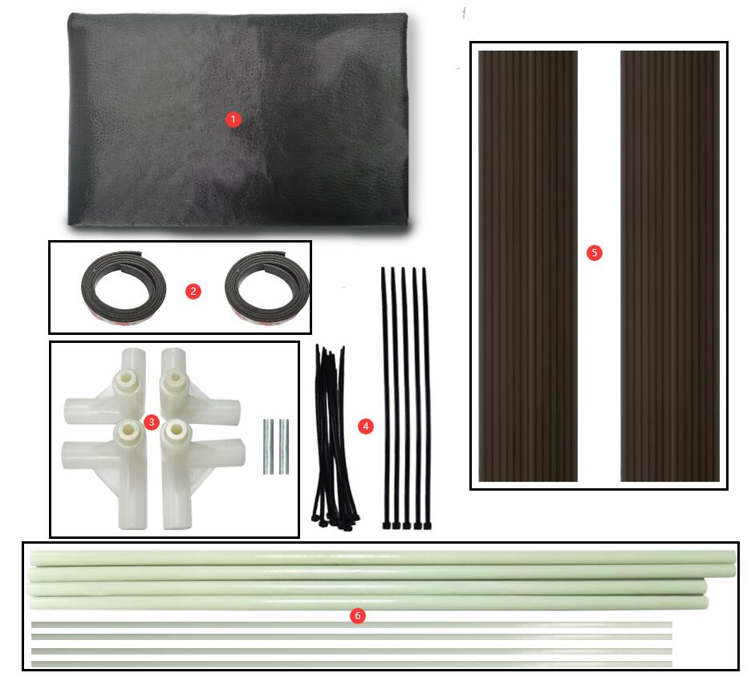
1. Cloth cover 
2. Rubber Magnetic Stripe  
3. Skeleton Connector 
4. Cable Tie 
5. PC plate  
6. Fibre rods

-----
## Assembly Steps
1. Remove the top frame of Z9V5Pro and insert the "PC plate" into the groove of the profile on side of the control assembly, and then install the top frame back.
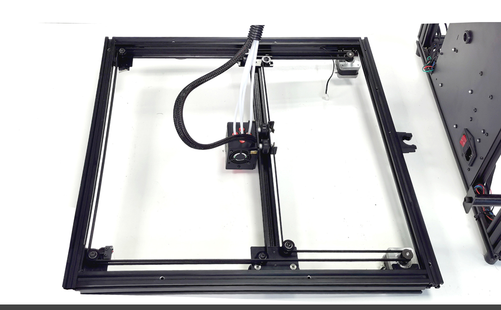
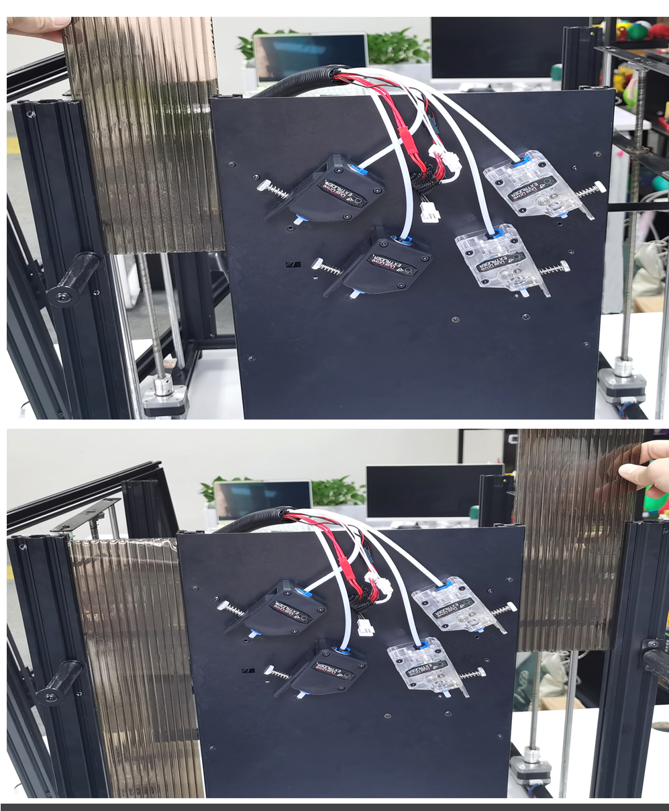

2. Assemble the skeleton according to the below picture and fix it on the front/rear profile of the top frame.
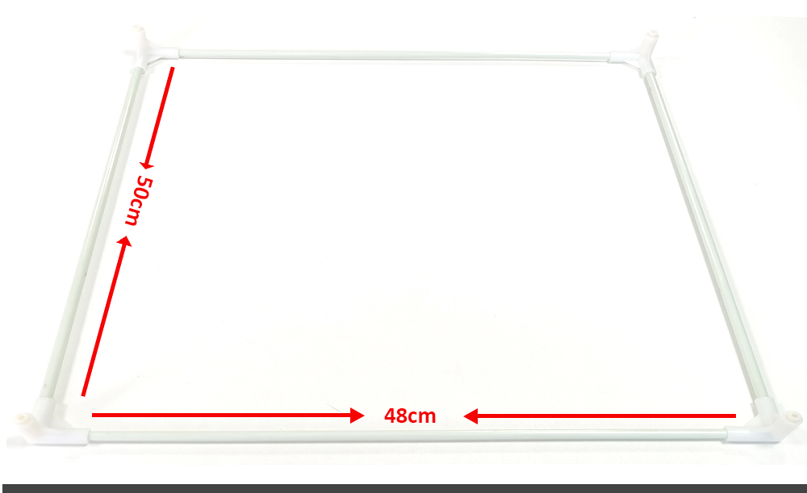
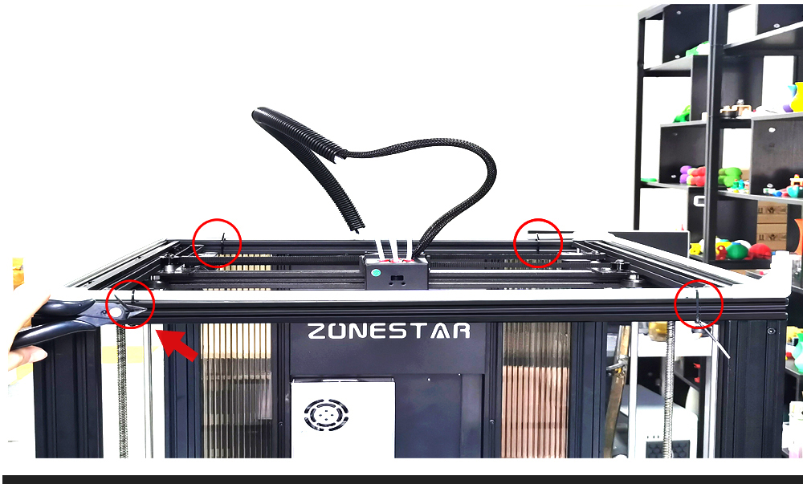

3. Turn the cloth cover over, insert two 4mm diameter fiber rods into the cloth grooves on both sides of the top of the cloth sleeve until they protrude from the small holes on the top. Then, insert the ends of the two protruding fiber rods into the metal connectors to connect them. Do it at the other side by the same steps.
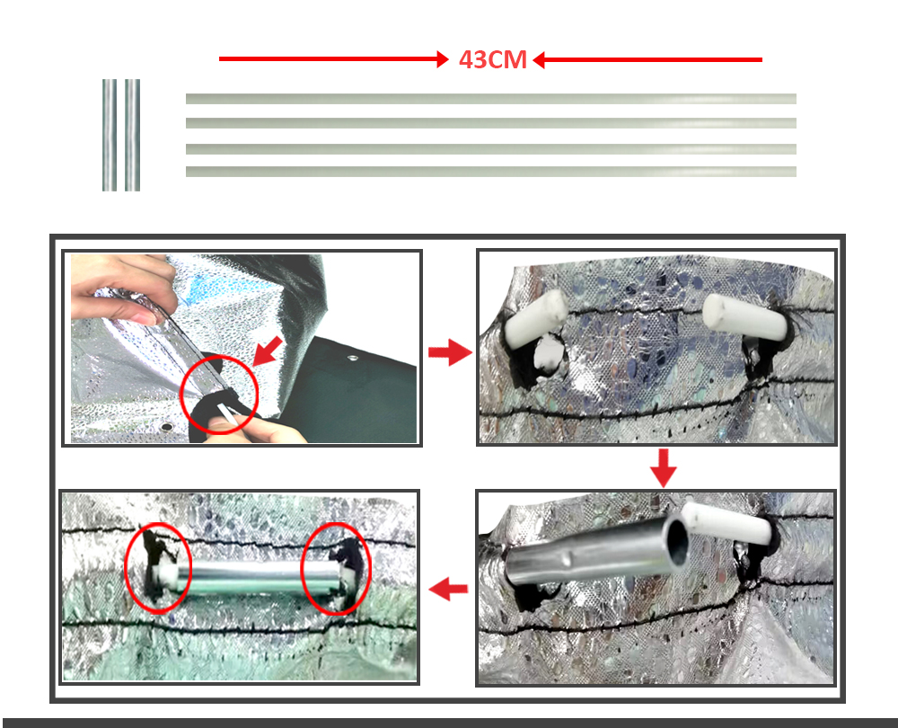

4. Turn the cloth cover over, flatten the top so that the two fiber rods extend the same length as before. Then insert the top of the fiber rod into the connectors fixed to the top frame of the machine.
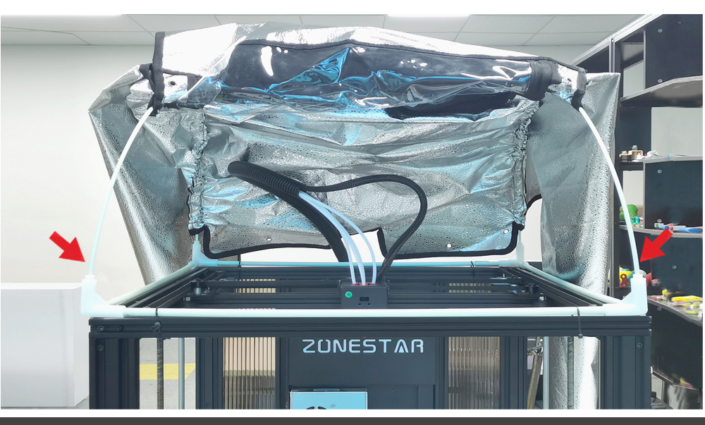

5. Fix the cloth cover on the frame of machine by the cable ties.
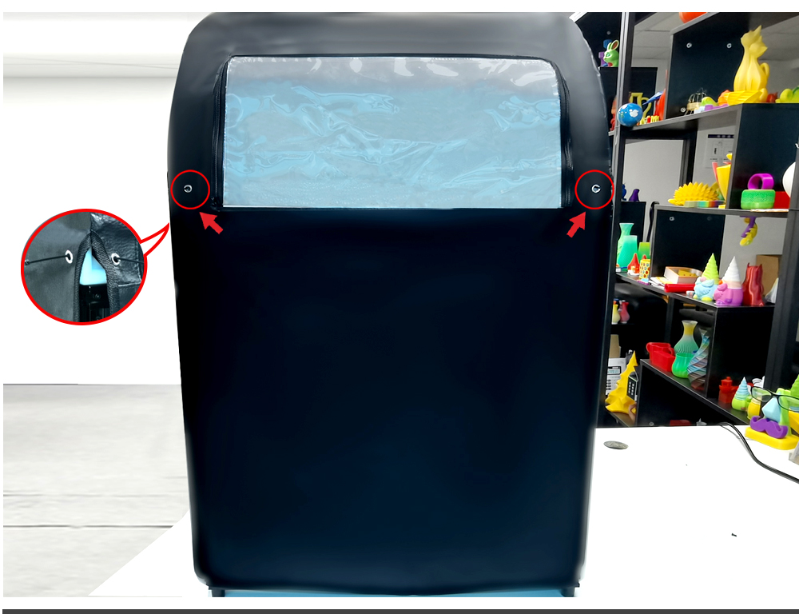
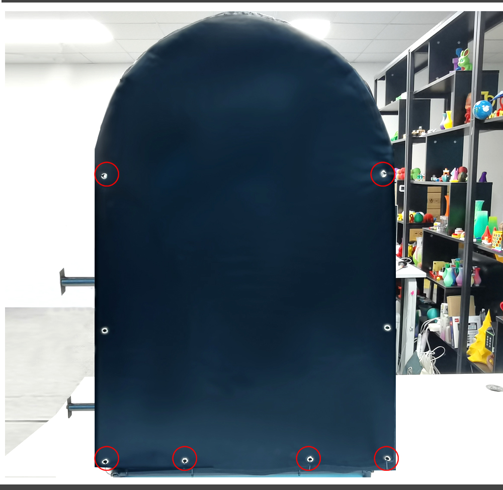

6. Pasted the rubber magnetic stripe on the front Z profiles.
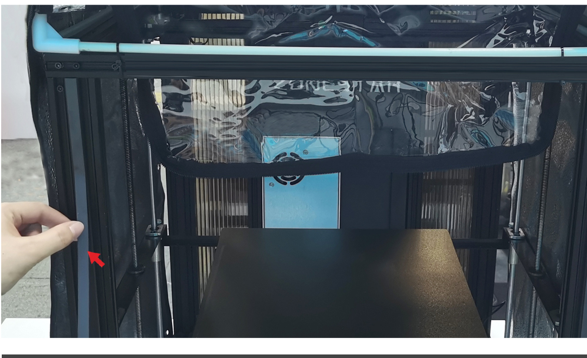
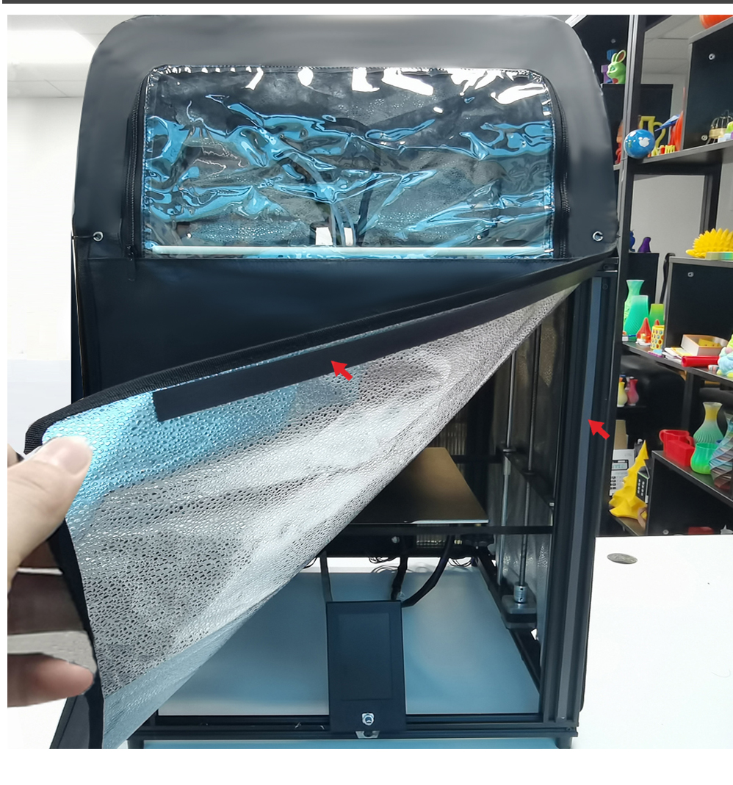

