### :globe_with_meridians: Choose Language (Translated by google)

-----
# Z9V5 Linear Rail Upgrade Kit Installation Guide
### :warning: ATTENTION PLEASE :warning:
Do not slide the slider out of the linear rail, otherwise the balls will slide out of the slider and damage the slider.     
### [:clapper:Video Tutorial]()

-----
## Parts
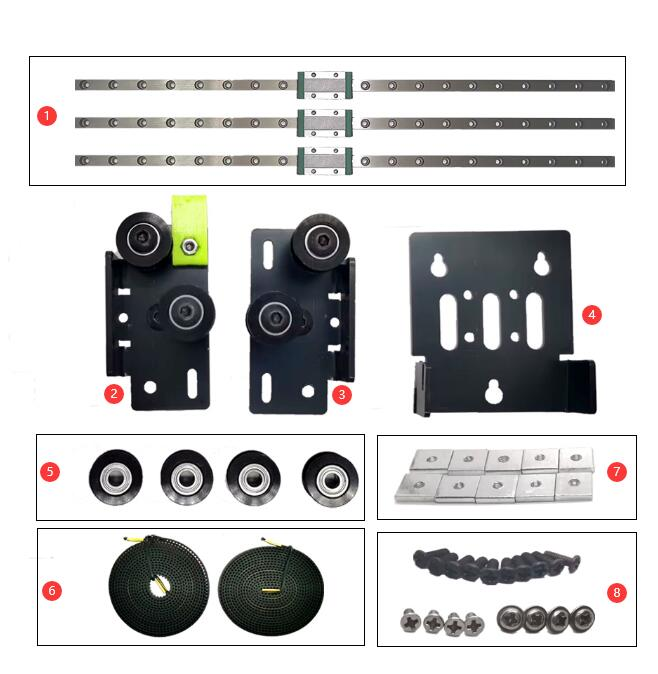
>
    1. linear rail with slider    2. Y carrier(right)     3. Y carrier(left)      4. X Carrier Metal sheet
    5. Idlers                     6. Belts                7. 10x10 square nut     8. Screws

## Installation
### 1. Take down the hot end (print head) from the X carrier.
Loosen the screws which fixed the print head on the X carrier and take down the print head.   
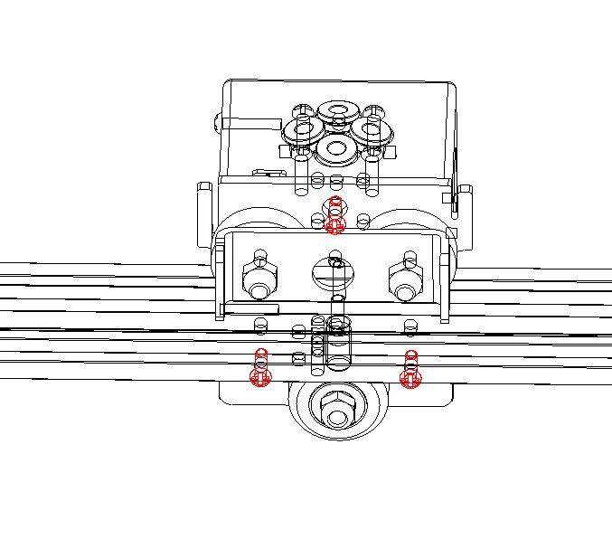
### 2. Remove the belts.
### 3. Replace idlers.
Take down the idlers from the front-top profile and replace with the new idlers.    
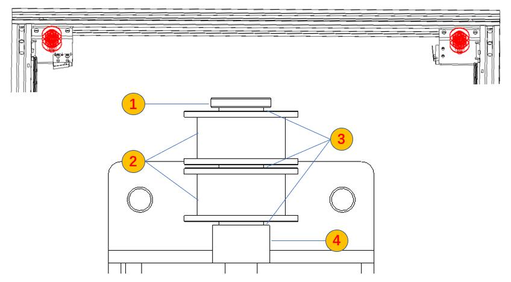
>
    1. Screws (use the original one)     2. New idler wheels     3. New shim  4. Pole (use the orignal one)
### 4. Take down the front-top profile.
Remove the screws shown on picture below to take down the front-top profile. **Note**the screw shown in Figure 3 only exists in the nearest Z9V5.  
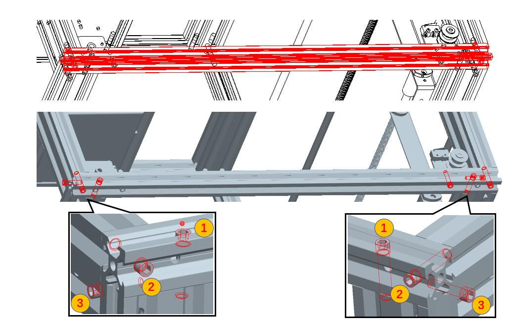
### 5. Take down the X axis assembly.
### 6. Move the wires of X and Y ENDSTOPs from the top groove to the bottom groove of Y profiles.
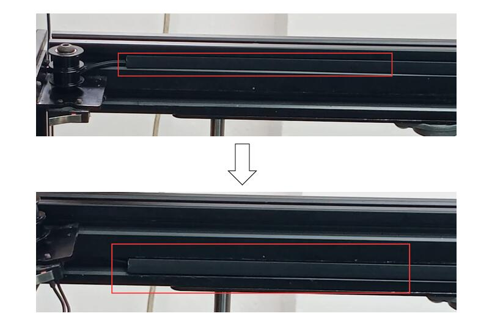

### 7. Remove the original X and Y carrier from X axis assembly
#### 7.1 Take down the 4 screws which fixed the Y carriers to X profiles
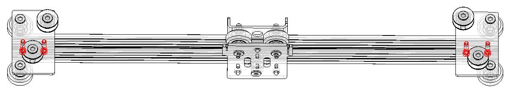
#### 7.2 Take down X carriers from X profile.

### 8. Install a linear rail to the X profile.
  **:warning:Note: When installing the linear rail, do not let the slider slide out of the rail.**    
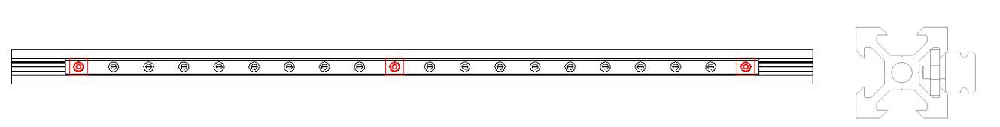
  - Fix 3 screws and square nuts to the linear guide rail.
  - Slide the linear guide rail from one side of the X profile, and place the square nut in the groove of the profile.
  - Roughly align at the middle of the linear rail and the X profile (deviation of 1-2mm is not related), and then fix the screws.
### 9. Install the new Y carriers (left and right) to the X profile.
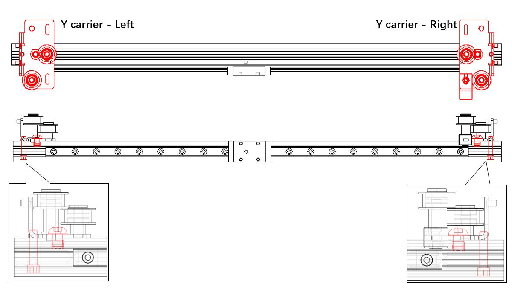
  - Pay attention to differentiation left and right Y carrier, there is a plastic print on the right Y carrier.
  - The carrier is fixed by a M4 screw that has been removed from the bottom and a M5 screw with boat-nut installed on the sheet metal rom the top. When fixing the boat-nut, first rotate the screws counterclockwise for 2-3 turns, and then tighten by rotating clockwise. Do not tighten the screws too tightly at this step.
### 10 Install X carrier metal sheet to the silder of X linear rail.
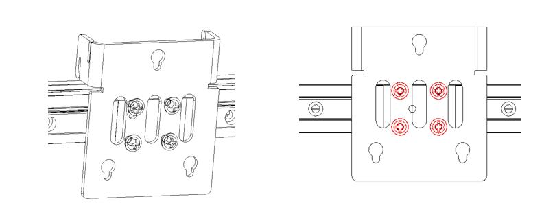
### 11. Install linear rails to Y profile
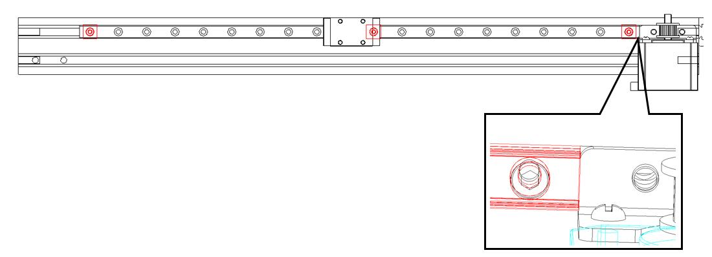
  - Fix 3 screws and square nuts to the linear guide rail
  - Slide the linear guide rail from one side of the Y profile, and place the square nut in the **top groove** of the Y profile. 
  - Move the linear rail to the innermost of the Y profile (touched to the motor metla piece), and then fix the screw.
### 12 Reinstall the top-front profile back.
### 13 Install the X axis assembly to the sliders of Y carrier.
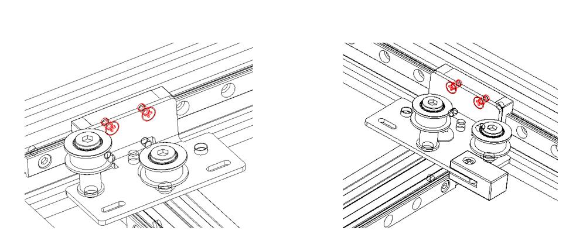
### 14. Install belts
### 15. Install the hot end back.
