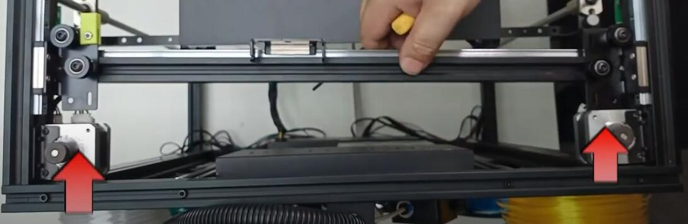

### <a id="choose-language">:globe_with_meridians: Choose language </a>

<!-- 

 -->

----
# <a id="en">Z9V5 Linear Rail Upgrade Kit Installation Guide</a>
### :warning: ATTENTION PLEASE :warning:
Do not slide the slider out of the linear rail, otherwise the balls will slide out of the slider and damage the slider.     
### Video Tutorial

## Parts

>
    1. linear rail with slider    2. Y carrier(right)     3. Y carrier(left)      4. X Carrier Metal sheet
    5. Idlers                     6. Belts                7. 10x10 square nut     8. Screws

## Installation
### 1. Take down the hot end (print head) from the X carrier.
Loosen the screws which fixed the print head on the X carrier and take down the print head.   
###### 
### 2. Remove the belts.
### 3. Replace idlers.
Take down the idlers from the front-top profile and replace with the new idlers.    
###### 
>
    1. Screws (use the original one)     2. New idler wheels     3. New shim  4. Pole (use the orignal one)
  :warning: **Note:**
  - Do not tighten the screws too tightly.
  - There may be differences in the elevation columns of different versions of machines.

### 4. Take down the front-top profile.
Remove the screws shown on picture below to take down the front-top profile. **Note**the screw shown in Figure 3 only exists in the nearest Z9V5.  
###### 
### 5. Take down the X axis assembly.
### 6. Move the wires of X and Y ENDSTOPs from the top groove to the bottom groove of Y profiles.
###### 

### 7. Remove the original X and Y carrier from X axis assembly
#### 7.1 Take down the 4 screws which fixed the Y carriers to X profiles
###### 
#### 7.2 Take down X carriers from X profile.

### 8. Install a linear rail to the X profile.
  **:warning:Note: When installing the linear rail, do not let the slider slide out of the rail.**    
###### 
  - Install 3 pcs screws and 3 pcs square nuts to the linear guide rail.
  - Slide the linear guide rail from one side of the X profile, and place the square nut in the groove of the profile.
  - Roughly align at the middle of the linear rail and the X profile, and then fix the screws.
### 9. Install the new Y carriers (left and right) to the X profile.
###### 
  - Pay attention to differentiation left and right Y carrier, there is a plastic print on the right Y carrier.
  - The carrier is fixed by a M4 screw that has been removed from the bottom and a M5 screw with boat-nut installed on the sheet metal rom the top. When fixing the boat-nut, first rotate the screws counterclockwise for 2-3 turns, and then tighten by rotating clockwise. Do not tighten the screws too tightly at this step.
### 10 Install X carrier metal sheet to the silder of X linear rail.
###### 
### 11. Install linear rails to Y profile
###### 
  - Fix 3 screws and square nuts to the linear guide rail
  - Slide the linear guide rail from one side of the Y profile, and place the square nut in the **top groove** of the Y profile. 
  - Move the linear rail to the innermost of the Y profile (touched to the motor metla piece), and then fix the screw.
### 12 Reinstall the top-front profile back.
### 13 Install the X axis assembly to the sliders of Y carrier.
###### 
:warning: Move the X-axis assembly to the end of the machine, align the left and right side Y carriers, and then tighten the screws that secure the Y-axis carriers.   
###### 
### 14. Reinstall the hot end.
### 15. Install the new belts.

----
# <a id="es">Guía de instalación del kit de actualización de riel lineal Z9V5</a> [:arrow_heading_up:](#choose-language)
### :warning: ATENCIÓN POR FAVOR :warning:
No deslice el control deslizante fuera del riel lineal, de lo contrario las bolas se deslizarán fuera del control deslizante y dañarán el control deslizante.
### Vídeotutorial

## Partes

>
 1. Riel lineal con deslizador 2. Soporte Y (derecha) 3. Soporte Y (izquierda) 4. Soporte X Chapa metálica
 5. Ruedas guía 6. Correas 7. Tuerca cuadrada de 10x10 8. Tornillos

## Instalación
### 1. Retire el extremo caliente (cabezal de impresión) del soporte X.
Afloje los tornillos que fijaron el cabezal de impresión en el soporte X y retire el cabezal de impresión.
###### 
### 2. Retire las correas.
### 3. Reemplace las poleas guía.
Retire las ruedas guía del perfil superior delantero y reemplácelas con ruedas guía nuevas.
###### 
>
 1. Tornillos (use el original) 2. Ruedas guía nuevas 3. Calza nueva 4. Poste (use el original)
 :warning: **Nota:**
 - No apretar demasiado los tornillos.
 - Pueden existir diferencias en las columnas de elevación de distintas versiones de máquinas.

### 4. Retire el perfil frontal superior.
Retire los tornillos que se muestran en la imagen a continuación para desmontar el perfil frontal superior. **Nota**El tornillo que se muestra en la Figura 3 solo existe en el Z9V5 más cercano.
###### 
### 5. Desmonte el conjunto del eje X.
### 6. Mueva los cables de los topes finales X e Y desde la ranura superior hasta la ranura inferior de los perfiles Y.
###### 

### 7. Retire los soportes X e Y originales del conjunto del eje X.
#### 7.1 Quitar los 4 tornillos que fijaban los soportes Y a los perfiles X
###### 
#### 7.2 Derribar X portadores del perfil X.

### 8. Instale un riel lineal en el perfil X.
 **:warning: Nota: Al instalar el riel lineal, no permita que el control deslizante se salga del riel.**
###### 
 - Instale 3 tornillos y 3 tuercas cuadradas en el riel guía lineal.
 - Deslizar el carril guía lineal desde un lado del perfil X, y colocar la tuerca cuadrada en la ranura del perfil.
 - Alinee aproximadamente en el centro del carril lineal y el perfil X, y luego fije los tornillos.
### 9. Instale los nuevos soportes Y (izquierdo y derecho) en el perfil X.
###### 
 - Preste atención a la diferenciación del soporte Y izquierdo y derecho, hay una impresión de plástico en el soporte Y derecho.
 - El soporte se fija mediante un tornillo M4 que se ha retirado de la parte inferior y un tornillo M5 con tuerca-barca instalado en la chapa de la parte superior. Al fijar la tuerca del barco, primero gire los tornillos en el sentido contrario a las agujas del reloj durante 2 o 3 vueltas y luego apriételos girándolos en el sentido de las agujas del reloj. No apriete demasiado los tornillos en este paso.
### 10 Instale la lámina metálica portadora X en el lado inferior del riel lineal X.
###### 
### 11. Instale los rieles lineales en el perfil Y
###### 
 - Fijar 3 tornillos y tuercas cuadradas al carril guía lineal.
 - Deslice el riel guía lineal desde un lado del perfil Y y coloque la tuerca cuadrada en la **ranura superior** del perfil Y.
 - Mueva el carril lineal hasta el interior del perfil Y (en contacto con la pieza metálica del motor) y luego fije el tornillo.
### 12 Vuelva a instalar el perfil frontal superior.
### 13 Instale el conjunto del eje X en los controles deslizantes del soporte Y.
###### 
:warning: Mueva el conjunto del eje X hasta el final de la máquina, alinee los soportes Y del lado izquierdo y derecho y luego apriete los tornillos que fijan los soportes del eje Y.
###### 
### 14. Reinstale el extremo caliente.
### 15. Instale las correas nuevas.

----
# <a id="pt">Guia de instalação do kit de atualização de trilho linear Z9V5</a> [:arrow_heading_up:](#choose-language)
### :warning: ATENÇÃO POR FAVOR :warning:
Não deslize o controle deslizante para fora do trilho linear, caso contrário as esferas deslizarão para fora do controle deslizante e danificarão o controle deslizante.
### Vídeo tutorial

## Peças

>
 1. trilho linear com controle deslizante 2. Transportador Y (direita) 3. Transportador Y (esquerda) 4. Transportador X Folha de metal
 5. Rodas-guia 6. Correias 7. Porca quadrada 10x10 8. Parafusos

## Instalação
### 1. Retire o hot end (cabeça de impressão) do suporte X.
Afrouxe os parafusos que fixam a cabeça de impressão no suporte X e retire a cabeça de impressão.
###### 
### 2. Remova as correias.
### 3. Substitua os roletes.
Retire as rodas-guia do perfil frontal superior e substitua-as pelas novas rodas-guia.
###### 
>
 1. Parafusos (use o original) 2. Novas rodas intermediárias 3. Novo calço 4. Pólo (use o original)
 :warning: **Nota:**
 - Não aperte os parafusos com muita força.
 - Podem existir diferenças nas colunas de elevação das diferentes versões de máquinas.

### 4. Retire o perfil frontal superior.
Remova os parafusos mostrados na imagem abaixo para retirar o perfil frontal superior. **Observação**o parafuso mostrado na Figura 3 existe apenas no Z9V5 mais próximo.
###### 
### 5. Retire o conjunto do eixo X.
### 6. Mova os fios dos ENDSTOPs X e Y da ranhura superior para a ranhura inferior dos perfis Y.
###### 

### 7. Remova o suporte X e Y original do conjunto do eixo X
#### 7.1 Retire os 4 parafusos que fixam os suportes Y aos perfis X
###### 
#### 7.2 Remova as operadoras X do perfil X.

### 8. Instale um trilho linear no perfil X.
 **:warning:Nota: Ao instalar o trilho linear, não deixe o controle deslizante deslizar para fora do trilho.**
###### 
 - Instale 3 parafusos e 3 porcas quadradas no trilho-guia linear.
 - Deslize o trilho guia linear de um lado do perfil X e coloque a porca quadrada na ranhura do perfil.
 - Alinhe aproximadamente no meio do trilho linear e do perfil X e fixe os parafusos.
### 9. Instale os novos suportes Y (esquerdo e direito) no perfil X.
###### 
 - Preste atenção na diferenciação do suporte Y esquerdo e direito, há uma impressão plástica no suporte Y direito.
 - O suporte é fixado por um parafuso M4 que foi removido da parte inferior e um parafuso M5 com porca barco instalado na chapa pela parte superior. Ao fixar a porca barco, primeiro gire os parafusos no sentido anti-horário por 2-3 voltas e depois aperte girando no sentido horário. Não aperte os parafusos com muita força nesta etapa.
### 10 Instale a chapa metálica do suporte X na placa do trilho linear X.
###### 
### 11. Instale trilhos lineares no perfil Y
###### 
 - Fixe 3 parafusos e porcas quadradas no trilho-guia linear
 - Deslize o trilho-guia linear de um lado do perfil Y e coloque a porca quadrada na **ranhura superior** do perfil Y.
 - Mova o trilho linear até o ponto mais interno do perfil em Y (encostado na peça metálica do motor) e depois fixe o parafuso.
### 12 Reinstale o perfil frontal superior de volta.
### 13 Instale o conjunto do eixo X nos controles deslizantes do suporte Y.
###### 
:warning: Mova o conjunto do eixo X para a extremidade da máquina, alinhe os transportadores Y do lado esquerdo e direito e, em seguida, aperte os parafusos que prendem os transportadores do eixo Y.
###### 
### 14. Reinstale o hot end.
### 15. Instale as novas correias.

----
# <a id="fr">Guide d'installation du kit de mise à niveau du rail linéaire Z9V5</a> [:arrow_heading_up:](#choose-language)
### :warning: ATTENTION S'IL VOUS PLAÎT :warning:
Ne faites pas glisser le curseur hors du rail linéaire, sinon les billes glisseraient hors du curseur et endommageraient le curseur.
### Didacticiel vidéo

## Les pièces

>
 1. rail linéaire avec curseur 2. Support Y (droite) 3. Support Y (gauche) 4. Support X Tôle
 5. Galets 6. Courroies 7. Écrou carré 10x10 8. Vis

##Installation
### 1. Retirez l'extrémité chaude (tête d'impression) du support X.
Desserrez les vis qui fixaient la tête d'impression sur le support X et démontez la tête d'impression.
###### 
### 2. Retirez les courroies.
### 3. Remplacez les rouleaux.
Retirez les rouleaux du profil supérieur avant et remplacez-les par les nouveaux rouleaux.
###### 
>
 1. Vis (utilisez celle d'origine) 2. Nouvelles roues folles 3. Nouvelle cale 4. Poteau (utilisez celle d'origine)
 :warning: **Remarque :**
 - Ne serrez pas trop les vis.
 - Il peut y avoir des différences dans les colonnes d'élévation des différentes versions de machines.

### 4. Retirez le profil supérieur avant.
Retirez les vis indiquées sur l'image ci-dessous pour démonter le profil avant supérieur. **Remarque**la vis illustrée sur la figure 3 n'existe que dans le Z9V5 le plus proche.
###### 
### 5. Démontez l'ensemble de l'axe X.
### 6. Déplacez les fils des butées X et Y de la rainure supérieure vers la rainure inférieure des profils Y.
###### 

### 7. Retirez les supports X et Y d'origine de l'assemblage de l'axe X
#### 7.1 Déposer les 4 vis qui fixaient les supports Y aux profilés X
###### 
#### 7.2 Supprimez les transporteurs X du profil X.

### 8. Installez un rail linéaire sur le profil X.
 **:warning: Remarque: lors de l'installation du rail linéaire, ne laissez pas le curseur glisser hors du rail.**
###### 
 - Installez 3 vis et 3 écrous carrés sur le rail de guidage linéaire.
 - Faites glisser le rail de guidage linéaire d'un côté du profilé X, et placez l'écrou carré dans la rainure du profilé.
 - Alignez grossièrement le milieu du rail linéaire et le profilé X, puis fixez les vis.

### 9. Installez les nouveaux supports Y (gauche et droit) sur le profil X.
###### 
 - Faites attention à la différenciation du support Y gauche et droit, il y a une impression plastique sur le support Y droit.
 - Le support est fixé par une vis M4 retirée par le bas et une vis M5 avec écrou bateau installée sur la tôle par le haut. Lors de la fixation de l'écrou bateau, faites d'abord tourner les vis dans le sens inverse des aiguilles d'une montre pendant 2 à 3 tours, puis serrez en les tournant dans le sens des aiguilles d'une montre. Ne serrez pas trop les vis à cette étape.

### 10 Installez la tôle de support X sur le support du rail linéaire X.
###### 

### 11. Installez les rails linéaires sur le profil Y
###### 
 - Fixer 3 vis et écrous carrés au rail de guidage linéaire
 - Faites glisser le rail de guidage linéaire d'un côté du profilé Y et placez l'écrou carré dans la **rainure supérieure** du profilé Y.
 - Déplacez le rail linéaire vers l'intérieur du profil Y (en contact avec la pièce métallique du moteur), puis fixez la vis.
### 12 Réinstallez le profil supérieur avant.

### 13 Installez l'ensemble de l'axe X sur les curseurs du support Y.
###### 
:warning: déplacez l'ensemble de l'axe X jusqu'à l'extrémité de la machine, alignez les supports Y latéraux gauche et droit, puis serrez les vis qui fixent les supports de l'axe Y.

###### 
### 14. Réinstallez le hot end.
### 15. Installez les nouvelles courroies.

----
# <a id="de">Installationsanleitung für das Upgrade-Kit für die Z9V5-Linearschiene</a> [:arrow_heading_up:](#choose-language)
### :warning: ACHTUNG BITTE :warning:
Schieben Sie den Schieber nicht aus der Linearschiene heraus, da sonst die Kugeln aus dem Schieber herausrutschen und den Schieber beschädigen.
### Video-Tutorial

## Teile

>
1. Linearschiene mit Schieber 2. Y-Träger (rechts) 3. Y-Träger (links) 4. X-Träger Metallblech
5. Spannrollen 6. Riemen 7. 10x10 Vierkantmutter 8. Schrauben

## Installation
### 1. Nehmen Sie das Hot-End (Druckkopf) vom X-Träger ab.
Lösen Sie die Schrauben, mit denen der Druckkopf am X-Träger befestigt ist, und nehmen Sie den Druckkopf ab.
###### 
### 2. Entfernen Sie die Riemen.
### 3. Ersetzen Sie die Spannrollen.
Nehmen Sie die Spannrollen vom vorderen oberen Profil ab und ersetzen Sie sie durch die neuen Spannrollen.
###### 
>
1. Schrauben (verwenden Sie die Originalschrauben) 2. Neue Spannrollen 3. Neue Unterlegscheibe 4. Stange (verwenden Sie die Originalschrauben)
:warning: **Hinweis:**
- Ziehen Sie die Schrauben nicht zu fest an.
- Es kann Unterschiede in den Höhensäulen verschiedener Maschinenversionen geben.

### 4. Nehmen Sie das vordere obere Profil ab.
Entfernen Sie die auf dem Bild unten gezeigten Schrauben, um das vordere obere Profil abzunehmen. **Hinweis** Die in Abbildung 3 gezeigte Schraube ist nur im nächsten Z9V5 vorhanden.
###### 
### 5. Bauen Sie die X-Achsen-Baugruppe ab.
### 6. Verlegen Sie die Drähte der X- und Y-ENDSTOPs von der oberen Nut zur unteren Nut der Y-Profile.
###### 

### 7. Entfernen Sie den ursprünglichen X- und Y-Träger von der X-Achsen-Baugruppe
#### 7.1 Entfernen Sie die 4 Schrauben, mit denen die Y-Träger an den X-Profilen befestigt sind
###### 
#### 7.2 Entfernen Sie die X-Träger vom X-Profil.

### 8. Installieren Sie eine Linearschiene am X-Profil.
**:warning:Hinweis: Lassen Sie beim Installieren der Linearschiene den Schieber nicht aus der Schiene gleiten.**
###### 
- Installieren Sie 3 Schrauben und 3 Vierkantmuttern an der Linearführungsschiene.
- Schieben Sie die lineare Führungsschiene von einer Seite des X-Profils und platzieren Sie die Vierkantmutter in der Nut des Profils.
- Richten Sie die Mitte der linearen Schiene und des X-Profils grob aus und ziehen Sie dann die Schrauben fest.

### 9. Installieren Sie die neuen Y-Träger (links und rechts) am X-Profil.
###### 
- Achten Sie auf die Unterscheidung zwischen linkem und rechtem Y-Träger, auf dem rechten Y-Träger befindet sich ein Kunststoffaufdruck.
- Der Träger wird durch eine M4-Schraube befestigt, die von unten entfernt wurde, und eine M5-Schraube mit Bootsmutter, die von oben auf dem Blech angebracht ist. Drehen Sie beim Anbringen der Bootsmutter die Schrauben zunächst 2-3 Umdrehungen gegen den Uhrzeigersinn und ziehen Sie sie dann durch Drehen im Uhrzeigersinn fest. Ziehen Sie die Schrauben bei diesem Schritt nicht zu fest an.

### 10 Installieren Sie das Metallblech des X-Trägers an der Seite der linearen X-Schiene.
###### 

### 11. Linearschienen am Y-Profil anbringen
####### 
- 3 Schrauben und Vierkantmuttern an der Linearführungsschiene anbringen
- Die Linearführungsschiene von einer Seite des Y-Profils einschieben und die Vierkantmutter in die **obere Nut** des Y-Profils einsetzen.
- Die Linearschiene ganz nach innen in das Y-Profil schieben (bis sie das Metallteil des Motors berührt) und dann die Schraube anziehen.

### 12 Das obere vordere Profil wieder anbringen.
### 13 Die X-Achsenbaugruppe an den Gleitstücken des Y-Trägers anbringen.
###### 
:warning: Die X-Achsenbaugruppe an das Ende der Maschine anbringen, die linken und rechten Y-Träger ausrichten und dann die Schrauben festziehen, die die Y-Achsenträger sichern.
###### 
### 14. Bauen Sie das Hot-End wieder ein.
### 15. Bauen Sie die neuen Riemen ein.

----
# <a id="it">Guida all'installazione del kit di aggiornamento della guida lineare Z9V5</a> [:arrow_heading_up:](#choose-language)
### :warning: ATTENZIONE PER FAVORE :warning:
Non far scorrere il cursore fuori dalla guida lineare, altrimenti le sfere scivoleranno fuori dal cursore e danneggeranno il cursore.
### Videotutorial

## Parti

>
 1. guida lineare con cursore 2. Carrello Y (destra) 3. Carrello Y (sinistra) 4. Carrello X Lamiera metallica
 5. Tenditori 6. Cinghie 7. Dado quadro 10x10 8. Viti

## Installazione
### 1. Rimuovere l'hot end (testina di stampa) dal supporto X.
Allentare le viti che fissavano la testina di stampa sul supporto X e smontare la testina di stampa.
###### 
### 2. Rimuovere le cinghie.
### 3. Sostituire i tenditori.
Rimuovere le tenditrici dal profilo superiore anteriore e sostituirle con le nuove tenditrici.
###### 
>
 1. Viti (usare quella originale) 2. Nuove ruote tenditrici 3. Nuovo spessore 4. Palo (usare quello originale)
 :warning: **Nota:**
 - Non stringere troppo le viti.
 - Potrebbero esserci differenze nelle colonne di elevazione delle diverse versioni delle macchine.

### 4. Smontare il profilo anteriore-superiore.
Rimuovere le viti mostrate nella figura sotto per smontare il profilo superiore anteriore. **Nota**la vite mostrata nella Figura 3 esiste solo nel Z9V5 più vicino.
###### 
### 5. Rimuovere il gruppo dell'asse X.
### 6. Spostare i fili dei ENDSTOP X e Y dalla scanalatura superiore alla scanalatura inferiore dei profili Y.
###### 

### 7. Rimuovere il supporto X e Y originale dal gruppo dell'asse X
#### 7.1 Togliere le 4 viti che fissavano i supporti Y ai profili X
###### 
#### 7.2 Elimina i vettori X dal profilo X.

### 8. Installare una guida lineare sul profilo X.
 **:warning: Nota: durante l'installazione della guida lineare, non lasciare che il cursore scivoli fuori dalla guida.**
###### 
 - Installare 3 viti e 3 dadi quadrati sulla guida lineare.
 - Far scorrere la guida lineare da un lato del profilo X e posizionare il dado quadrato nella scanalatura del profilo.
 - Allineare approssimativamente al centro della guida lineare e del profilo X, quindi fissare le viti.
### 9. Installare i nuovi supporti Y (sinistro e destro) sul profilo X.
###### 
 - Prestare attenzione alla differenziazione del supporto Y sinistro e destro, sul supporto Y destro è presente una stampa in plastica.
 - Il supporto è fissato tramite una vite M4 rimossa dal fondo e una vite M5 con dado a barca installata sulla lamiera dalla parte superiore. Quando si fissa il dado della barca, ruotare prima le viti in senso antiorario per 2-3 giri, quindi serrarle ruotandole in senso orario. Non stringere troppo le viti in questa fase.
### 10 Installare la lamiera metallica del supporto X sul rivestimento della guida lineare X.
###### 
### 11. Installare le guide lineari sul profilo Y
###### 
 - Fissare 3 viti e dadi quadrati alla guida lineare
 - Far scorrere la guida lineare da un lato del profilo Y e posizionare il dado quadrato nella **scanalatura superiore** del profilo Y.
 - Spostare la guida lineare nella parte più interna del profilo Y (toccata sul pezzo metallico del motore), quindi fissare la vite.
### 12 Reinstallare nuovamente il profilo anteriore superiore.
### 13 Installare il gruppo dell'asse X sui cursori del supporto Y.
###### 
:warning: spostare il gruppo dell'asse X all'estremità della macchina, allineare i supporti Y del lato sinistro e destro, quindi serrare le viti che fissano i supporti dell'asse Y.
###### 
### 14. Reinstallare l'hot-end.
### 15. Installare le nuove cinghie.

----
# <a id="ru">Руководство по установке комплекта обновления линейной направляющей Z9V5</a> [:arrow_heading_up:](#choose-language)
### :warning: ВНИМАНИЕ :warning:
Не выдвигайте ползунок из линейной направляющей, иначе шарики выскользнут из ползунка и повредят его.
### Видеоурок

## Детали

>
 1. Линейная направляющая с ползунком 2. Держатель Y (справа) 3. Держатель Y (слева) 4. Держатель X Металлический лист
 5. Натяжные ролики 6. Ремни 7. Квадратная гайка 10х10 8. Винты

## Монтаж
### 1. Снимите горячий конец (печатающую головку) с держателя X.
Ослабьте винты, которые фиксируют печатающую головку на держателе X, и снимите печатающую головку.
###### 
### 2. Снимите ремни.
### 3. Замените натяжные ролики.
Снимите натяжные ролики с переднего верхнего профиля и замените их новыми.
###### 
>
 1. Винты (используйте оригинальные) 2. Новые натяжные колеса 3. Новая прокладка 4. Полюс (используйте оригинальную)
 :warning: **Примечание:**
 - Не затягивайте винты слишком сильно.
 - Могут быть различия в высоте столбцов разных версий машин.

### 4. Снимите передний верхний профиль.
Удалите винты, показанные на рисунке ниже, чтобы снять передний верхний профиль. **Обратите внимание**, что винт, показанный на рисунке 3, имеется только в ближайшем Z9V5.
###### 
### 5. Снимите узел оси X.
### 6. Переместите провода концевых упоров X и Y из верхнего паза в нижний паз Y-профиля.
###### 

### 7. Снимите исходный суппорт X и Y с узла оси X.
#### 7.1 Открутите 4 винта, которыми держатели Y крепятся к профилям X.
###### 
#### 7.2 Удалить X операторов связи из X профиля.

### 8. Установите линейную направляющую на X-профиль.
 **:warning:Примечание. При установке линейной направляющей не допускайте выскальзывания ползунка из направляющей.**
###### 
 - Установите 3 винта и 3 квадратных гайки на линейную направляющую.
 - Сдвиньте линейную направляющую с одной стороны X-профиля и поместите квадратную гайку в паз профиля.
 - Примерно совместите середину линейной направляющей и X-профиля, а затем закрепите винты.
### 9. Установите новые держатели Y (слева и справа) в профиль X.
###### 
 - Обратите внимание на различение левого и правого держателя Y, на правом держателе Y имеется пластиковая печать.
 - Держатель крепится винтом М4, снятым снизу, и винтом М5 с лодочной гайкой, установленным на листовом металле сверху. При фиксации гайки-лодочки сначала поверните винты против часовой стрелки на 2-3 оборота, а затем затяните, вращая их по часовой стрелке. На этом этапе не затягивайте винты слишком сильно.
### 10 Установите металлический лист несущей X на золотник линейного рельса X.
###### 
### 11. Установите линейные направляющие на Y-профиль.
###### 
 - Закрепите 3 винта и квадратные гайки на линейной направляющей.
 - Сдвиньте линейную направляющую с одной стороны Y-профиля и поместите квадратную гайку в **верхний паз** Y-профиля.
 - Переместите линейную направляющую к самой внутренней части Y-профиля (прикасаясь к металлическому элементу двигателя), а затем закрепите винт.
###12 Установите верхний передний профиль обратно.
### 13 Установите узел оси X на ползунки держателя Y.
###### 
:warning: Переместите узел оси X в конец машины, выровняйте левую и правую стороны держателей Y, а затем затяните винты, крепящие держатели оси Y.
###### 
### 14. Переустановите хотэнд.
### 15. Установите новые ремни.

----
# <a id="jp">Z9V5 リニア レール アップグレード キット インストール ガイド</a>  [:arrow_heading_up:](#choose-language)
### :warning: ご注意ください :warning:
スライダーをリニア レールからスライドさせないでください。そうしないと、ボールがスライダーからスライドし、スライダーが損傷します。
### ビデオ チュートリアル

## パーツ

>
1. スライダー付きリニア レール 2. Y キャリア (右) 3. Y キャリア (左) 4. X キャリア 金属シート
5. アイドラー 6. ベルト 7. 10x10 角ナット 8. ネジ

## インストール
### 1. ホット エンド (プリント ヘッド) を X キャリアから取り外します。
プリントヘッドを X キャリアに固定しているネジを緩めて、プリントヘッドを取り外します。
###### 
### 2. ベルトを取り外します。
### 3. アイドラーを交換します。
フロントトップ プロファイルからアイドラーを取り外し、新しいアイドラーと交換します。
###### 
>
1. ネジ (元のものを使用) 2. 新しいアイドラー ホイール 3. 新しいシム 4. ポール (元のものを使用)
:warning: **注意:**
- ネジを締めすぎないでください。
- マシンのバージョンによって、仰角の柱が異なる場合があります。

### 4. フロントトップ プロファイルを取り外します。
フロントトップ プロファイルを外すには、下の写真に示されているネジを取り外します。**注意**図 3 に示されているネジは、最も近い Z9V5 にのみ存在します。
###### 
### 5. X 軸アセンブリを取り外します。
### 6. X および Y エンドストップのワイヤを Y プロファイルの上部の溝から下部の溝に移動します。
##### 

### 7. X 軸アセンブリから元の X および Y キャリアを取り外します
#### 7.1 Y キャリアを X プロファイルに固定している 4 本のネジを取り外します
###### 
#### 7.2 X プロファイルから X キャリアを取り外します。

### 8. X プロファイルにリニア レールを取り付けます。
**:warning:注意: リニア レールを取り付けるときは、スライダーがレールから滑り出さないようにしてください。**
###### 
- リニア ガイド レールに 3 本のネジと 3 個の四角ナットを取り付けます。
- リニアガイドレールをXプロファイルの片側からスライドさせ、四角ナットをプロファイルの溝に置きます。
- リニアレールとXプロファイルの中央を大まかに揃えてから、ネジを固定します。
### 9. 新しいYキャリア（左と右）をXプロファイルに取り付けます。
###### 
- 左と右のYキャリアを区別することに注意してください。右のYキャリアにはプラスチックのプリントがあります。
- キャリアは、下部から取り外したM4ネジと、上からシートメタルに取り付けられたボートナット付きのM5ネジで固定されています。ボートナットを固定するときは、最初にネジを反時計回りに2〜3回転してから、時計回りに回して締めます。この手順では、ネジを締めすぎないようにしてください。
### 10 XリニアレールのサイドにXキャリアメタルシートを取り付けます。
###### 
### 11. リニア レールを Y プロファイルに取り付けます
###### 
- 3 本のネジと四角ナットをリニア ガイド レールに固定します
- リニア ガイド レールを Y プロファイルの片側からスライドさせ、四角ナットを Y プロファイルの **上部の溝** に配置します。
- リニア レールを Y プロファイルの最も内側 (モーター メトラ ピースに接触) に移動し、ネジを固定します。
### 12 トップフロント プロファイルを再度取り付けます。
### 13 X 軸アセンブリを Y キャリアのスライダーに取り付けます。
###### 
:warning: X 軸アセンブリをマシンの端に移動し、左側と右側の Y キャリアを揃えてから、Y 軸キャリアを固定するネジを締めます。
###### 
### 14. ホットエンドを再度取り付けます。
### 15. 新しいベルトを取り付けます。

----
# <a id="kr">Z9V5 선형 레일 업그레이드 키트 설치 안내서</a> [:arrow_heading_up:](#choose-language)
### :warning: 주의하세요 :warning:
슬라이더를 선형 레일 밖으로 밀어내지 마십시오. 그렇지 않으면 볼이 슬라이더 밖으로 미끄러져 나와 슬라이더가 손상될 수 있습니다.
### 비디오 튜토리얼

## 부속

>
 1. 슬라이더가 있는 선형 레일 2. Y 캐리어(오른쪽) 3. Y 캐리어(왼쪽) 4. X 캐리어 금속 시트
 5. 아이들러 6. 벨트 7. 10x10 사각 너트 8. 나사

## 설치
### 1. X 캐리어에서 핫엔드(프린트 헤드)를 떼어냅니다.
X 캐리어의 프린트 헤드를 고정한 나사를 풀고 프린트 헤드를 아래로 내립니다.
###### 
### 2. 벨트를 제거합니다.
### 3. 아이들러를 교체하세요.
전면 상단 프로파일에서 아이들러를 제거하고 새 아이들러로 교체합니다.
###### 
>
 1. 나사(원래 것을 사용) 2. 새 아이들러 휠 3. 새 심 4. 폴(원래 것을 사용)
 :warning: **참고:**
 - 나사를 너무 세게 조이지 마십시오.
 - 기계 버전에 따라 고도 열에 차이가 있을 수 있습니다.

### 4. 전면 상단 프로필을 내립니다.
아래 그림에 표시된 나사를 제거하여 전면 상단 프로파일을 아래로 내립니다. **참고**그림 3에 표시된 나사는 가장 가까운 Z9V5에만 있습니다.
###### 
### 5. X축 어셈블리를 분해합니다.
### 6. X 및 Y ENDSTOP의 와이어를 상단 홈에서 Y 프로파일의 하단 홈으로 이동합니다.
###### 

### 7. X축 어셈블리에서 원래 X 및 Y 캐리어를 제거합니다.
#### 7.1 Y 캐리어를 X 프로파일에 고정한 4개의 나사를 풀어냅니다.
###### 
#### 7.2 X 프로필에서 X 캐리어를 제거합니다.

### 8. X 프로파일에 선형 레일을 설치합니다.
 **:warning: 참고: 선형 레일을 설치할 때 슬라이더가 레일 밖으로 미끄러지지 않도록 하십시오.**
###### 
 - 선형 가이드 레일에 나사 3개와 사각 너트 3개를 설치합니다.
 - X 프로파일의 한쪽 측면에서 선형 가이드 레일을 밀고 사각 너트를 프로파일의 홈에 놓습니다.
 - 리니어 레일과 X 프로파일의 중앙을 대략적으로 맞춘 후 나사를 고정합니다.
### 9. 새 Y 캐리어(왼쪽 및 오른쪽)를 X 프로파일에 설치합니다.
###### 
 - 왼쪽과 오른쪽 Y 캐리어 구별에 주의하세요. 오른쪽 Y 캐리어에 플라스틱 프린트가 있습니다.
 - 캐리어는 하단에서 제거된 M4 나사와 상단에서 판금에 설치된 보트 너트가 있는 M5 나사로 고정됩니다. 보트 너트를 고정할 때에는 먼저 나사를 시계 반대 방향으로 2~3바퀴 돌린 후 시계 방향으로 돌려 조여줍니다. 이 단계에서 나사를 너무 세게 조이지 마십시오.
### 10 X 리니어 레일의 실버에 X 캐리어 메탈 시트를 설치합니다.
###### 
### 11. Y 프로파일에 선형 레일 설치
###### 
 - 리니어 가이드 레일에 나사 3개와 사각 너트를 고정합니다.
 - Y 프로파일의 한쪽에서 선형 가이드 레일을 밀고 Y 프로파일의 **상단 홈**에 사각형 너트를 놓습니다.
 - 선형 레일을 Y 프로파일의 가장 안쪽(모터 금속 조각에 닿음)으로 이동시킨 후 나사를 고정합니다.
### 12 상단 전면 프로파일을 다시 설치하세요.
### 13 X축 어셈블리를 Y캐리어의 슬라이더에 설치합니다.
###### 
:warning: X축 어셈블리를 기계 끝으로 이동하고 왼쪽 및 오른쪽 Y 캐리어를 맞춘 다음 Y축 캐리어를 고정하는 나사를 조입니다.
###### 
### 14. 핫엔드를 다시 설치합니다.
### 15. 새 벨트를 설치합니다.